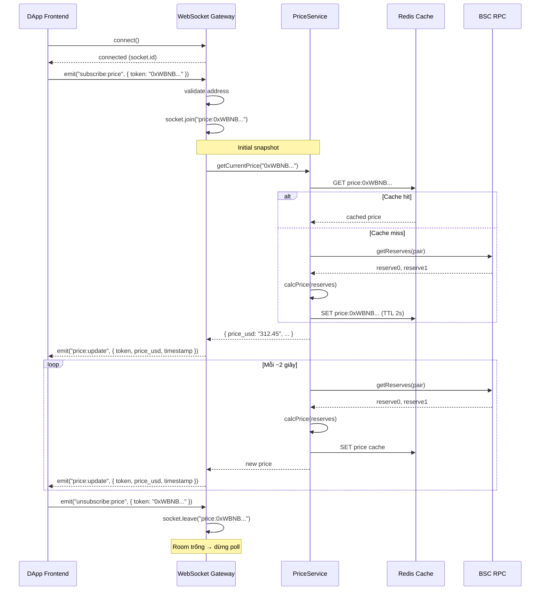
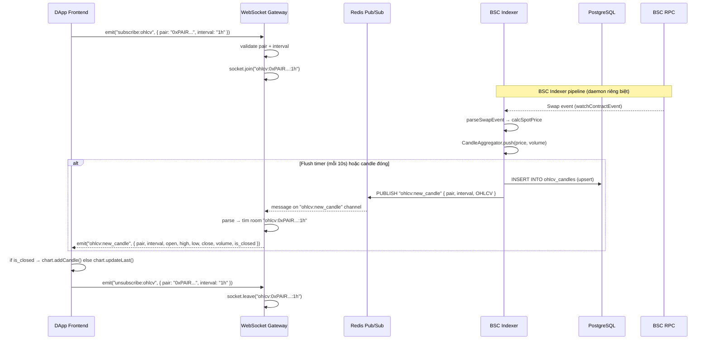
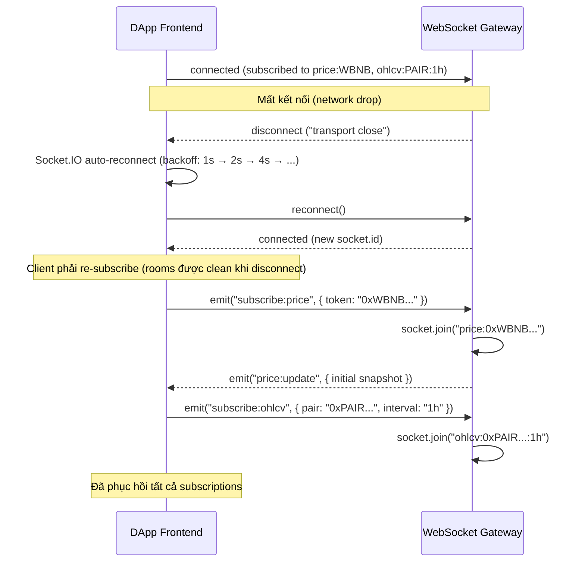

# LizSwap WebSocket Protocol Specification

> **URL**: `wss://lizswap.xyz/ws`
> **Transport**: Socket.IO v4 (WebSocket primary, HTTP long-polling fallback)
> **Server**: Node.js + Express + Socket.IO v4 (Backend API, port `:3000`)
> **Client**: `socket.io-client` (DApp Frontend + Admin Dashboard)

---

## Mục lục

1. [Kiến trúc tổng quan](#kiến-trúc-tổng-quan)
2. [Connection](#connection)
3. [Client → Server Events](#client--server-events)
4. [Server → Client Events](#server--client-events)
5. [Room / Namespace Logic](#room--namespace-logic)
6. [Error Handling](#error-handling)
7. [Giới hạn & Rate Limiting](#giới-hạn--rate-limiting)
8. [Sequence Diagrams](#sequence-diagrams)
9. [Frontend Integration Guide](#frontend-integration-guide)

---

## Kiến trúc tổng quan

```
DApp Frontend (socket.io-client)
    │
    ├── subscribe:price ──────┐
    ├── subscribe:ohlcv ──────┤
    │                         ▼
    │              ┌──────────────────────┐
    │              │   WebSocket Gateway  │
    │              │   (Socket.IO v4)     │
    │              └──────┬───────────────┘
    │                     │
    │         ┌───────────┼───────────────┐
    │         ▼           ▼               ▼
    │    PriceService  RedisRepo     OHLCVService
    │    (poll 2s)     (pub/sub)     (candle data)
    │         │           │               │
    │         ▼           ▼               ▼
    │    BSCClient     Redis 7       PostgreSQL
    │    (reserves)    (cache)       (ohlcv_candles)
    │
    ◄── price:update ─────────────────────┘
    ◄── ohlcv:new_candle ─────────────────┘
```

**Luồng dữ liệu:**
- **Price**: `PriceService` poll reserves on-chain mỗi ~2s → broadcast `price:update` tới room
- **OHLCV**: BSC Indexer ghi candle vào PostgreSQL + publish qua Redis pub/sub → `WebSocket Gateway` nhận → broadcast `ohlcv:new_candle` tới room

---

## Connection

### URL & Transport

```javascript
import { io } from 'socket.io-client';

const socket = io('wss://lizswap.xyz', {
  path: '/ws',
  transports: ['websocket', 'polling'],  // WebSocket ưu tiên
  reconnection: true,
  reconnectionAttempts: Infinity,
  reconnectionDelay: 1000,       // 1s
  reconnectionDelayMax: 30000,   // 30s max
  timeout: 20000,                // 20s connection timeout
});
```

### Server Configuration

```javascript
import { Server } from 'socket.io';

const io = new Server(httpServer, {
  path: '/ws',
  cors: {
    origin: ['https://lizswap.xyz', 'https://admin.lizswap.xyz'],
    methods: ['GET', 'POST'],
  },
  pingInterval: 25000,    // 25s — gửi ping mỗi 25s
  pingTimeout: 20000,     // 20s — disconnect nếu không nhận pong sau 20s
  maxHttpBufferSize: 1e6, // 1MB max message size
  transports: ['websocket', 'polling'],
});
```

### Authentication

| Event group | Auth | Mô tả |
|---|---|---|
| `subscribe:price` / `price:update` | **Không cần** | Public — tất cả user đều nhận |
| `subscribe:ohlcv` / `ohlcv:new_candle` | **Không cần** | Public — dữ liệu chart |
| Admin events (nếu mở rộng) | **JWT required** | Gửi token qua `auth.token` khi connect |

```javascript
// Public connection (DApp Frontend) — không cần auth
const socket = io('wss://lizswap.xyz', { path: '/ws' });

// Admin connection (nếu cần realtime admin) — cần JWT
const adminSocket = io('wss://lizswap.xyz', {
  path: '/ws',
  auth: { token: 'Bearer eyJhbGciOi...' },
});
```

### Heartbeat

Socket.IO tự quản lý heartbeat qua cơ chế ping/pong:

| Tham số | Giá trị | Mô tả |
|---|---|---|
| `pingInterval` | `25000` (25s) | Server gửi ping packet mỗi 25 giây |
| `pingTimeout` | `20000` (20s) | Nếu client không phản hồi pong trong 20s → disconnect |
| **Tổng**: | `45s` | Thời gian tối đa phát hiện mất kết nối |

### Reconnection Strategy

Socket.IO auto-reconnect với exponential backoff:

| Tham số | Giá trị | Mô tả |
|---|---|---|
| `reconnection` | `true` | Bật tự động reconnect |
| `reconnectionAttempts` | `Infinity` | Thử reconnect vô hạn |
| `reconnectionDelay` | `1000` (1s) | Delay ban đầu giữa các lần retry |
| `reconnectionDelayMax` | `30000` (30s) | Delay tối đa (backoff cap) |
| **Randomization factor** | `0.5` (default) | Thêm jitter ±50% vào delay |

**Sau reconnect**, client cần **re-subscribe** lại tất cả rooms đã đăng ký:

```javascript
socket.on('connect', () => {
  // Re-subscribe sau reconnect
  activeSubscriptions.forEach(sub => {
    socket.emit(sub.event, sub.payload);
  });
});
```

---

## Client → Server Events

### `subscribe:price`

Đăng ký nhận cập nhật giá realtime cho một token. Server join client vào room `price:{token_address}`.

**Direction**: Client → Server

**Payload:**

```typescript
interface SubscribePricePayload {
  token: string;  // Địa chỉ token contract (42 ký tự, 0x...)
}
```

**Ví dụ:**

```javascript
socket.emit('subscribe:price', {
  token: '0xbb4CdB9CBd36B01bD1cBaEBF2De08d9173bc095c'
});
```

**Xử lý phía Server:**
1. Validate `token` — phải là BSC address hợp lệ (42 ký tự)
2. Join client vào room `price:0xbb4CdB9CBd36B01bD1cBaEBF2De08d9173bc095c`
3. Gửi lại giá hiện tại ngay lập tức (initial snapshot)
4. Sau đó broadcast `price:update` mỗi ~2 giây

**Error:** Nếu token address không hợp lệ → emit `error` event

---

### `unsubscribe:price`

Huỷ đăng ký nhận giá realtime cho một token. Server remove client khỏi room.

**Direction**: Client → Server

**Payload:**

```typescript
interface UnsubscribePricePayload {
  token: string;  // Địa chỉ token contract
}
```

**Ví dụ:**

```javascript
socket.emit('unsubscribe:price', {
  token: '0xbb4CdB9CBd36B01bD1cBaEBF2De08d9173bc095c'
});
```

**Xử lý phía Server:**
1. Leave client khỏi room `price:{token}`
2. Nếu room trống (không còn subscriber) → dừng poll giá cho token đó

---

### `subscribe:ohlcv`

Đăng ký nhận candle OHLCV realtime cho một pair + interval. Server join client vào room `ohlcv:{pair_address}:{interval}`.

**Direction**: Client → Server

**Payload:**

```typescript
interface SubscribeOHLCVPayload {
  pair: string;       // Địa chỉ Pair contract (42 ký tự, 0x...)
  interval: string;   // Khung thời gian: '1m' | '5m' | '1h' | '1d'
}
```

**Ví dụ:**

```javascript
socket.emit('subscribe:ohlcv', {
  pair: '0xabc123def456...',
  interval: '1h'
});
```

**Xử lý phía Server:**
1. Validate `pair` — BSC address hợp lệ
2. Validate `interval` — chỉ chấp nhận `1m`, `5m`, `1h`, `1d`
3. Join client vào room `ohlcv:0xabc123...:1h`
4. Khi BSC Indexer flush candle mới → Redis pub/sub → Gateway broadcast `ohlcv:new_candle`

**Error:** Nếu interval không hợp lệ → emit `error` event

---

### `unsubscribe:ohlcv`

Huỷ đăng ký nhận candle realtime.

**Direction**: Client → Server

**Payload:**

```typescript
interface UnsubscribeOHLCVPayload {
  pair: string;       // Địa chỉ Pair contract
  interval: string;   // Khung thời gian
}
```

**Ví dụ:**

```javascript
socket.emit('unsubscribe:ohlcv', {
  pair: '0xabc123def456...',
  interval: '1h'
});
```

**Xử lý phía Server:**
1. Leave client khỏi room `ohlcv:{pair}:{interval}`

---

## Server → Client Events

### `price:update`

Push giá token mới nhất. Server broadcast tới room `price:{token_address}` mỗi ~2 giây.

**Direction**: Server → Client

**Payload:**

```typescript
interface PriceUpdatePayload {
  token: string;       // Địa chỉ token contract
  symbol: string;      // Symbol: "WBNB", "USDT"
  price_usd: string;   // Giá tính bằng USD (string để tránh floating point)
  price_bnb: string;   // Giá tính bằng BNB
  change_24h: string;  // % thay đổi 24h (VD: "+2.35" hoặc "-1.20")
  timestamp: number;   // Unix timestamp (seconds)
}
```

**Ví dụ:**

```javascript
socket.on('price:update', (data) => {
  console.log(data);
  // {
  //   token: "0xbb4CdB9CBd36B01bD1cBaEBF2De08d9173bc095c",
  //   symbol: "WBNB",
  //   price_usd: "312.45",
  //   price_bnb: "1.0",
  //   change_24h: "+2.35",
  //   timestamp: 1711929600
  // }
});
```

**Tần suất**: Mỗi ~2 giây. `PriceService` poll reserves on-chain qua `BSCClient` → tính giá → broadcast.

> [!NOTE]
> **Nguồn dữ liệu**: Giá tính từ pool reserves on-chain (`reserve1 / reserve0`, chuẩn hoá decimals). Cache tạm trong Redis (TTL 2s). Nếu không có thay đổi giá → vẫn broadcast để confirm connection alive.

---

### `ohlcv:new_candle`

Push nến OHLCV mới hoặc cập nhật nến hiện tại. Server broadcast tới room `ohlcv:{pair_address}:{interval}`.

**Direction**: Server → Client

**Payload:**

```typescript
interface NewCandlePayload {
  pair: string;        // Địa chỉ Pair contract
  interval: string;    // Khung thời gian: '1m' | '5m' | '1h' | '1d'
  open_time: number;   // Unix timestamp (seconds) mở nến
  open: string;        // Giá mở
  high: string;        // Giá cao nhất
  low: string;         // Giá thấp nhất
  close: string;       // Giá đóng
  volume: string;      // Khối lượng (token0)
  tx_count: number;    // Số giao dịch trong nến
  is_closed: boolean;  // true nếu nến đã đóng, false nếu đang mở (live update)
}
```

**Ví dụ:**

```javascript
socket.on('ohlcv:new_candle', (data) => {
  console.log(data);
  // {
  //   pair: "0xabc123...def456",
  //   interval: "1h",
  //   open_time: 1711929600,
  //   open: "312.45",
  //   high: "314.20",
  //   low: "312.00",
  //   close: "313.80",
  //   volume: "98.234",
  //   tx_count: 35,
  //   is_closed: false
  // }
});
```

**Frontend xử lý:**

```javascript
socket.on('ohlcv:new_candle', (candle) => {
  if (candle.is_closed) {
    // Nến đã đóng — thêm nến mới vào chart
    chart.update(candle);
  } else {
    // Nến đang mở — cập nhật nến cuối cùng trên chart (live tick)
    chart.updateLastCandle(candle);
  }
});
```

**Tần suất**: Mỗi khi BSC Indexer flush dữ liệu (~10 giây hoặc khi nến đóng).

> [!NOTE]
> **Pipeline**: BSC Indexer `CandleBuilder` → `IndexerWriter` → PostgreSQL INSERT + Redis PUBLISH (`channel: ohlcv:new_candle`) → WebSocket Gateway subscribe Redis → broadcast tới room Socket.IO tương ứng.

---

## Room / Namespace Logic

### Room Naming Convention

| Nhóm | Room Format | Ví dụ |
|---|---|---|
| Price | `price:{token_address}` | `price:0xbb4CdB9CBd36B01bD1cBaEBF2De08d9173bc095c` |
| OHLCV | `ohlcv:{pair_address}:{interval}` | `ohlcv:0xabc123...def456:1h` |

### Room Lifecycle

```
subscribe:price { token: "0xbb4..." }
    → socket.join("price:0xbb4...")
    → PriceService bắt đầu poll nếu chưa poll
    → Broadcast price:update mỗi 2s tới room

unsubscribe:price { token: "0xbb4..." }
    → socket.leave("price:0xbb4...")
    → Nếu room trống → PriceService dừng poll cho token đó

subscribe:ohlcv { pair: "0xabc...", interval: "1h" }
    → socket.join("ohlcv:0xabc...:1h")

unsubscribe:ohlcv { pair: "0xabc...", interval: "1h" }
    → socket.leave("ohlcv:0xabc...:1h")
```

### Namespace

LizSwap dùng **default namespace** (`/`). Không tạo custom namespace để giữ đơn giản. Phân biệt bằng room names.

### Disconnect Cleanup

Khi client disconnect (mất mạng, tab đóng), Socket.IO tự động remove client khỏi tất cả rooms. Server side:

```javascript
socket.on('disconnect', (reason) => {
  // Socket.IO tự cleanup rooms
  // Kiểm tra nếu room trống → dừng poll / unsubscribe Redis
  cleanupEmptyRooms(socket);
});
```

---

## Error Handling

### Error Event

Server emit event `error` khi có lỗi validate hoặc xử lý.

**Direction**: Server → Client

**Payload:**

```typescript
interface WSErrorPayload {
  code: string;      // Error code
  message: string;   // Mô tả lỗi
  event?: string;    // Event gây lỗi (optional)
}
```

### Error Codes

| Code | Mô tả | Khi nào |
|---|---|---|
| `INVALID_ADDRESS` | Địa chỉ token/pair không hợp lệ | `subscribe:price` / `subscribe:ohlcv` với address sai format |
| `INVALID_INTERVAL` | Interval không hỗ trợ | `subscribe:ohlcv` với interval khác `1m/5m/1h/1d` |
| `MAX_SUBSCRIPTIONS` | Vượt quá giới hạn subscription | Client subscribe quá 50 rooms |
| `UNAUTHORIZED` | JWT không hợp lệ (admin events) | Connect với auth token sai/hết hạn |
| `INTERNAL_ERROR` | Lỗi server nội bộ | Lỗi không xác định |

### Ví dụ Error

```javascript
socket.on('error', (err) => {
  console.error(err);
  // {
  //   code: "INVALID_INTERVAL",
  //   message: "Interval must be one of: 1m, 5m, 1h, 1d.",
  //   event: "subscribe:ohlcv"
  // }
});
```

### Connection Error Handling (Client)

```javascript
socket.on('connect_error', (err) => {
  console.error('Connection failed:', err.message);
  // Socket.IO sẽ tự retry theo reconnection config
});

socket.on('disconnect', (reason) => {
  if (reason === 'io server disconnect') {
    // Server chủ động disconnect → cần connect lại thủ công
    socket.connect();
  }
  // Các reason khác: 'transport close', 'ping timeout' → auto reconnect
});
```

---

## Giới hạn & Rate Limiting

### Subscription Limits

| Tham số | Giá trị | Mô tả |
|---|---|---|
| Max price subscriptions | `20` / client | Tối đa 20 token price đồng thời |
| Max OHLCV subscriptions | `10` / client | Tối đa 10 pair:interval đồng thời |
| Max total rooms | `50` / client | Tổng rooms tối đa bao gồm cả price + ohlcv |

Khi vượt quá, server emit `error` với code `MAX_SUBSCRIPTIONS`:

```json
{
  "code": "MAX_SUBSCRIPTIONS",
  "message": "Maximum 20 price subscriptions per client exceeded.",
  "event": "subscribe:price"
}
```

### Message Rate

| Tham số | Giá trị | Mô tả |
|---|---|---|
| `price:update` frequency | ~2s / token | PriceService poll mỗi 2 giây |
| `ohlcv:new_candle` frequency | ~10s / pair | Indexer flush mỗi 10 giây |
| Max inbound events | `30` / phút / client | Client gửi quá nhiều subscribe/unsubscribe |

### Bandwidth Estimation

| Scenario | Subscriptions | Messages / phút | Size / message | Bandwidth |
|---|---|---|---|---|
| 1 token price | 1 | ~30 | ~200 bytes | ~6 KB/phút |
| 5 token prices | 5 | ~150 | ~200 bytes | ~30 KB/phút |
| 1 pair chart | 1 | ~6 | ~300 bytes | ~1.8 KB/phút |
| **Typical user** | 2 prices + 1 chart | ~66 | ~200-300 bytes | ~16 KB/phút |

---

## Sequence Diagrams

### Flow 1: Subscribe Price → Receive Updates → Unsubscribe



### Flow 2: Subscribe OHLCV → Receive Candles



### Flow 3: Reconnect → Re-subscribe



---

## Frontend Integration Guide

### DApp Frontend — SwapPage + CandlestickChart

```typescript
// hooks/useWebSocket.ts
import { io, Socket } from 'socket.io-client';
import { useEffect, useRef, useCallback } from 'react';

const WS_URL = process.env.NEXT_PUBLIC_WS_URL || 'wss://lizswap.xyz';
const WS_PATH = '/ws';

export function useWebSocket() {
  const socketRef = useRef<Socket | null>(null);

  useEffect(() => {
    const socket = io(WS_URL, {
      path: WS_PATH,
      transports: ['websocket', 'polling'],
      reconnection: true,
      reconnectionAttempts: Infinity,
      reconnectionDelay: 1000,
      reconnectionDelayMax: 30000,
    });

    socketRef.current = socket;

    return () => {
      socket.disconnect();
    };
  }, []);

  return socketRef.current;
}
```

### Subscribe Price

```typescript
// hooks/usePriceSubscription.ts
export function usePriceSubscription(token: string | null) {
  const socket = useWebSocket();
  const [price, setPrice] = useState<PriceUpdatePayload | null>(null);

  useEffect(() => {
    if (!socket || !token) return;

    socket.emit('subscribe:price', { token });

    const handler = (data: PriceUpdatePayload) => {
      if (data.token === token) {
        setPrice(data);
      }
    };

    socket.on('price:update', handler);

    return () => {
      socket.emit('unsubscribe:price', { token });
      socket.off('price:update', handler);
    };
  }, [socket, token]);

  return price;
}
```

### Subscribe OHLCV (CandlestickChart)

```typescript
// hooks/useOHLCVSubscription.ts
export function useOHLCVSubscription(
  pair: string | null,
  interval: string
) {
  const socket = useWebSocket();

  useEffect(() => {
    if (!socket || !pair) return;

    socket.emit('subscribe:ohlcv', { pair, interval });

    const handler = (candle: NewCandlePayload) => {
      if (candle.pair === pair && candle.interval === interval) {
        // Cập nhật chart — logic xử lý tại component
        onNewCandle?.(candle);
      }
    };

    socket.on('ohlcv:new_candle', handler);

    return () => {
      socket.emit('unsubscribe:ohlcv', { pair, interval });
      socket.off('ohlcv:new_candle', handler);
    };
  }, [socket, pair, interval]);
}
```

### Reconnect Handler

```typescript
// Trong useWebSocket hook
socket.on('connect', () => {
  console.log('Connected:', socket.id);
  // Re-subscribe logic sẽ tự trigger qua useEffect dependencies
  // khi component re-render với socket connected state
});

socket.on('disconnect', (reason) => {
  console.warn('Disconnected:', reason);
  // Socket.IO tự reconnect trừ khi reason = 'io server disconnect'
});

socket.on('error', (err: WSErrorPayload) => {
  console.error(`WS Error [${err.code}]:`, err.message);
  // Hiển thị toast notification nếu cần
});
```

---

## Tham chiếu tài liệu

| Tài liệu | Mô tả |
|---|---|
| [AGENT.md — mục 5](../../AGENT.md) | WebSocket Events tổng quan |
| [c4-components-backend.md](../architecture/c4-components-backend.md) | WebSocket Gateway, PriceService, RedisRepository (pub/sub) |
| [c4-components-frontend.md](../architecture/c4-components-frontend.md) | APIClient (DApp), CandlestickChart, CandleRenderer |
| [techstack.md](../architecture/techstack.md) | Socket.IO v4, viem, lightweight-charts |
| [rest-api.md](rest-api.md) | REST API — `GET /api/ohlcv` (data format nhất quán với WS payload) |
