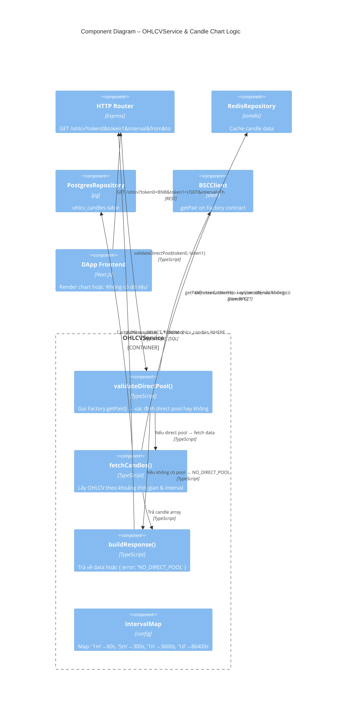
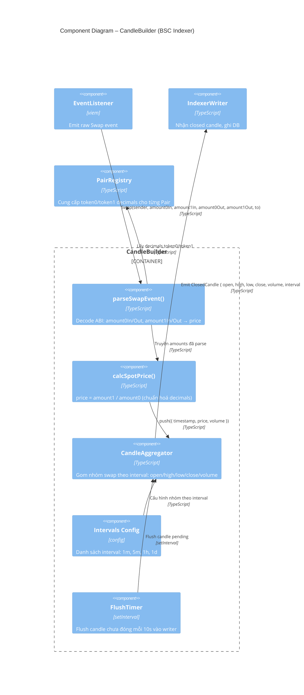
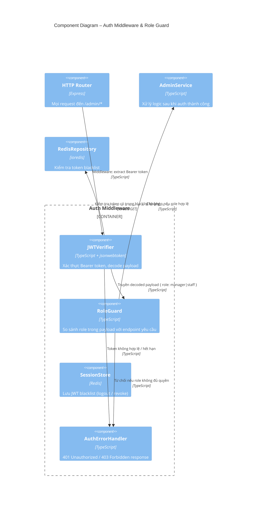

# C4 Level 3 – Component Diagram: Backend

## LizSwap Backend Services

Lớp backend của LizSwap gồm 2 tiến trình độc lập triển khai trên server:
- **Backend API** (`Node.js + TypeScript + Express`): phục vụ REST & WebSocket cho cả DApp Frontend và Admin Dashboard.
- **BSC Indexer** (`Node.js + TypeScript + viem`): daemon lắng nghe sự kiện on-chain, index dữ liệu OHLCV vào PostgreSQL và cập nhật Redis.

---

## Kiến trúc tổng quan – Backend Layer

**Backend API** `(Node.js + TypeScript + Express)`
- HTTP Router → Auth Middleware
- HTTP Router → PriceService / PoolService / OHLCVService / AdminService
- Services → PostgresRepository (PostgreSQL)
- Services → RedisRepository (Redis)
- Services → BSCClient (viem → BSC RPC)
- WebSocket Gateway → PriceService + RedisRepository (pub/sub)

**BSC Indexer** `(Node.js + TypeScript – Daemon riêng biệt)`
- PairRegistry → BSCClient → Factory.allPairs()
- EventListener → BSC WebSocket RPC (Swap / Mint / Burn)
- EventListener → CandleBuilder → IndexerWriter
- IndexerWriter → PostgresRepository + RedisRepository
- FallbackFetcher → External OHLCV Source → PostgresRepository

---

## Diagram 1 – Tổng thể Backend Components

```mermaid
C4Component
  title Component Diagram – Backend Layer (LizSwap)

  Container(frontendC, "DApp Frontend", "Next.js", "Gọi REST/WS để lấy giá & OHLCV")
  Container(adminC, "Admin Dashboard", "Next.js", "Gọi API quản trị hệ thống")
  ContainerDb(postgresC, "PostgreSQL", "PostgreSQL 15", "Lưu OHLCV, sessions, config")
  ContainerDb(redisC, "Redis", "Redis 7", "Cache giá, pool data, rate limit")
  Container(bscC, "Binance Smart Chain", "BSC RPC", "Nguồn dữ liệu on-chain")
  Container(factoryC, "LizSwapFactory", "Solidity", "Kiểm tra pair tồn tại")

  Container_Boundary(backendApi, "Backend API (Node.js + TypeScript)") {
    Component(httpRouter, "HTTP Router", "Express Router", "Định tuyến tất cả REST endpoints")
    Component(wsGateway, "WebSocket Gateway", "Socket.IO v4", "Publish giá & OHLCV realtime cho client")
    Component(authMiddleware, "Auth Middleware", "JWT + Role Guard", "Xác thực token, kiểm tra role Manager/Staff")
    Component(priceService, "PriceService", "TypeScript", "Lấy giá token từ BSC RPC / pool reserves")
    Component(poolService, "PoolService", "TypeScript", "Thống kê pool: TVL, volume, APR")
    Component(ohlcvService, "OHLCVService", "TypeScript", "Truy vấn OHLCV, kiểm tra direct pool")
    Component(adminService, "AdminService", "TypeScript", "Quản lý config, user, role Staff")
    Component(pgRepo, "PostgresRepository", "TypeScript + pg", "CRUD: ohlcv_candles, users, system_config")
    Component(redisRepo, "RedisRepository", "TypeScript + ioredis", "Get/Set cache: prices, pool stats, rate limit")
    Component(bscClient, "BSCClient", "viem PublicClient", "Đọc on-chain: reserves, getPair, getPrice")
  }

  Container_Boundary(indexer, "BSC Indexer (Node.js + TypeScript)") {
    Component(eventListener, "EventListener", "viem watchContractEvent", "Subscribe Swap/Mint/Burn events từ Pair contracts")
    Component(pairRegistry, "PairRegistry", "TypeScript", "Giữ danh sách Pair cần theo dõi, đồng bộ từ Factory")
    Component(candleBuilder, "CandleBuilder", "TypeScript", "Chuyển từng Swap event → OHLCV candle (1m/5m/1h/1d)")
    Component(indexerWriter, "IndexerWriter", "TypeScript", "Ghi candle mới vào PostgreSQL, cập nhật Redis")
    Component(fallbackFetcher, "FallbackFetcher", "TypeScript + axios", "Fetch dữ liệu nến từ nguồn ngoài nếu thiếu")
  }

  %% Frontend → API
  Rel(frontendC, httpRouter, "GET /prices, /pools, /ohlcv", "REST HTTPS")
  Rel(frontendC, wsGateway, "Subscribe giá realtime", "WebSocket")
  Rel(adminC, httpRouter, "GET/POST /admin/*", "REST HTTPS")

  %% Router → Middleware → Services
  Rel(httpRouter, authMiddleware, "Xác thực JWT cho /admin/*", "TypeScript")
  Rel(httpRouter, priceService, "GET /prices/:token", "TypeScript")
  Rel(httpRouter, poolService, "GET /pools, /pools/:pair/stats", "TypeScript")
  Rel(httpRouter, ohlcvService, "GET /ohlcv?token0=&token1=&interval=", "TypeScript")
  Rel(httpRouter, adminService, "POST /admin/config, /admin/users", "TypeScript")

  %% Services → Repositories & BSC
  Rel(priceService, redisRepo, "Cache hit: lấy giá từ Redis", "ioredis")
  Rel(priceService, bscClient, "Cache miss: đọc reserves on-chain", "viem RPC")
  Rel(poolService, pgRepo, "Query TVL, volume từ OHLCV data", "SQL")
  Rel(poolService, redisRepo, "Cache pool stats", "ioredis")
  Rel(ohlcvService, bscClient, "getPair(token0, token1) → direct pool check", "viem RPC")
  Rel(ohlcvService, redisRepo, "Cache hit: lấy candle từ Redis", "ioredis")
  Rel(ohlcvService, pgRepo, "Cache miss: query ohlcv_candles", "SQL")
  Rel(adminService, pgRepo, "CRUD system_config, user_roles", "SQL")

  %% WS Gateway
  Rel(wsGateway, priceService, "Poll giá mỗi 2s, broadcast", "TypeScript")
  Rel(wsGateway, redisRepo, "Subscribe Redis pub/sub channel", "ioredis")

  %% BSCClient → BSC
  Rel(bscClient, bscC, "eth_call / getLogs", "JSON-RPC HTTPS")
  Rel(bscClient, factoryC, "getPair(tokenA, tokenB)", "viem readContract")

  %% Indexer internal pipeline
  Rel(pairRegistry, bscClient, "Lấy danh sách allPairs từ Factory", "viem RPC")
  Rel(eventListener, pairRegistry, "Lấy danh sách contract cần watch", "TypeScript")
  Rel(eventListener, bscC, "watchContractEvent (Swap/Mint/Burn)", "WebSocket RPC")
  Rel(eventListener, candleBuilder, "Push raw Swap event", "TypeScript")
  Rel(candleBuilder, indexerWriter, "Push OHLCV candle đã tính", "TypeScript")
  Rel(indexerWriter, pgRepo, "INSERT INTO ohlcv_candles", "SQL")
  Rel(indexerWriter, redisRepo, "SET latest candle cache", "ioredis")
  Rel(fallbackFetcher, pgRepo, "INSERT candle từ nguồn ngoài", "SQL")
  Rel(fallbackFetcher, redisRepo, "Warm up cache", "ioredis")

  UpdateLayoutConfig($c4ShapeInRow="4", $c4BoundaryInRow="1")
```

---

## Diagram 2 – Chi tiết OHLCVService (Candlestick Logic)

---

## Diagram 3 – Chi tiết CandleBuilder (Indexer Pipeline)

---

## Diagram 4 – Chi tiết Auth & Role Guard

---

## Database Schema (tham chiếu)

### Bảng `ohlcv_candles`
| Cột | Kiểu | Mô tả |
|---|---|---|
| `id` | BIGSERIAL PK | Auto increment |
| `pair_address` | VARCHAR(42) | Địa chỉ Pair contract (indexed) |
| `token0` | VARCHAR(42) | Địa chỉ token0 |
| `token1` | VARCHAR(42) | Địa chỉ token1 |
| `interval` | VARCHAR(4) | `1m`, `5m`, `1h`, `1d` |
| `open_time` | BIGINT | Unix timestamp mở nến (indexed) |
| `open` | NUMERIC(38,18) | Giá mở |
| `high` | NUMERIC(38,18) | Giá cao nhất |
| `low` | NUMERIC(38,18) | Giá thấp nhất |
| `close` | NUMERIC(38,18) | Giá đóng |
| `volume` | NUMERIC(38,18) | Khối lượng token0 |
| `tx_count` | INT | Số giao dịch trong nến |

> [!IMPORTANT]
> **Indexes cần thiết trên `ohlcv_candles`**:
> - Composite index: `(pair_address, interval, open_time)` — tối ưu query OHLCV theo pair và khoảng thời gian
> - Unique constraint: `(pair_address, interval, open_time)` — tránh duplicate khi Indexer restart hoặc replay events

### Bảng `system_config`
| Cột | Kiểu | Mô tả |
|---|---|---|
| `key` | VARCHAR PK | Tên config |
| `value` | JSONB | Giá trị config |
| `updated_by` | VARCHAR | ID Manager cập nhật cuối |
| `updated_at` | TIMESTAMP | Thời gian cập nhật |

### Bảng `user_roles`
| Cột | Kiểu | Mô tả |
|---|---|---|
| `id` | UUID PK | |
| `wallet_address` | VARCHAR(42) | Địa chỉ ví BSC (unique) |
| `role` | ENUM | `manager`, `staff` |
| `created_by` | UUID | Manager tạo |
| `is_active` | BOOLEAN | Trạng thái tài khoản |

---

## REST API Endpoints (tóm tắt)

| Method | Endpoint | Auth | Mô tả |
|---|---|---|---|
| `GET` | `/api/prices/:token` | — | Giá token hiện tại |
| `GET` | `/api/pools` | — | Danh sách pools & stats |
| `GET` | `/api/pools/:pair/stats` | — | TVL, volume, APR của pool |
| `GET` | `/api/ohlcv` | — | Dữ liệu nến theo cặp & interval |
| `POST` | `/api/auth/login` | — | Đăng nhập bằng wallet signature |
| `POST` | `/api/auth/logout` | JWT | Invalidate token |
| `GET` | `/api/admin/users` | Manager/Staff | Danh sách user & role |
| `POST` | `/api/admin/users` | Manager | Thêm Staff mới |
| `PUT` | `/api/admin/users/:id/role` | Manager | Cập nhật role |
| `DELETE` | `/api/admin/users/:id` | Manager | Vô hiệu hoá tài khoản |
| `GET` | `/api/admin/activity` | Manager/Staff | Lịch sử giao dịch Swap/Mint/Burn, filter theo pair và thời gian |
| `GET` | `/api/admin/stats` | Manager/Staff | Thống kê tổng quan: 24h volume, TVL, số active wallets |
| `GET` | `/api/admin/config` | Manager/Staff | Xem cấu hình hệ thống |
| `PUT` | `/api/admin/config` | Manager | Cập nhật cấu hình |

### WebSocket Events
| Event | Direction | Mô tả |
|---|---|---|
| `subscribe:price` | Client → Server | Đăng ký nhận giá token |
| `price:update` | Server → Client | Push giá mới nhất |
| `subscribe:ohlcv` | Client → Server | Đăng ký nhận candle realtime |
| `ohlcv:new_candle` | Server → Client | Push nến mới khi Indexer flush |

---

## Ghi chú thiết kế

> [!IMPORTANT]
> **Direct Pool Check**: `OHLCVService.validateDirectPool()` PHẢI gọi `Factory.getPair()` on-chain. Nếu trả về `address(0)` → trả `{ error: 'NO_DIRECT_POOL' }` → Frontend hiển thị *"Không có dữ liệu chart"*.

> [!NOTE]
> **Indexer vs API**: BSC Indexer là daemon riêng biệt, không gọi qua API. Nó ghi thẳng vào PostgreSQL và Redis. Backend API chỉ đọc dữ liệu đã được index.

> [!NOTE]
> **Auth Flow**: LizSwap dùng **wallet-based auth** — Manager/Staff ký message bằng MetaMask, Backend xác thực signature (EIP-191), cấp JWT token với role tương ứng.