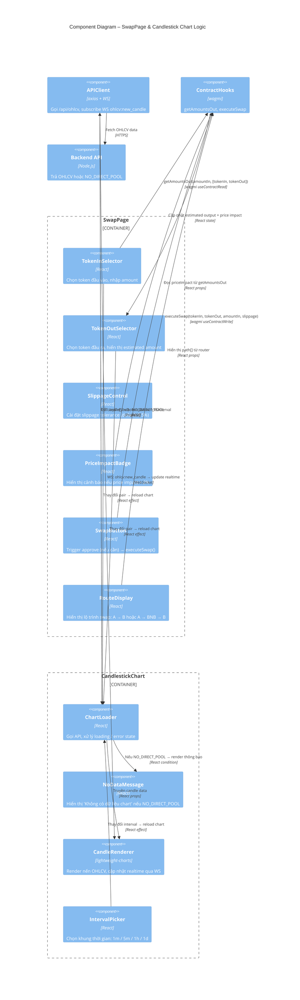
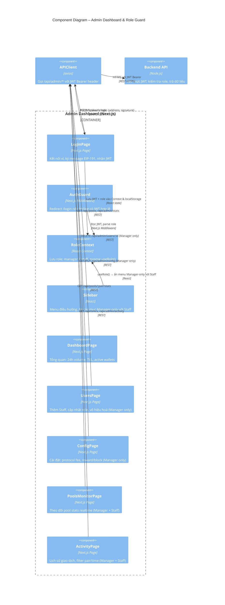

# C4 Level 3 – Component Diagram: Frontend

## LizSwap Frontend Apps

Lớp Frontend của LizSwap gồm 2 ứng dụng **Next.js** riêng biệt (hoặc 2 app trong monorepo):
- **DApp Frontend**: Giao diện người dùng công khai — Trader & Liquidity Provider.
- **Admin Dashboard**: Giao diện quản trị nội bộ — Manager & Staff.

Cả hai đều dùng **wagmi + viem** để tương tác on-chain và **MetaMask** để ký giao dịch.

---

## Kiến trúc tổng quan – Frontend Layer

**DApp Frontend** `(Next.js + wagmi + viem)`
- Pages: `/swap`, `/pool`, `/pool/add`, `/pool/remove`, `/stake`
- Shared: `WalletConnector` (wagmi), `ContractHooks` (viem), `APIClient` (REST/WS)
- On-chain writes → MetaMask → BSC
- Off-chain reads → Backend API (giá, OHLCV, pool stats)

**Admin Dashboard** `(Next.js + REST)`
- Pages: `/login`, `/dashboard`, `/users`, `/config`, `/pools`, `/activity`
- Shared: `AuthGuard` (JWT), `APIClient`, `RoleGuard` (Manager/Staff)
- Không giao tiếp on-chain trực tiếp — chỉ qua Backend API

---

## Diagram 1 – Tổng thể Frontend Components

```mermaid
C4Component
  title Component Diagram – Frontend Layer (LizSwap)

  Container(metamaskExt, "MetaMask", "Browser Extension", "Ký giao dịch BSC")
  Container(backendExt, "Backend API", "Node.js + Express", "REST & WebSocket")
  Container(routerExt, "LizSwapRouter", "Solidity", "Thực thi swap/liquidity on-chain")
  Container(stakingExt, "LizSwapStaking", "Solidity", "Stake/Unstake LP Token on-chain")
  Container(factoryExt, "LizSwapFactory", "Solidity", "Kiểm tra pool tồn tại")

  Container_Boundary(dapp, "DApp Frontend (Next.js + wagmi + viem)") {
    Component(walletConn, "WalletConnector", "wagmi useConnect", "Kết nối MetaMask, quản lý account/chain state")
    Component(swapPage, "SwapPage", "Next.js Page", "Giao diện swap token, hiển thị giá & slippage")
    Component(poolPage, "PoolPage", "Next.js Page", "Danh sách pools, TVL, APR, nút Add/Remove")
    Component(addLiqPage, "AddLiquidityPage", "Next.js Page", "Form thêm thanh khoản, tính optimal amounts")
    Component(removeLiqPage, "RemoveLiquidityPage", "Next.js Page", "Form rút thanh khoản, hiển thị LP token balance")
    Component(stakePage, "StakePage", "Next.js Page", "Stake/Unstake LP Token, hiển thị pending reward")
    Component(chartWidget, "CandlestickChart", "lightweight-charts", "Render chart nến hoặc thông báo không có dữ liệu")
    Component(contractHooks, "ContractHooks", "wagmi useContractWrite/Read", "Hook tái sử dụng: swap, addLiquidity, stake, getReserves")
    Component(dappApiClient, "APIClient", "axios + WebSocket", "Gọi Backend API: giá, OHLCV, pool stats")
    Component(tokenSelector, "TokenSelector", "React Component", "Tìm kiếm & chọn token từ danh sách pool")
    Component(txToast, "TxToast", "React Component", "Thông báo trạng thái giao dịch: pending/success/failed")
  }

  Container_Boundary(adminApp, "Admin Dashboard (Next.js + REST)") {
    Component(loginPage, "LoginPage", "Next.js Page", "Đăng nhập bằng wallet signature (EIP-191)")
    Component(authGuard, "AuthGuard", "Next.js Middleware", "Kiểm tra JWT, redirect nếu chưa đăng nhập")
    Component(roleGuard, "RoleGuard", "React Context", "Ẩn/hiện UI theo role Manager/Staff")
    Component(dashboardPage, "DashboardPage", "Next.js Page", "Tổng quan: volume, TVL, active users (Manager + Staff)")
    Component(usersPage, "UsersPage", "Next.js Page", "Danh sách user/role, thêm/vô hiệu hoá Staff (Manager only)")
    Component(configPage, "ConfigPage", "Next.js Page", "Cập nhật system_config: fee, reward/block (Manager only)")
    Component(poolsAdminPage, "PoolsMonitorPage", "Next.js Page", "Theo dõi pool stats, TVL, volume (Manager + Staff)")
    Component(activityPage, "ActivityPage", "Next.js Page", "Lịch sử Swap/Mint/Burn, filter theo pair (Manager + Staff)")
    Component(adminApiClient, "APIClient", "axios", "Gọi Backend /api/admin/* với JWT Bearer")
  }

  %% DApp: Wallet connection
  Rel(walletConn, metamaskExt, "eth_requestAccounts / signMessage", "EIP-1193")

  %% DApp pages → Wallet & Contract Hooks
  Rel(swapPage, walletConn, "Lấy account & chain", "wagmi hook")
  Rel(swapPage, contractHooks, "executeSwap()", "wagmi useContractWrite")
  Rel(swapPage, dappApiClient, "GET /api/prices/:token", "REST")
  Rel(swapPage, chartWidget, "Truyền pair & interval", "React props")

  Rel(poolPage, dappApiClient, "GET /api/pools", "REST")
  Rel(poolPage, contractHooks, "getReserves() / getPair()", "wagmi useContractRead")

  Rel(addLiqPage, contractHooks, "addLiquidity(tokenA, tokenB, amounts)", "wagmi useContractWrite")
  Rel(removeLiqPage, contractHooks, "removeLiquidity(pair, liquidity)", "wagmi useContractWrite")

  Rel(stakePage, contractHooks, "stake() / unstake() / claimReward()", "wagmi useContractWrite")
  Rel(stakePage, contractHooks, "pendingReward(address)", "wagmi useContractRead")

  %% Chart widget → API
  Rel(chartWidget, dappApiClient, "GET /api/ohlcv?token0&token1&interval", "REST")

  %% Contract Hooks → On-chain
  Rel(contractHooks, routerExt, "swapExactTokensForTokens / addLiquidity", "viem writeContract")
  Rel(contractHooks, stakingExt, "stake / unstake / claimReward", "viem writeContract")
  Rel(contractHooks, factoryExt, "getPair(tokenA, tokenB)", "viem readContract")

  %% DApp WS → Backend
  Rel(dappApiClient, backendExt, "REST + WebSocket: price, OHLCV, pool stats", "HTTPS / WS")

  %% Tx notification
  Rel(contractHooks, txToast, "Emit tx hash / error", "React event")

  %% Admin: Auth flow
  Rel(loginPage, walletConn, "Ký message với MetaMask", "EIP-191")
  Rel(loginPage, adminApiClient, "POST /api/auth/login (signature)", "REST HTTPS")
  Rel(authGuard, adminApiClient, "Verify JWT trên mỗi navigation", "Next.js Middleware")

  %% Admin pages
  Rel(dashboardPage, adminApiClient, "GET /api/pools, /api/admin/*", "REST")
  Rel(usersPage, adminApiClient, "GET/POST/DELETE /api/admin/users", "REST")
  Rel(configPage, adminApiClient, "GET/PUT /api/admin/config", "REST")
  Rel(poolsAdminPage, adminApiClient, "GET /api/pools/:pair/stats", "REST")
  Rel(activityPage, adminApiClient, "GET /api/ohlcv, /api/admin/activity", "REST")

  %% Admin API → Backend
  Rel(adminApiClient, backendExt, "REST /api/admin/* với JWT Bearer", "HTTPS")

  UpdateLayoutConfig($c4ShapeInRow="4", $c4BoundaryInRow="1")
```

---

## Diagram 2 – Chi tiết SwapPage & CandlestickChart

---

## Diagram 3 – Chi tiết PoolPage & Liquidity Flow

```mermaid
C4Component
  title Component Diagram – PoolPage & Liquidity Management

  Container_Boundary(pool_boundary, "PoolPage") {
    Component(poolList, "PoolList", "React", "Danh sách pools: pair name, TVL, APR, 24h volume")
    Component(myPositions, "MyPositions", "React", "LP token balance & pool share của user hiện tại")
    Component(addBtn, "AddLiquidityButton", "React", "Chuyển đến /pool/add?token0=&token1=")
    Component(removeBtn, "RemoveLiquidityButton", "React", "Chuyển đến /pool/remove?pair=")
  }

  Container_Boundary(addliq_boundary, "AddLiquidityPage") {
    Component(tokenAPicker, "TokenA Picker", "React", "Chọn tokenA, nhập amount")
    Component(tokenBPicker, "TokenB Picker", "React", "Chọn tokenB, tự tính amount theo reserves")
    Component(lpPreview, "LP Token Preview", "React", "Hiển thị LP token sẽ nhận, pool share %")
    Component(approveBtnA, "ApproveButton (A)", "React", "Approve tokenA cho Router nếu allowance < amount")
    Component(approveBtnB, "ApproveButton (B)", "React", "Approve tokenB cho Router nếu allowance < amount")
    Component(confirmAddBtn, "ConfirmAddButton", "React", "Gọi addLiquidity() trên Router")
  }

  Container_Boundary(removeliq_boundary, "RemoveLiquidityPage") {
    Component(lpSlider, "LP Amount Slider", "React", "Chọn % LP token muốn rút (25/50/75/100%)")
    Component(receivePreview, "ReceivePreview", "React", "Hiển thị token0 + token1 sẽ nhận lại")
    Component(approveLP, "ApproveLP Button", "React", "Approve LP token cho Router")
    Component(confirmRemoveBtn, "ConfirmRemoveButton", "React", "Gọi removeLiquidity() trên Router")
  }

  Component(contractHP, "ContractHooks", "wagmi", "getReserves, addLiquidity, removeLiquidity, allowance")
  Component(apiClientP, "APIClient", "axios", "GET /api/pools, /api/pools/:pair/stats")
  Component(backendP, "Backend API", "Node.js", "Pool stats: TVL, volume, APR")

  Rel(poolList, apiClientP, "GET /api/pools", "REST")
  Rel(apiClientP, backendP, "Fetch pool list & stats", "HTTPS")
  Rel(myPositions, contractHP, "balanceOf(user) trên Pair contract", "wagmi useContractRead")

  Rel(tokenAPicker, contractHP, "getReserves() → tính token B amount", "wagmi useContractRead")
  Rel(approveBtnA, contractHP, "approve(Router, amountA)", "wagmi useContractWrite")
  Rel(approveBtnB, contractHP, "approve(Router, amountB)", "wagmi useContractWrite")
  Rel(confirmAddBtn, contractHP, "addLiquidity(tokenA, tokenB, amts, deadline)", "wagmi useContractWrite")
  Rel(lpPreview, contractHP, "Tính LP = sqrt(amtA * amtB) - MINIMUM_LIQUIDITY", "wagmi useContractRead")

  Rel(lpSlider, contractHP, "balanceOf(user) → tính amount LP", "wagmi useContractRead")
  Rel(receivePreview, contractHP, "Tính token0/1 trả về theo LP * reserves / totalSupply", "wagmi compute")
  Rel(approveLP, contractHP, "approve(Router, lpAmount)", "wagmi useContractWrite")
  Rel(confirmRemoveBtn, contractHP, "removeLiquidity(tokenA, tokenB, lp, min, deadline)", "wagmi useContractWrite")

  UpdateLayoutConfig($c4ShapeInRow="3", $c4BoundaryInRow="1")
```

---

## Diagram 4 – Chi tiết Admin Dashboard & Role Guard

---

## Page Map tổng hợp

### DApp Frontend

| Route | Component | Actors | Tính năng chính |
|---|---|---|---|
| `/swap` | SwapPage | Trader, LP | Chọn cặp, nhập amount, xem chart, thực thi swap |
| `/pool` | PoolPage | Trader, LP | Danh sách pool, TVL/APR, LP balance cá nhân |
| `/pool/add` | AddLiquidityPage | LP | Nhập 2 token, approve, thêm thanh khoản |
| `/pool/remove` | RemoveLiquidityPage | LP | Chọn % LP, preview output, rút thanh khoản |
| `/stake` | StakePage | LP | Stake/Unstake LP Token, claim reward |

### Admin Dashboard

| Route | Roles | Tính năng chính |
|---|---|---|
| `/login` | Manager, Staff | Đăng nhập bằng wallet signature |
| `/dashboard` | Manager, Staff | Tổng quan hệ thống |
| `/pools` | Manager, Staff | Theo dõi pool stats |
| `/activity` | Manager, Staff | Lịch sử giao dịch |
| `/users` | **Manager only** | Quản lý Staff |
| `/config` | **Manager only** | Cấu hình hệ thống & contract |

---

## Ghi chú thiết kế

> [!IMPORTANT]
> **Chart logic tại Frontend**: `CandlestickChart` kiểm tra response từ API — nếu nhận `{ error: 'NO_DIRECT_POOL' }` thì render `NoDataMessage`, không render chart. Không có fallback tự tính từ multi-hop.

> [!IMPORTANT]
> **Role Guard tại Admin**: Trang `/users` và `/config` phải kiểm tra role ở **cả 2 tầng**: React (ẩn UI) và Backend API (403 Forbidden). Không chỉ dựa vào UI-level.

> [!NOTE]
> **Approve flow**: Trước khi `addLiquidity` hoặc `swap`, Frontend phải kiểm tra `allowance` hiện tại. Nếu `allowance < amount` → hiển thị nút **Approve** và đợi tx confirm trước khi tiếp tục.

> [!NOTE]
> **wagmi + viem**: Dùng `useContractWrite` cho write transactions (swap, addLiquidity, stake), `useContractRead` cho view calls (getReserves, balanceOf, pendingReward). Tất cả metadata contract (ABI, address) lưu trong `src/constants/contracts.ts`.
