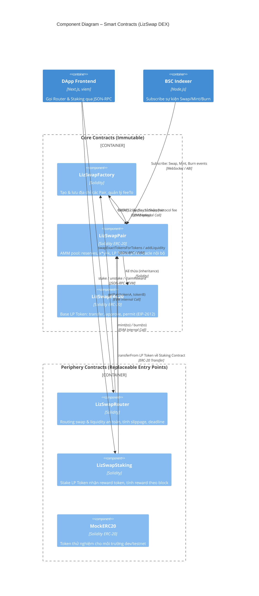
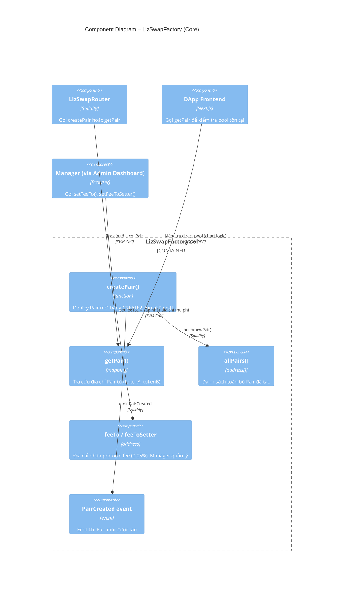
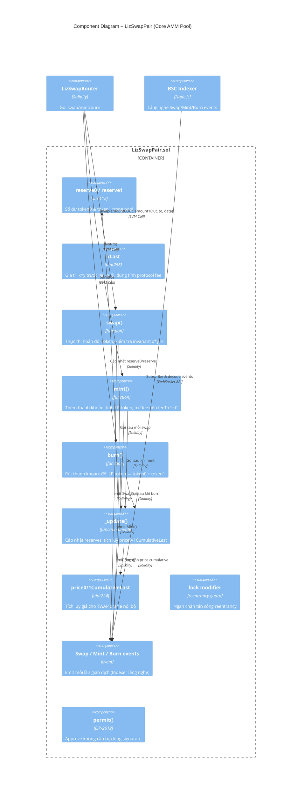
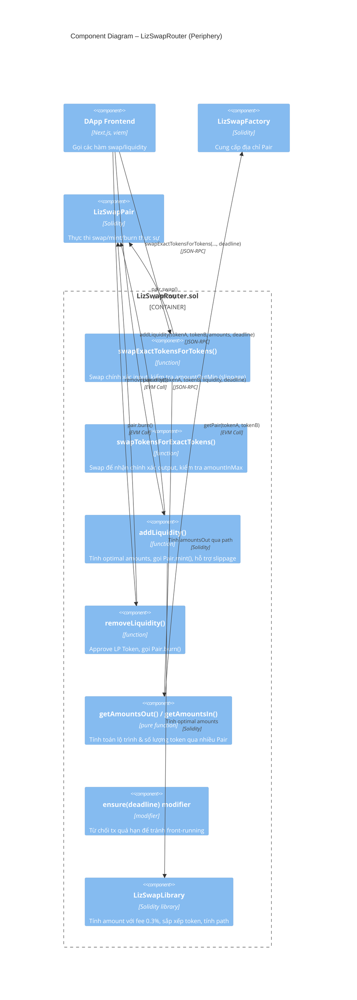
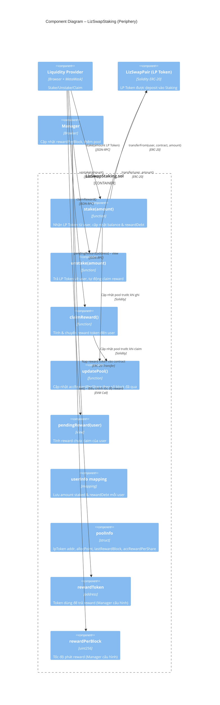

# C4 Level 3 – Component Diagram: Smart Contracts

## LizSwap Smart Contracts

Đây là thiết kế bên trong lớp **Smart Contracts** của LizSwap trên BSC,
theo mô hình **Uniswap V2** với sự tách biệt rõ ràng giữa **Core** và **Periphery**.  
Tất cả contracts được viết bằng **Solidity** và triển khai bằng **Foundry**.

---

## Kiến trúc tổng quan – Core vs Periphery

```
┌─────────────────────────────────────────────────────────────────────┐
│                         PERIPHERY (Entry Points)                    │
│   ┌──────────────────────────┐   ┌──────────────────────────────┐  │
│   │      Router Contract     │   │    LP Staking Contract       │  │
│   │  (LizSwapRouter.sol)     │   │    (LizSwapStaking.sol)      │  │
│   └────────────┬─────────────┘   └──────────────────────────────┘  │
└────────────────│────────────────────────────────────────────────────┘
                 │ EVM Call
┌────────────────▼────────────────────────────────────────────────────┐
│                           CORE (Immutable)                          │
│   ┌──────────────────────────┐   ┌──────────────────────────────┐  │
│   │    Factory Contract      │──▶│      Pair Contract           │  │
│   │  (LizSwapFactory.sol)    │   │    (LizSwapPair.sol)         │  │
│   └──────────────────────────┘   └──────────────────────────────┘  │
└─────────────────────────────────────────────────────────────────────┘
```

---

## Diagram 1 – Tổng thể Smart Contract Components



---

## Diagram 2 – Chi tiết LizSwapFactory



---

## Diagram 3 – Chi tiết LizSwapPair (AMM Core)



---

## Diagram 4 – Chi tiết LizSwapRouter (Periphery)



---

## Diagram 5 – Chi tiết LizSwapStaking (Periphery)



---

## Bảng tổng hợp Functions & Events

### LizSwapFactory
| Function / Event | Visibility | Mô tả |
|---|---|---|
| `createPair(tokenA, tokenB)` | external | Deploy Pair mới bằng CREATE2 |
| `getPair(tokenA, tokenB)` | external view | Tra cứu địa chỉ Pair |
| `allPairs(index)` | external view | Lấy Pair theo index |
| `allPairsLength()` | external view | Tổng số Pair |
| `setFeeTo(address)` | external | Manager only – địa chỉ nhận protocol fee |
| `setFeeToSetter(address)` | external | Chuyển quyền quản lý fee |
| `PairCreated(token0, token1, pair, uint)` | event | Emit khi tạo Pair mới |

### LizSwapPair
| Function / Event | Visibility | Mô tả |
|---|---|---|
| `swap(amount0Out, amount1Out, to, data)` | external lock | Thực thi swap với flash loan support |
| `mint(to)` | external lock | Add liquidity, nhận LP Token |
| `burn(to)` | external lock | Remove liquidity, đốt LP Token |
| `getReserves()` | external view | Trả về (reserve0, reserve1, blockTimestampLast) |
| `price0/1CumulativeLast` | public | Biến tích luỹ TWAP |
| `permit(owner, spender, value, deadline, v, r, s)` | external | EIP-2612 gasless approve |
| `Swap / Mint / Burn / Sync` | events | BSC Indexer subscribe |

### LizSwapRouter
| Function | Mô tả |
|---|---|
| `swapExactTokensForTokens()` | Swap theo exact input |
| `swapTokensForExactTokens()` | Swap theo exact output |
| `addLiquidity()` | Thêm thanh khoản |
| `removeLiquidity()` | Rút thanh khoản |
| `getAmountsOut() / getAmountsIn()` | Tính toán path & amounts |

### LizSwapStaking
| Function | Mô tả |
|---|---|
| `stake(uint256)` | Deposit LP Token |
| `unstake(uint256)` | Rút LP Token + claim reward |
| `claimReward()` | Claim reward token |
| `pendingReward(address)` | View reward chưa claim |
| `updatePool()` | Cập nhật accRewardPerShare |

---

## Ghi chú bảo mật

> [!IMPORTANT]
> **Reentrancy Guard**: Tất cả các hàm thay đổi state trong `LizSwapPair` phải dùng modifier `lock` để ngăn reentrancy attack.

> [!IMPORTANT]
> **Slippage & Deadline**: `LizSwapRouter` phải kiểm tra `amountOutMin`, `amountInMax` và `deadline` cho mỗi giao dịch để bảo vệ người dùng khỏi MEV/front-running.

> [!NOTE]
> **Protocol Fee**: Kích hoạt bằng cách set `feeTo != address(0)` trong Factory. Khi bật, 1/6 của 0.3% swap fee (~0.05%) được tích luỹ vào Pair và rút ra khi `mint/burn`.