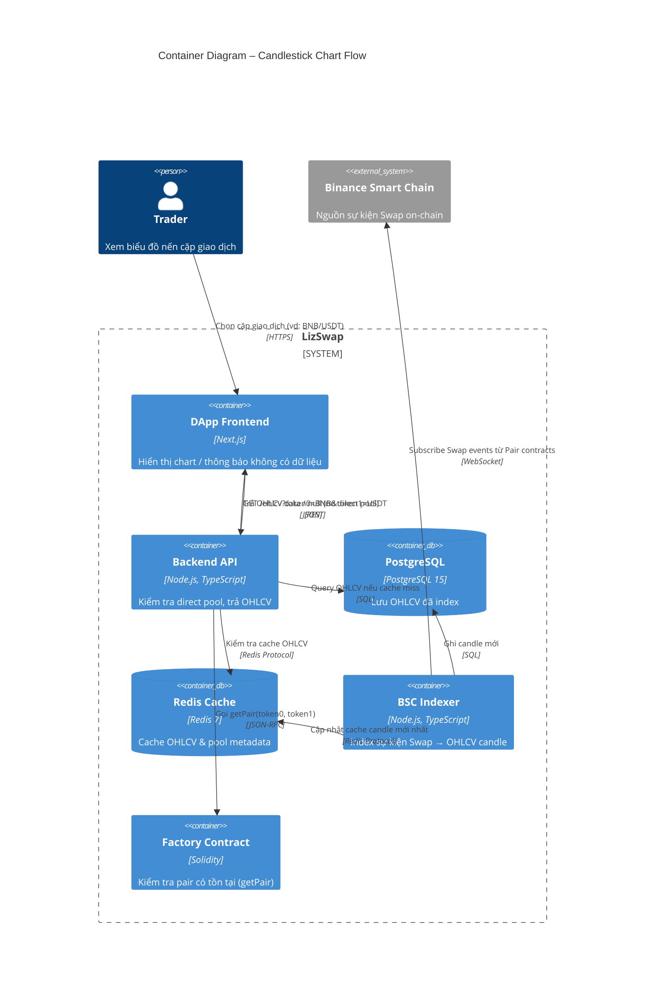

# C4 Level 2 – Container Diagram

## LizSwap DEX

Đây là cái nhìn chi tiết về các **containers** (ứng dụng/dịch vụ có thể triển khai độc lập)
bên trong hệ thống **LizSwap**, cách chúng giao tiếp với nhau và với các hệ thống bên ngoài.

---

## Containers tổng quan

| Container | Tech | Mô tả |
|---|---|---|
| DApp Frontend | Next.js + wagmi/viem | Giao diện người dùng: Swap, Pool, Stake, Chart |
| Admin Dashboard | Next.js | Giao diện quản trị dành cho Manager & Staff |
| Backend API | Node.js + TypeScript | REST/WebSocket API: xử lý logic nghiệp vụ off-chain |
| PostgreSQL | PostgreSQL | Lưu dữ liệu người dùng, OHLCV index, cấu hình hệ thống |
| Redis Cache | Redis | Cache giá token, dữ liệu pool realtime |
| BSC Indexer | Node.js + TypeScript | Lắng nghe sự kiện on-chain (Swap, Mint, Burn) → index OHLCV |
| Smart Contracts (Core) | Solidity / Foundry | Factory, Pair, Router – logic AMM on-chain |
| Smart Contracts (Periphery) | Solidity / Foundry | LP Staking Contract, Mock ERC-20 tokens |

---

## Diagram – Tổng thể

```mermaid
C4Container
  title Container Diagram – LizSwap DEX (BSC)

  Person(trader, "Trader", "Swap token, xem chart")
  Person(lp, "Liquidity Provider", "Add/Remove liquidity, Stake LP")
  Person(manager, "Manager", "Quản trị hệ thống & contract")
  Person(staff, "Staff", "Theo dõi hoạt động")

  System_Ext(metamask, "MetaMask", "Web3 Wallet – ký giao dịch")
  System_Ext(bsc, "Binance Smart Chain", "Mạng BSC – thực thi contract")
  System_Ext(ohlcvSource, "OHLCV Data Source", "Nguồn dữ liệu nến bên ngoài (fallback)")

  System_Boundary(lizswap, "LizSwap") {

    Container(frontend, "DApp Frontend", "Next.js, wagmi, viem", "Giao diện Swap, Pool, Stake, Candlestick Chart")
    Container(adminDash, "Admin Dashboard", "Next.js, REST", "Giao diện quản trị cho Manager & Staff")
    Container(backendApi, "Backend API", "Node.js, TypeScript, Express", "REST & WebSocket: giá token, OHLCV, pool stats, quản trị")
    ContainerDb(postgres, "PostgreSQL", "PostgreSQL 15", "Lưu OHLCV index, user sessions, cấu hình hệ thống")
    ContainerDb(redis, "Redis Cache", "Redis 7", "Cache giá token realtime, pool data, rate limiting")
    Container(indexer, "BSC Indexer", "Node.js, TypeScript, ethers/viem", "Index sự kiện Swap/Mint/Burn on-chain → OHLCV")

    Container_Boundary(contracts, "Smart Contracts (BSC)") {
      Container(factory, "Factory Contract", "Solidity, Foundry", "Quản lý danh sách Pair, tạo pool mới")
      Container(pair, "Pair Contract", "Solidity, Foundry", "AMM pool: giữ reserves, tính toán x*y=k, phát LP Token")
      Container(router, "Router Contract", "Solidity, Foundry", "Routing swap, add/remove liquidity an toàn")
      Container(staking, "LP Staking Contract", "Solidity, Foundry", "Stake LP Token để nhận phần thưởng")
    }
  }

  %% Trader & LP → Frontend
  Rel(trader, frontend, "Sử dụng DApp", "HTTPS")
  Rel(lp, frontend, "Quản lý thanh khoản & stake", "HTTPS")

  %% Manager & Staff → Admin Dashboard
  Rel(manager, adminDash, "Quản trị hệ thống", "HTTPS")
  Rel(staff, adminDash, "Theo dõi hoạt động", "HTTPS")

  %% Frontend → Wallet & On-chain read
  Rel(frontend, metamask, "Yêu cầu ký giao dịch", "EIP-1193")
  Rel(frontend, backendApi, "Lấy giá, OHLCV, pool stats", "REST / WebSocket")
  Rel(frontend, router, "Gọi swap/addLiquidity", "JSON-RPC qua viem")
  Rel(frontend, staking, "Stake / Unstake LP Token", "JSON-RPC qua viem")

  %% Admin → Backend
  Rel(adminDash, backendApi, "Gọi API quản trị", "REST / HTTPS")

  %% Backend → DB & Cache
  Rel(backendApi, postgres, "Đọc/ghi dữ liệu", "SQL")
  Rel(backendApi, redis, "Cache giá & pool data", "Redis Protocol")

  %% Backend → BSC read
  Rel(backendApi, bsc, "Đọc trạng thái pool on-chain", "JSON-RPC")

  %% Indexer pipeline
  Rel(indexer, bsc, "Subscribe sự kiện Swap/Mint/Burn", "WebSocket JSON-RPC")
  Rel(indexer, postgres, "Ghi OHLCV đã index", "SQL")
  Rel(indexer, redis, "Cập nhật cache giá realtime", "Redis Protocol")
  Rel(indexer, ohlcvSource, "Fallback dữ liệu nến nếu cần", "HTTP")

  %% MetaMask → BSC
  Rel(metamask, bsc, "Phát giao dịch đã ký", "JSON-RPC")

  %% Contract internal
  Rel(router, factory, "Tra cứu địa chỉ Pair", "EVM Call")
  Rel(router, pair, "Thực thi swap / liquidity", "EVM Call")
  Rel(pair, factory, "Xác nhận caller hợp lệ", "EVM Call")

  UpdateLayoutConfig($c4ShapeInRow="3", $c4BoundaryInRow="1")
```

---

## Diagram – Chi tiết luồng Candlestick Chart

---

## Ghi chú thiết kế

### Tách biệt Core – Periphery (theo Uniswap V2)
- **Core** (`Factory`, `Pair`): logic AMM thuần tuý, tối ưu gas, không nâng cấp được.
- **Periphery** (`Router`, `Staking`): entry point an toàn cho người dùng, có thể thay thế mà không ảnh hưởng Core.

### Candle Chart – Quy tắc hiển thị
| Trường hợp | Hành vi |
|---|---|
| Cặp có **direct pool** (vd: BNB/USDT) | Hiển thị biểu đồ nến từ OHLCV đã index |
| Cặp cần **routing nhiều pool** (vd: A/B qua BNB) | Hiển thị *"Không có dữ liệu chart"* |

### Phân quyền Admin
| Role | Quyền Frontend | Quyền Backend API | Quyền Contract |
|---|---|---|---|
| Manager | Toàn bộ | Toàn bộ (bao gồm `/admin`) | ✅ Có (setFee, pause…) |
| Staff | Dashboard only | Read-only monitoring | ❌ Không |