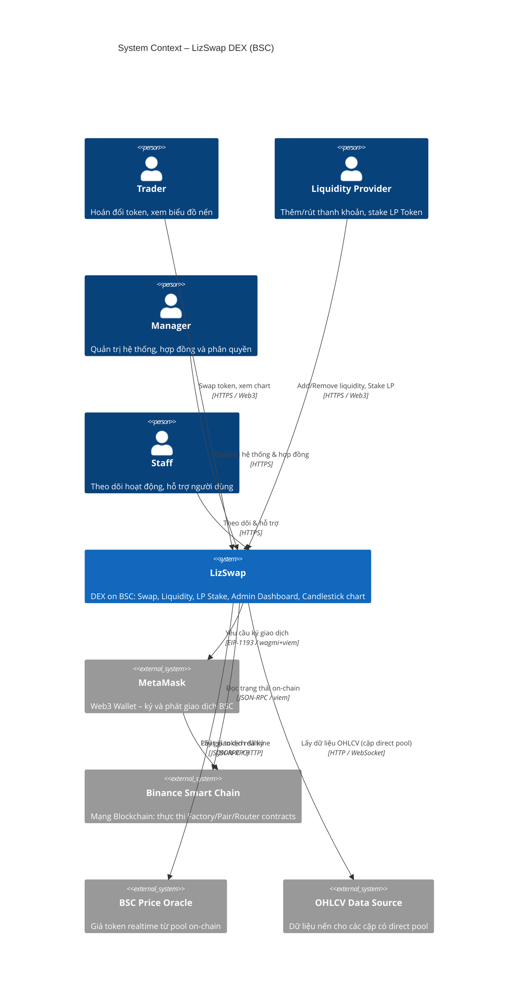

# C4 Level 1 – System Context Diagram

## LizSwap DEX

LizSwap là một Sàn giao dịch phi tập trung (DEX) triển khai trên **Binance Smart Chain (BSC)**,
sử dụng cơ chế **Automated Market Maker (AMM)** theo mô hình Uniswap V2.  
Người dùng có thể hoán đổi token ERC-20, cung cấp thanh khoản, stake LP Token,
và theo dõi biểu đồ nến realtime cho các cặp giao dịch có pool trực tiếp.

---

## Actors (Người dùng / Hệ thống ngoài)

| Actor | Loại | Mô tả |
|---|---|---|
| Trader | Người dùng | Hoán đổi token (Swap), xem biểu đồ giá |
| Liquidity Provider | Người dùng | Thêm/rút thanh khoản, nhận LP Token, stake LP |
| Manager | Người dùng nội bộ | Quản trị toàn bộ: cấu hình app, quản lý contract, phân quyền Staff |
| Staff | Người dùng nội bộ | Theo dõi hoạt động, hỗ trợ người dùng (không có quyền quản lý contract/cài đặt) |
| MetaMask | Hệ thống ngoài | Ví Web3, ký xác thực giao dịch on-chain |
| Binance Smart Chain | Hệ thống ngoài | Mạng Blockchain BSC – thực thi Smart Contract |
| BSC Price Oracle | Hệ thống ngoài | Cung cấp giá token on-chain (PancakeSwap / hệ thống pool nội bộ) |
| OHLCV Data Source | Hệ thống ngoài | Cung cấp dữ liệu nến lịch sử cho cặp có pool trực tiếp (tự index hoặc third-party) |

---

## Diagram

---

## Ghi chú thiết kế

- **Candle Chart Logic**: Chỉ hiển thị chart nến cho các cặp có **direct pool** (ví dụ: BNB/USDT).  
  Các cặp phải routing qua nhiều pool (ví dụ: ASP → BNB → JPY) sẽ hiển thị thông báo *"Không có dữ liệu chart"*.
- **Manager vs Staff**: Manager có toàn quyền (bao gồm gọi hàm admin trên Smart Contract).  
  Staff chỉ xem dashboard, không được thao tác contract hoặc thay đổi cấu hình hệ thống.