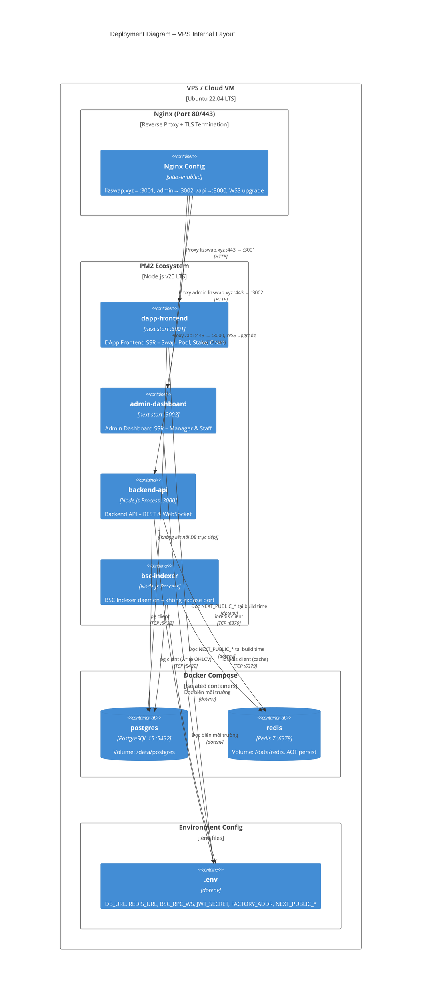

# C4 Level 4 – Deployment Diagram

## LizSwap DEX – Infrastructure Deployment

Sơ đồ triển khai mô tả cách các **containers** của LizSwap được ánh xạ lên **môi trường hạ tầng thực tế**.  
Kiến trúc này hướng đến **đồ án / môi trường production nhỏ**, không dùng CI/CD — deploy thủ công.

---

## Tổng quan môi trường triển khai

**Cloud / Hosting:**
- DApp Frontend → VPS (Next.js `next start`, PM2, Nginx serve)
- Admin Dashboard → VPS (Next.js `next start`, PM2, Nginx serve)
- Backend API → VPS (Ubuntu, PM2)
- BSC Indexer → VPS (Ubuntu, PM2, cùng server)
- PostgreSQL → VPS (Docker)
- Redis → VPS (Docker)
- Smart Contracts → Binance Smart Chain (BSC Mainnet hoặc BSC Testnet)

---

## Diagram 1 – Deployment Tổng thể

```mermaid
C4Deployment
  title Deployment Diagram – LizSwap DEX (Production)

  Deployment_Node(userBrowser, "User Browser", "Chrome / Firefox / Brave") {
    Container(dappFe, "DApp Frontend", "Next.js, wagmi, viem", "Giao diện Swap, Pool, Stake, Chart")
    Container(metamaskExt, "MetaMask Extension", "Browser Extension", "Ký và phát giao dịch BSC")
  }

  Deployment_Node(adminBrowser, "Admin Browser", "Chrome (Private)") {
    Container(adminFe, "Admin Dashboard", "Next.js", "Giao diện quản trị Manager & Staff")
  }

  Deployment_Node(vps, "VPS / Cloud VM", "Ubuntu 22.04 LTS, 4 vCPU / 8 GB RAM") {

    Deployment_Node(pm2Node, "PM2 Process Manager", "Node.js Runtime") {
      Container(dappApp, "dapp-frontend", "Next.js next start :3001", "Serve DApp Frontend SSR")
      Container(adminApp, "admin-dashboard", "Next.js next start :3002", "Serve Admin Dashboard SSR")
      Container(backendApi, "backend-api", "Node.js, TypeScript, Express :3000", "REST & WebSocket: giá, OHLCV, quản trị")
      Container(bscIndexer, "bsc-indexer", "Node.js, TypeScript, viem", "Daemon index Swap/Mint/Burn → OHLCV")
    }

    Deployment_Node(dockerNode, "Docker Engine", "Docker 24+") {
      ContainerDb(postgres, "PostgreSQL", "PostgreSQL 15 (Docker)", "Lưu ohlcv_candles, user_roles, system_config")
      ContainerDb(redis, "Redis", "Redis 7 (Docker)", "Cache giá token, pool stats, JWT blacklist")
    }

    Deployment_Node(nginxNode, "Nginx", "Reverse Proxy / TLS") {
      Container(nginxSvc, "Nginx", "sites-enabled", "lizswap.xyz → :3001, admin.lizswap.xyz → :3002, /api → :3000")
    }
  }

  Deployment_Node(bscNetwork, "Binance Smart Chain", "BSC Mainnet / Testnet") {
    Container(factoryContract, "LizSwapFactory", "Solidity, Foundry", "Tạo và lưu Pair contracts")
    Container(pairContract, "LizSwapPair", "Solidity, Foundry", "AMM pool: reserves, LP Token, x*y=k")
    Container(routerContract, "LizSwapRouter", "Solidity, Foundry", "Routing swap & liquidity")
    Container(stakingContract, "LizSwapStaking", "Solidity, Foundry", "Stake LP Token, nhận reward")
  }

  Deployment_Node(bscRpc, "BSC RPC Nodes", "QuickNode / Ankr / BSC Public RPC") {
    Container(rpcEndpoint, "JSON-RPC Endpoint", "HTTPS + WebSocket", "Kết nối BSC: eth_call, getLogs, watchEvent")
  }

  %% User → Nginx → Frontend apps on VPS
  Rel(userBrowser, nginxSvc, "https://lizswap.xyz", "HTTPS")
  Rel(adminBrowser, nginxSvc, "https://admin.lizswap.xyz", "HTTPS")
  Rel(nginxSvc, dappApp, "Proxy → :3001", "HTTP")
  Rel(nginxSvc, adminApp, "Proxy → :3002", "HTTP")

  %% Nginx → Backend
  Rel(nginxSvc, backendApi, "Proxy /api → :3000, WSS upgrade", "HTTP / WS")

  %% Served pages run in browser
  Rel(dappApp, dappFe, "Serve Next.js SSR bundle", "HTTP")
  Rel(adminApp, adminFe, "Serve Next.js SSR bundle", "HTTP")

  %% Frontend → MetaMask → BSC
  Rel(dappFe, metamaskExt, "Yêu cầu ký giao dịch", "EIP-1193")
  Rel(metamaskExt, rpcEndpoint, "Phát tx đã ký", "JSON-RPC HTTPS")

  %% Frontend → BSC read (direct)
  Rel(dappFe, rpcEndpoint, "readContract: getReserves, balanceOf", "JSON-RPC HTTPS")
  Rel(rpcEndpoint, bscNetwork, "Forward to BSC node", "P2P")

  %% Backend → DB
  Rel(backendApi, postgres, "SQL queries", "TCP :5432")
  Rel(backendApi, redis, "Cache operations", "TCP :6379")
  Rel(backendApi, rpcEndpoint, "eth_call: getPair, reserves", "JSON-RPC HTTPS")

  %% Indexer pipeline
  Rel(bscIndexer, rpcEndpoint, "Subscribe Swap/Mint/Burn events", "WebSocket WSS")
  Rel(bscIndexer, postgres, "INSERT ohlcv_candles", "TCP :5432")
  Rel(bscIndexer, redis, "SET latest candle cache", "TCP :6379")

  %% Contracts on BSC
  Rel(routerContract, factoryContract, "getPair()", "EVM Call")
  Rel(routerContract, pairContract, "swap / mint / burn", "EVM Call")
  Rel(stakingContract, pairContract, "LP Token transferFrom", "ERC-20")

  UpdateLayoutConfig($c4ShapeInRow="3", $c4BoundaryInRow="1")
```

---

## Diagram 2 – Deployment Chi tiết VPS



---

## Diagram 3 – Smart Contract Deployment (Foundry)

```mermaid
C4Deployment
  title Deployment Diagram – Smart Contracts (Foundry Deploy)

  Deployment_Node(devMachine, "Developer Machine", "Local / Windows WSL2") {
    Deployment_Node(foundryEnv, "Foundry Toolchain", "forge, cast, anvil") {
      Container(deployScript, "Deploy Script", "Solidity Script / forge script", "DeployAll.s.sol: deploy Factory → Pair → Router → Staking")
      Container(anvilLocal, "Anvil", "Local BSC Fork", "Môi trường test local fork BSC")
    }
  }

  Deployment_Node(bscTestnet, "BSC Testnet (Chain ID: 97)", "Binance Smart Chain Testnet") {
    Container(factoryT, "LizSwapFactory (Testnet)", "Solidity", "Địa chỉ testnet: 0xFactory...")
    Container(routerT, "LizSwapRouter (Testnet)", "Solidity", "Địa chỉ testnet: 0xRouter...")
    Container(stakingT, "LizSwapStaking (Testnet)", "Solidity", "Địa chỉ testnet: 0xStaking...")
    Container(mockTokens, "Mock ERC-20 Tokens", "Solidity", "WBNB, USDT, MockToken A/B... cho demo")
  }

  Deployment_Node(bscMainnet, "BSC Mainnet (Chain ID: 56)", "Binance Smart Chain Mainnet") {
    Container(factoryM, "LizSwapFactory (Mainnet)", "Solidity", "Địa chỉ mainnet: 0xFactory...")
    Container(routerM, "LizSwapRouter (Mainnet)", "Solidity", "Địa chỉ mainnet: 0xRouter...")
    Container(stakingM, "LizSwapStaking (Mainnet)", "Solidity", "Địa chỉ mainnet: 0xStaking...")
  }

  Deployment_Node(bscScan, "BscScan", "Block Explorer") {
    Container(verifyTool, "Contract Verification", "forge verify-contract", "Verify source code, ABI public")
  }

  Rel(deployScript, anvilLocal, "forge script --fork-url http://localhost:8545", "RPC")
  Rel(deployScript, bscTestnet, "forge script --rpc-url BSC_TESTNET --broadcast", "JSON-RPC HTTPS")
  Rel(deployScript, bscMainnet, "forge script --rpc-url BSC_MAINNET --broadcast", "JSON-RPC HTTPS")
  Rel(deployScript, verifyTool, "forge verify-contract --chain bsc", "API")
  Rel(factoryT, routerT, "getPair() reference", "EVM")
  Rel(factoryM, routerM, "getPair() reference", "EVM")

  UpdateLayoutConfig($c4ShapeInRow="3", $c4BoundaryInRow="1")
```

---

## Bảng ánh xạ Container → Infrastructure

| Container | Môi trường | Tech | Port / URL |
|---|---|---|---|
| DApp Frontend | VPS (PM2) | Next.js `next start` | `:3001` (internal) → `https://lizswap.xyz` |
| Admin Dashboard | VPS (PM2) | Next.js `next start` | `:3002` (internal) → `https://admin.lizswap.xyz` |
| Backend API | VPS (PM2) | Node.js | `:3000` (internal) → `/api/*` qua Nginx |
| WebSocket Gateway | VPS (PM2) | Node.js WS | `:3000` (internal) → `/ws` qua Nginx upgrade |
| BSC Indexer | VPS (PM2) | Node.js | Daemon, không expose port |
| PostgreSQL | VPS (Docker) | PostgreSQL 15 | `:5432` (internal only) |
| Redis | VPS (Docker) | Redis 7 | `:6379` (internal only) |
| Nginx | VPS | Nginx + Let's Encrypt | `:80` → redirect `:443` TLS |
| Smart Contracts | BSC Mainnet | Solidity | On-chain addresses |
| BSC RPC | External | QuickNode / Ankr | `https://` + `wss://` |

---

## Ghi chú triển khai

> [!IMPORTANT]
> **Nginx là entry point duy nhất**: PostgreSQL và Redis chỉ lắng nghe trên `localhost` (127.0.0.1). Backend API và Indexer **không được expose port ra ngoài** trực tiếp.

> [!IMPORTANT]
> **Smart Contract deploy thủ công (Foundry)**: Không có CI/CD. Developer dùng `forge script` để deploy. Sau khi deploy phải cập nhật địa chỉ contract vào `.env` của Backend và `src/constants/contracts.ts` của Frontend.

> [!NOTE]
> **BSC RPC**: Nên dùng **QuickNode** hoặc **Ankr** thay vì public RPC để đảm bảo tốc độ và ổn định khi subscribe WebSocket event. Public RPC có thể bị rate-limit và không ổn định cho Indexer.

> [!NOTE]
> **PM2 Ecosystem File**: Dùng `ecosystem.config.js` để quản lý cả `backend-api` và `bsc-indexer`. Đặt `autorestart: true` và `watch: false` cho cả 2 process.

> [!NOTE]
> **SSL/TLS**: Dùng **Let's Encrypt + Certbot** để cấp certificate miễn phí cho cả 2 domain: `lizswap.xyz` (DApp) và `admin.lizswap.xyz` (Admin). Nginx xử lý TLS termination cho toàn bộ traffic.

---

## Deploy Checklist (thủ công)

**Smart Contracts:**
- [ ] `forge build` – compile contracts
- [ ] `forge test` – chạy toàn bộ test suite
- [ ] `forge script DeployAll.s.sol --rpc-url BSC_TESTNET --broadcast` – deploy testnet
- [ ] `forge verify-contract` – verify trên BscScan
- [ ] Lưu địa chỉ contract vào `addresses.json` / `.env`

**Backend VPS:**
- [ ] Clone repo, `npm install`
- [ ] Tạo `.env` với `DB_URL`, `REDIS_URL`, `BSC_RPC_WS`, `FACTORY_ADDR`, `JWT_SECRET`
- [ ] `docker compose up -d postgres redis`
- [ ] `npm run migrate` – tạo schema database
- [ ] `pm2 start ecosystem.config.js`
- [ ] `pm2 save && pm2 startup`
- [ ] Cấu hình Nginx + Let's Encrypt

**Frontend (VPS – PM2):**
- [ ] Clone repo, `npm install` trong `apps/dapp` và `apps/admin`
- [ ] Tạo `.env.local` với `NEXT_PUBLIC_API_URL`, `NEXT_PUBLIC_WS_URL`, `NEXT_PUBLIC_FACTORY_ADDR`, `NEXT_PUBLIC_ROUTER_ADDR`
- [ ] `npm run build` trong từng app
- [ ] `pm2 start ecosystem.config.js` (bao gồm entry `dapp-frontend` và `admin-dashboard`)
- [ ] Cấu hình Nginx virtual host: `lizswap.xyz` → `:3001`, `admin.lizswap.xyz` → `:3002`
- [ ] `certbot --nginx -d lizswap.xyz -d admin.lizswap.xyz`
