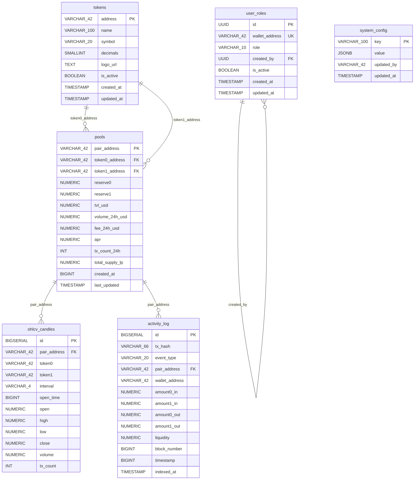

# LizSwap Database Schema

> **DBMS**: PostgreSQL 15
> **Runtime**: Docker container, volume mount `/data/postgres`
> **Connection**: `localhost:5432` (chỉ bind internal, không expose ra ngoài)
> **Client library**: `pg` (node-postgres) + TypeScript

---

## Mục lục

1. [Tổng quan](#tổng-quan)
2. [ER Diagram](#er-diagram)
3. [Bảng `tokens`](#bảng-tokens)
4. [Bảng `pools`](#bảng-pools)
5. [Bảng `ohlcv_candles`](#bảng-ohlcv_candles)
6. [Bảng `activity_log`](#bảng-activity_log)
7. [Bảng `user_roles`](#bảng-user_roles)
8. [Bảng `system_config`](#bảng-system_config)
9. [Migration Convention](#migration-convention)
10. [Ghi chú vận hành](#ghi-chú-vận-hành)

---

## Tổng quan

LizSwap sử dụng 6 bảng chính, phân theo chức năng:

| Nhóm | Bảng | Mô tả | Ghi bởi |
|---|---|---|---|
| **Market Data** | `tokens` | Metadata token (symbol, decimals, logo) | Indexer / Admin |
| **Market Data** | `pools` | Cache thông tin pool (TVL, volume, reserves) | Indexer |
| **Market Data** | `ohlcv_candles` | Dữ liệu nến OHLCV theo interval | Indexer |
| **Activity** | `activity_log` | Lịch sử giao dịch on-chain (Swap/Mint/Burn) | Indexer |
| **Auth & Admin** | `user_roles` | Phân quyền wallet → role (Manager/Staff) | Backend API |
| **Auth & Admin** | `system_config` | Cấu hình hệ thống dạng key-value | Backend API |

**Mapping với API endpoints** (chi tiết tại [rest-api.md](../api/rest-api.md)):

| Bảng | Endpoints đọc | Endpoints ghi |
|---|---|---|
| `tokens` | `GET /api/prices/:token` | — (Indexer tự ghi) |
| `pools` | `GET /api/pools`, `GET /api/pools/:pair/stats`, `GET /api/admin/stats` | — (Indexer tự ghi) |
| `ohlcv_candles` | `GET /api/ohlcv`, `GET /api/admin/stats` | — (Indexer tự ghi) |
| `activity_log` | `GET /api/admin/activity`, `GET /api/admin/stats` | — (Indexer tự ghi) |
| `user_roles` | `POST /api/auth/login`, `GET /api/admin/users` | `POST /api/admin/users`, `PUT /api/admin/users/:id/role`, `DELETE /api/admin/users/:id` |
| `system_config` | `GET /api/admin/config` | `PUT /api/admin/config` |

---

## ER Diagram



---

## Bảng `tokens`

Metadata token ERC-20 trên BSC. Dùng cho frontend hiển thị danh sách token (`TokenSelector`) và backend tính giá (`PriceService`).

### Schema

```sql
CREATE TABLE tokens (
    address         VARCHAR(42)     PRIMARY KEY,
    name            VARCHAR(100)    NOT NULL,
    symbol          VARCHAR(20)     NOT NULL,
    decimals        SMALLINT        NOT NULL DEFAULT 18,
    logo_url        TEXT,
    is_active       BOOLEAN         NOT NULL DEFAULT true,
    created_at      TIMESTAMP       NOT NULL DEFAULT NOW(),
    updated_at      TIMESTAMP       NOT NULL DEFAULT NOW()
);
```

### Columns

| Cột | Kiểu | Constraints | Mô tả |
|---|---|---|---|
| `address` | `VARCHAR(42)` | `PRIMARY KEY` | Địa chỉ contract token (checksum hoặc lowercase, bắt đầu `0x`) |
| `name` | `VARCHAR(100)` | `NOT NULL` | Tên đầy đủ: "Wrapped BNB", "Tether USD" |
| `symbol` | `VARCHAR(20)` | `NOT NULL` | Ký hiệu: "WBNB", "USDT", "BUSD" |
| `decimals` | `SMALLINT` | `NOT NULL DEFAULT 18` | Số chữ số thập phân (thường 18 trên BSC) |
| `logo_url` | `TEXT` | — | URL logo token (nullable, dùng hiển thị frontend) |
| `is_active` | `BOOLEAN` | `NOT NULL DEFAULT true` | `false` → token bị ẩn khỏi danh sách |
| `created_at` | `TIMESTAMP` | `NOT NULL DEFAULT NOW()` | Thời điểm thêm vào DB |
| `updated_at` | `TIMESTAMP` | `NOT NULL DEFAULT NOW()` | Thời điểm cập nhật cuối |

### Indexes

| Tên Index | Columns | Loại | Mô tả |
|---|---|---|---|
| `tokens_pkey` | `(address)` | B-tree, Unique (PK) | Tra cứu token theo address |
| `idx_tokens_symbol` | `(symbol)` | B-tree | Tìm kiếm theo symbol |
| `idx_tokens_is_active` | `(is_active)` | B-tree | Filter danh sách token active |

```sql
CREATE INDEX idx_tokens_symbol ON tokens (symbol);
CREATE INDEX idx_tokens_is_active ON tokens (is_active) WHERE is_active = true;
```

### Sample Data

| address | name | symbol | decimals | logo_url | is_active |
|---|---|---|---|---|---|
| `0xbb4CdB9CBd36B01bD1cBaEBF2De08d9173bc095c` | Wrapped BNB | WBNB | 18 | `https://assets.lizswap.xyz/tokens/wbnb.png` | true |
| `0x55d398326f99059fF775485246999027B3197955` | Tether USD | USDT | 18 | `https://assets.lizswap.xyz/tokens/usdt.png` | true |

---

## Bảng `pools`

Cache thông tin pool on-chain. BSC Indexer cập nhật định kỳ, Backend API chỉ đọc. Phục vụ `GET /api/pools` và `GET /api/pools/:pair/stats`.

### Schema

```sql
CREATE TABLE pools (
    pair_address    VARCHAR(42)     PRIMARY KEY,
    token0_address  VARCHAR(42)     NOT NULL REFERENCES tokens(address),
    token1_address  VARCHAR(42)     NOT NULL REFERENCES tokens(address),
    reserve0        NUMERIC(38,18)  NOT NULL DEFAULT 0,
    reserve1        NUMERIC(38,18)  NOT NULL DEFAULT 0,
    tvl_usd         NUMERIC(24,2)   NOT NULL DEFAULT 0,
    volume_24h_usd  NUMERIC(24,2)   NOT NULL DEFAULT 0,
    fee_24h_usd     NUMERIC(24,2)   NOT NULL DEFAULT 0,
    apr             NUMERIC(8,2)    NOT NULL DEFAULT 0,
    tx_count_24h    INT             NOT NULL DEFAULT 0,
    total_supply_lp NUMERIC(38,18)  NOT NULL DEFAULT 0,
    created_at      BIGINT          NOT NULL,
    last_updated    TIMESTAMP       NOT NULL DEFAULT NOW()
);
```

### Columns

| Cột | Kiểu | Constraints | Mô tả |
|---|---|---|---|
| `pair_address` | `VARCHAR(42)` | `PRIMARY KEY` | Địa chỉ Pair contract (CREATE2 bởi Factory) |
| `token0_address` | `VARCHAR(42)` | `NOT NULL`, `FK → tokens(address)` | Địa chỉ token0 |
| `token1_address` | `VARCHAR(42)` | `NOT NULL`, `FK → tokens(address)` | Địa chỉ token1 |
| `reserve0` | `NUMERIC(38,18)` | `NOT NULL DEFAULT 0` | Reserve token0 hiện tại (chuẩn hoá decimals) |
| `reserve1` | `NUMERIC(38,18)` | `NOT NULL DEFAULT 0` | Reserve token1 hiện tại |
| `tvl_usd` | `NUMERIC(24,2)` | `NOT NULL DEFAULT 0` | Total Value Locked (USD) |
| `volume_24h_usd` | `NUMERIC(24,2)` | `NOT NULL DEFAULT 0` | Khối lượng giao dịch 24h (USD) |
| `fee_24h_usd` | `NUMERIC(24,2)` | `NOT NULL DEFAULT 0` | Phí swap thu được 24h (USD) — 0.3% of volume |
| `apr` | `NUMERIC(8,2)` | `NOT NULL DEFAULT 0` | Annual Percentage Rate ước tính (%) |
| `tx_count_24h` | `INT` | `NOT NULL DEFAULT 0` | Số giao dịch trong 24h |
| `total_supply_lp` | `NUMERIC(38,18)` | `NOT NULL DEFAULT 0` | Tổng LP token supply |
| `created_at` | `BIGINT` | `NOT NULL` | Unix timestamp tạo pool (từ PairCreated event) |
| `last_updated` | `TIMESTAMP` | `NOT NULL DEFAULT NOW()` | Thời điểm Indexer cập nhật cuối |

### Indexes

| Tên Index | Columns | Loại | Mô tả |
|---|---|---|---|
| `pools_pkey` | `(pair_address)` | B-tree, Unique (PK) | Tra cứu pool theo address |
| `idx_pools_token0` | `(token0_address)` | B-tree | Tìm pool chứa token cụ thể |
| `idx_pools_token1` | `(token1_address)` | B-tree | Tìm pool chứa token cụ thể |
| `idx_pools_tvl` | `(tvl_usd DESC)` | B-tree | Sắp xếp pool theo TVL |

```sql
CREATE INDEX idx_pools_token0 ON pools (token0_address);
CREATE INDEX idx_pools_token1 ON pools (token1_address);
CREATE INDEX idx_pools_tvl ON pools (tvl_usd DESC);
```

### Sample Data

| pair_address | token0_address | token1_address | reserve0 | reserve1 | tvl_usd | volume_24h_usd | apr | tx_count_24h |
|---|---|---|---|---|---|---|---|---|
| `0xabc123...def456` | `0xbb4CdB...095c` | `0x55d398...7955` | 15000.123 | 4686038.50 | 9372077.00 | 1250000.00 | 42.50 | 3420 |
| `0xdef789...abc012` | `0xbb4CdB...095c` | `0xe9e7CE...3c27` | 8500.500 | 2656655.25 | 5313310.50 | 850000.00 | 38.20 | 2150 |

---

## Bảng `ohlcv_candles`

Dữ liệu nến OHLCV, index từ Swap events on-chain bởi BSC Indexer. Phục vụ `GET /api/ohlcv` (CandlestickChart) và `GET /api/admin/stats`.

### Schema

```sql
CREATE TABLE ohlcv_candles (
    id              BIGSERIAL       PRIMARY KEY,
    pair_address    VARCHAR(42)     NOT NULL,
    token0          VARCHAR(42)     NOT NULL,
    token1          VARCHAR(42)     NOT NULL,
    interval        VARCHAR(4)      NOT NULL,
    open_time       BIGINT          NOT NULL,
    open            NUMERIC(38,18)  NOT NULL,
    high            NUMERIC(38,18)  NOT NULL,
    low             NUMERIC(38,18)  NOT NULL,
    close           NUMERIC(38,18)  NOT NULL,
    volume          NUMERIC(38,18)  NOT NULL DEFAULT 0,
    tx_count        INT             NOT NULL DEFAULT 0,

    CONSTRAINT uq_candle UNIQUE (pair_address, interval, open_time)
);
```

### Columns

| Cột | Kiểu | Constraints | Mô tả |
|---|---|---|---|
| `id` | `BIGSERIAL` | `PRIMARY KEY` | Auto increment ID |
| `pair_address` | `VARCHAR(42)` | `NOT NULL` | Địa chỉ Pair contract |
| `token0` | `VARCHAR(42)` | `NOT NULL` | Địa chỉ token0 trong pair |
| `token1` | `VARCHAR(42)` | `NOT NULL` | Địa chỉ token1 trong pair |
| `interval` | `VARCHAR(4)` | `NOT NULL` | Khung thời gian: `1m`, `5m`, `1h`, `1d` |
| `open_time` | `BIGINT` | `NOT NULL` | Unix timestamp (seconds) mở nến |
| `open` | `NUMERIC(38,18)` | `NOT NULL` | Giá mở (token1/token0) |
| `high` | `NUMERIC(38,18)` | `NOT NULL` | Giá cao nhất trong interval |
| `low` | `NUMERIC(38,18)` | `NOT NULL` | Giá thấp nhất trong interval |
| `close` | `NUMERIC(38,18)` | `NOT NULL` | Giá đóng |
| `volume` | `NUMERIC(38,18)` | `NOT NULL DEFAULT 0` | Khối lượng giao dịch (tính theo token0) |
| `tx_count` | `INT` | `NOT NULL DEFAULT 0` | Số giao dịch swap trong nến |

### Indexes

| Tên Index | Columns | Loại | Mô tả |
|---|---|---|---|
| `ohlcv_candles_pkey` | `(id)` | B-tree, Unique (PK) | Primary key |
| `uq_candle` | `(pair_address, interval, open_time)` | B-tree, Unique | Tránh duplicate khi Indexer restart/replay |
| `idx_candles_query` | `(pair_address, interval, open_time)` | B-tree (composite) | Tối ưu query OHLCV theo pair + interval + time range |

```sql
-- Unique constraint đã tạo implicit unique index
-- Composite index cho query chính:
CREATE INDEX idx_candles_query ON ohlcv_candles (pair_address, interval, open_time);
```

> [!IMPORTANT]
> **Unique constraint** `(pair_address, interval, open_time)` là bắt buộc — tránh duplicate candle khi BSC Indexer restart hoặc replay events. Indexer nên dùng `INSERT ... ON CONFLICT DO UPDATE` (upsert).

### Sample Data

| id | pair_address | token0 | token1 | interval | open_time | open | high | low | close | volume | tx_count |
|---|---|---|---|---|---|---|---|---|---|---|---|
| 1 | `0xabc123...def456` | `0xbb4CdB...095c` | `0x55d398...7955` | `1h` | 1711926000 | 312.100000 | 313.500000 | 311.800000 | 312.450000 | 125.678000 | 42 |
| 2 | `0xabc123...def456` | `0xbb4CdB...095c` | `0x55d398...7955` | `1h` | 1711929600 | 312.450000 | 314.200000 | 312.000000 | 313.800000 | 98.234000 | 35 |

---

## Bảng `activity_log`

Lịch sử giao dịch on-chain: Swap, Mint (Add Liquidity), Burn (Remove Liquidity). BSC Indexer ghi, Admin Dashboard đọc qua `GET /api/admin/activity`.

### Schema

```sql
CREATE TABLE activity_log (
    id              BIGSERIAL       PRIMARY KEY,
    tx_hash         VARCHAR(66)     NOT NULL,
    event_type      VARCHAR(20)     NOT NULL,
    pair_address    VARCHAR(42)     NOT NULL,
    wallet_address  VARCHAR(42)     NOT NULL,
    amount0_in      NUMERIC(38,18)  DEFAULT 0,
    amount1_in      NUMERIC(38,18)  DEFAULT 0,
    amount0_out     NUMERIC(38,18)  DEFAULT 0,
    amount1_out     NUMERIC(38,18)  DEFAULT 0,
    liquidity       NUMERIC(38,18)  DEFAULT 0,
    block_number    BIGINT          NOT NULL,
    timestamp       BIGINT          NOT NULL,
    indexed_at      TIMESTAMP       NOT NULL DEFAULT NOW(),

    CONSTRAINT chk_event_type CHECK (event_type IN ('swap', 'mint', 'burn'))
);
```

### Columns

| Cột | Kiểu | Constraints | Mô tả |
|---|---|---|---|
| `id` | `BIGSERIAL` | `PRIMARY KEY` | Auto increment ID |
| `tx_hash` | `VARCHAR(66)` | `NOT NULL` | Transaction hash (66 ký tự: `0x` + 64 hex) |
| `event_type` | `VARCHAR(20)` | `NOT NULL`, `CHECK IN ('swap','mint','burn')` | Loại event: `swap`, `mint`, `burn` |
| `pair_address` | `VARCHAR(42)` | `NOT NULL` | Địa chỉ Pair contract đã emit event |
| `wallet_address` | `VARCHAR(42)` | `NOT NULL` | Địa chỉ ví thực hiện giao dịch (`sender` / `to`) |
| `amount0_in` | `NUMERIC(38,18)` | `DEFAULT 0` | Số lượng token0 đầu vào (Swap) |
| `amount1_in` | `NUMERIC(38,18)` | `DEFAULT 0` | Số lượng token1 đầu vào (Swap) |
| `amount0_out` | `NUMERIC(38,18)` | `DEFAULT 0` | Số lượng token0 đầu ra (Swap) / rút ra (Burn) |
| `amount1_out` | `NUMERIC(38,18)` | `DEFAULT 0` | Số lượng token1 đầu ra (Swap) / rút ra (Burn) |
| `liquidity` | `NUMERIC(38,18)` | `DEFAULT 0` | Số LP token mint (Mint) hoặc burn (Burn) |
| `block_number` | `BIGINT` | `NOT NULL` | Block number chứa transaction |
| `timestamp` | `BIGINT` | `NOT NULL` | Unix timestamp (seconds) của block |
| `indexed_at` | `TIMESTAMP` | `NOT NULL DEFAULT NOW()` | Thời điểm Indexer ghi vào DB |

### Indexes

| Tên Index | Columns | Loại | Mô tả |
|---|---|---|---|
| `activity_log_pkey` | `(id)` | B-tree, Unique (PK) | Primary key |
| `idx_activity_pair_time` | `(pair_address, timestamp DESC)` | B-tree | Filter theo pair + thời gian (Admin Dashboard) |
| `idx_activity_event_type` | `(event_type)` | B-tree | Filter theo loại event |
| `idx_activity_wallet` | `(wallet_address)` | B-tree | Tra cứu hoạt động theo ví |
| `idx_activity_tx_hash` | `(tx_hash)` | B-tree | Tra cứu theo transaction hash |
| `idx_activity_timestamp` | `(timestamp DESC)` | B-tree | Sắp xếp theo thời gian mới nhất |

```sql
CREATE INDEX idx_activity_pair_time ON activity_log (pair_address, timestamp DESC);
CREATE INDEX idx_activity_event_type ON activity_log (event_type);
CREATE INDEX idx_activity_wallet ON activity_log (wallet_address);
CREATE INDEX idx_activity_tx_hash ON activity_log (tx_hash);
CREATE INDEX idx_activity_timestamp ON activity_log (timestamp DESC);
```

### Cách sử dụng theo event_type

| event_type | Columns sử dụng | Mô tả |
|---|---|---|
| `swap` | `amount0_in`, `amount1_in`, `amount0_out`, `amount1_out` | Swap token: 1 cặp in/out khác 0 |
| `mint` | `amount0_out` (as amount0), `amount1_out` (as amount1), `liquidity` | Add Liquidity: nhận LP token |
| `burn` | `amount0_out`, `amount1_out`, `liquidity` | Remove Liquidity: burn LP → nhận token |

### Sample Data

**Swap event:**

| id | tx_hash | event_type | pair_address | wallet_address | amount0_in | amount1_in | amount0_out | amount1_out | liquidity | block_number | timestamp |
|---|---|---|---|---|---|---|---|---|---|---|---|
| 1 | `0xtxhash123...abc` | swap | `0xabc123...def456` | `0xuser1...addr` | 1.500000 | 0 | 0 | 468.675000 | 0 | 38500001 | 1711929600 |

**Mint event:**

| id | tx_hash | event_type | pair_address | wallet_address | amount0_in | amount1_in | amount0_out | amount1_out | liquidity | block_number | timestamp |
|---|---|---|---|---|---|---|---|---|---|---|---|
| 2 | `0xtxhash456...def` | mint | `0xabc123...def456` | `0xuser2...addr` | 0 | 0 | 10.000000 | 3124.500000 | 176.770000 | 38499990 | 1711929500 |

---

## Bảng `user_roles`

Phân quyền Admin Dashboard: wallet address → role (Manager/Staff). Phục vụ auth flow (`POST /api/auth/login`) và quản lý user (`/api/admin/users`).

### Schema

```sql
CREATE TYPE user_role AS ENUM ('manager', 'staff');

CREATE TABLE user_roles (
    id              UUID            PRIMARY KEY DEFAULT gen_random_uuid(),
    wallet_address  VARCHAR(42)     NOT NULL UNIQUE,
    role            user_role       NOT NULL DEFAULT 'staff',
    created_by      UUID            REFERENCES user_roles(id) ON DELETE SET NULL,
    is_active       BOOLEAN         NOT NULL DEFAULT true,
    created_at      TIMESTAMP       NOT NULL DEFAULT NOW(),
    updated_at      TIMESTAMP       NOT NULL DEFAULT NOW()
);
```

### Columns

| Cột | Kiểu | Constraints | Mô tả |
|---|---|---|---|
| `id` | `UUID` | `PRIMARY KEY`, `DEFAULT gen_random_uuid()` | ID duy nhất |
| `wallet_address` | `VARCHAR(42)` | `NOT NULL`, `UNIQUE` | Địa chỉ ví BSC (bắt đầu `0x`) |
| `role` | `user_role` (ENUM) | `NOT NULL DEFAULT 'staff'` | Role: `manager` hoặc `staff` |
| `created_by` | `UUID` | `FK → user_roles(id) ON DELETE SET NULL` | Manager đã tạo user này (nullable cho Manager đầu tiên) |
| `is_active` | `BOOLEAN` | `NOT NULL DEFAULT true` | `false` = tài khoản bị vô hiệu hoá (soft delete) |
| `created_at` | `TIMESTAMP` | `NOT NULL DEFAULT NOW()` | Thời điểm tạo |
| `updated_at` | `TIMESTAMP` | `NOT NULL DEFAULT NOW()` | Thời điểm cập nhật cuối (role change, deactivate) |

### Indexes

| Tên Index | Columns | Loại | Mô tả |
|---|---|---|---|
| `user_roles_pkey` | `(id)` | B-tree, Unique (PK) | Primary key |
| `user_roles_wallet_address_key` | `(wallet_address)` | B-tree, Unique | Tra cứu nhanh khi login (verify signature → tìm role) |
| `idx_user_roles_active` | `(is_active)` | B-tree (partial) | Filter user active |

```sql
-- Unique constraint trên wallet_address đã tạo implicit unique index
CREATE INDEX idx_user_roles_active ON user_roles (is_active) WHERE is_active = true;
```

### Sample Data

| id | wallet_address | role | created_by | is_active | created_at |
|---|---|---|---|---|---|
| `550e8400-e29b-41d4-a716-446655440000` | `0x1234567890abcdef1234567890abcdef12345678` | manager | NULL | true | 2026-04-01 00:00:00 |
| `550e8400-e29b-41d4-a716-446655440001` | `0xabcdefabcdefabcdefabcdefabcdefabcdefabcd` | staff | `550e8400-...-440000` | true | 2026-04-01 12:00:00 |

> [!NOTE]
> **Manager đầu tiên** được seed thủ công vào DB khi deploy. `created_by = NULL` vì không có Manager nào tạo trước đó.

---

## Bảng `system_config`

Cấu hình hệ thống dạng key-value. Manager cập nhật qua Admin Dashboard (`PUT /api/admin/config`). Cả Manager và Staff đều xem được (`GET /api/admin/config`).

### Schema

```sql
CREATE TABLE system_config (
    key             VARCHAR(100)    PRIMARY KEY,
    value           JSONB           NOT NULL,
    updated_by      VARCHAR(42)     NOT NULL,
    updated_at      TIMESTAMP       NOT NULL DEFAULT NOW()
);
```

### Columns

| Cột | Kiểu | Constraints | Mô tả |
|---|---|---|---|
| `key` | `VARCHAR(100)` | `PRIMARY KEY` | Tên config duy nhất |
| `value` | `JSONB` | `NOT NULL` | Giá trị config (linh hoạt: string, number, boolean, object) |
| `updated_by` | `VARCHAR(42)` | `NOT NULL` | Wallet address của Manager cập nhật cuối |
| `updated_at` | `TIMESTAMP` | `NOT NULL DEFAULT NOW()` | Thời điểm cập nhật cuối |

### Indexes

| Tên Index | Columns | Loại | Mô tả |
|---|---|---|---|
| `system_config_pkey` | `(key)` | B-tree, Unique (PK) | Tra cứu config theo key |

### Config Keys dự kiến

| Key | Value Type | Mô tả | Ví dụ |
|---|---|---|---|
| `protocol_fee_enabled` | boolean | Bật/tắt protocol fee (1/6 của 0.3%) | `true` |
| `fee_to_address` | string | Địa chỉ nhận protocol fee | `"0xfee0...1234"` |
| `reward_per_block` | string | Reward token phát cho mỗi block (Staking) | `"0.5"` |
| `indexer_poll_interval_ms` | number | Khoảng thời gian poll BSC (ms) | `2000` |
| `maintenance_mode` | boolean | Chế độ bảo trì hệ thống | `false` |

### Sample Data

| key | value | updated_by | updated_at |
|---|---|---|---|
| `protocol_fee_enabled` | `true` | `0x1234...5678` | 2026-04-01 06:00:00 |
| `reward_per_block` | `"0.5"` | `0x1234...5678` | 2026-04-01 06:00:00 |
| `fee_to_address` | `"0xfee0123...abc"` | `0x1234...5678` | 2026-04-01 06:00:00 |
| `indexer_poll_interval_ms` | `2000` | `0x1234...5678` | 2026-04-01 06:00:00 |

---

## Migration Convention

### Naming

Tên file migration theo format:

```
YYYYMMDDHHMMSS_description.sql
```

**Ví dụ:**

```
20260401000001_create_tokens.sql
20260401000002_create_pools.sql
20260401000003_create_ohlcv_candles.sql
20260401000004_create_activity_log.sql
20260401000005_create_user_roles.sql
20260401000006_create_system_config.sql
20260401000007_seed_initial_manager.sql
20260401000008_seed_default_config.sql
```

### Thư mục

```
packages/backend/
├── src/
│   └── db/
│       └── migrations/
│           ├── 20260401000001_create_tokens.sql
│           ├── 20260401000002_create_pools.sql
│           └── ...
```

### Quy tắc

1. **Mỗi migration là idempotent** — dùng `IF NOT EXISTS` cho `CREATE TABLE/INDEX`
2. **Không bao giờ sửa migration đã chạy** — tạo migration mới để thay đổi
3. **Seed data** (Manager đầu tiên, default config) tách riêng migration
4. **Rollback**: Mỗi migration nên có phần `-- DOWN` comment cho rollback thủ công

### Ví dụ migration

```sql
-- 20260401000001_create_tokens.sql
-- UP
CREATE TABLE IF NOT EXISTS tokens (
    address         VARCHAR(42)     PRIMARY KEY,
    name            VARCHAR(100)    NOT NULL,
    symbol          VARCHAR(20)     NOT NULL,
    decimals        SMALLINT        NOT NULL DEFAULT 18,
    logo_url        TEXT,
    is_active       BOOLEAN         NOT NULL DEFAULT true,
    created_at      TIMESTAMP       NOT NULL DEFAULT NOW(),
    updated_at      TIMESTAMP       NOT NULL DEFAULT NOW()
);

CREATE INDEX IF NOT EXISTS idx_tokens_symbol ON tokens (symbol);
CREATE INDEX IF NOT EXISTS idx_tokens_is_active ON tokens (is_active) WHERE is_active = true;

-- DOWN
-- DROP TABLE IF EXISTS tokens;
```

---

## Ghi chú vận hành

> [!IMPORTANT]
> **PostgreSQL chạy trong Docker**, chỉ bind `localhost:5432` — không expose port ra ngoài VPS. Data volume mount tại `/data/postgres` trên host.

> [!IMPORTANT]
> **Backup**: Nên thiết lập `pg_dump` cron job hàng ngày. Bảng `ohlcv_candles` và `activity_log` sẽ tăng nhanh — cân nhắc partition theo `open_time` / `timestamp` nếu vượt 100M rows.

> [!NOTE]
> **Indexer ghi, API đọc**: BSC Indexer là daemon riêng biệt ghi thẳng vào PostgreSQL (INSERT/UPDATE). Backend API chỉ đọc (SELECT) cho các bảng `tokens`, `pools`, `ohlcv_candles`, `activity_log`. Chỉ có `user_roles` và `system_config` là Backend API cần ghi.

> [!NOTE]
> **Redis bổ trợ**: Redis (port `6379`, bind localhost) dùng làm cache layer — không phải primary storage. Khi Redis down, Backend API fallback đọc trực tiếp từ PostgreSQL. Chi tiết cache keys xem tại [c4-components-backend.md](../architecture/c4-components-backend.md).

---

## Tham chiếu tài liệu

| Tài liệu | Mô tả |
|---|---|
| [AGENT.md — mục 5](../../AGENT.md) | Backend API endpoints tổng quan |
| [c4-components-backend.md](../architecture/c4-components-backend.md) | Component diagram, database schema gốc |
| [rest-api.md](../api/rest-api.md) | REST API Specification — response schemas mapping |
| [c4-deployment.md](../architecture/c4-deployment.md) | Hạ tầng Docker + PostgreSQL deployment |
