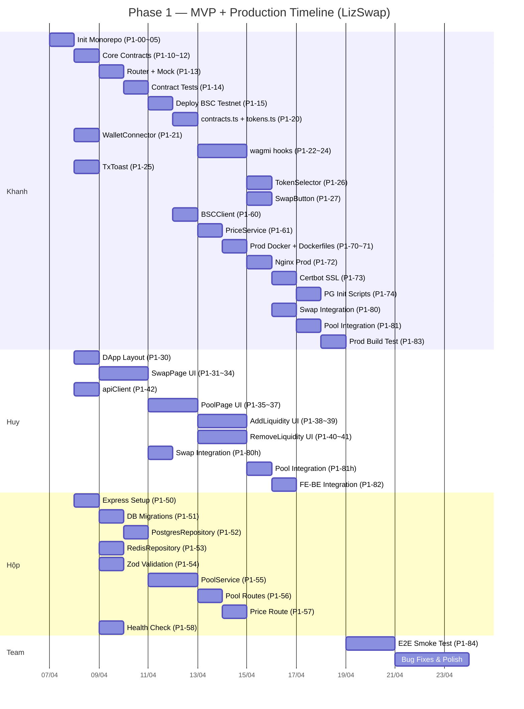

# Phase 1 — Sprint Plan

---

## Sprint 1 (Ngày 1–5): Foundation

| Người | Task chính |
|-------|-----------|
| **Khanh** | P1-00~05 (Init monorepo, 1 ngày) → P1-10~12 (Core contracts, 1 ngày) → P1-13 (Router, 0.5 ngày) → P1-14 (Tests, 1 ngày) → P1-15 (Deploy, 0.5 ngày) |
| **Huy** | (Đợi P1-00) → P1-30 (DApp layout, 1 ngày) → P1-31~34 (SwapPage UI, 2 ngày) → P1-42 (apiClient, 0.5 ngày) |
| **Hộp** | (Đợi P1-00) → P1-50 (Express setup, 1 ngày) → P1-51 (Migrations, 1 ngày) → P1-52 (PgRepo, 1 ngày) → P1-53 (RedisRepo, 1 ngày) |

---

## Sprint 2 (Ngày 6–10): Core Features

| Người | Task chính |
|-------|-----------|
| **Khanh** | P1-20 (contracts.ts, 0.5 ngày) → P1-21 (WalletConnector, 1 ngày) → P1-22~24 (wagmi hooks, 1.5 ngày) → P1-25 (TxToast, 0.5 ngày) → P1-26 (TokenSelector, 1 ngày) |
| **Huy** | P1-35~37 (PoolPage UI, 1.5 ngày) → P1-38~39 (AddLiquidity UI, 1.5 ngày) → P1-40~41 (RemoveLiquidity UI, 1.5 ngày) |
| **Hộp** | P1-54 (Zod, 0.5 ngày) → P1-55 (PoolService, 1.5 ngày) → P1-56 (Pool routes, 1 ngày) → P1-58 (Health check, 0.5 ngày) |

---

## Sprint 3 (Ngày 11–15): Backend On-chain + Production Infra + Integration

| Người | Task chính |
|-------|-----------|
| **Khanh** | P1-27 (SwapButton, 0.5 ngày) → P1-60 (BSCClient, 1 ngày) → P1-61 (PriceService, 1 ngày) → P1-70~71 (Prod Docker + Dockerfiles, 1 ngày) → P1-72 (Nginx, 0.5 ngày) |
| **Huy** | P1-80 (Swap integration, 0.5 ngày) → P1-81 (Pool integration, 0.5 ngày) → P1-82 (FE-BE integration, 1 ngày) → Buffer / UI polish |
| **Hộp** | P1-57 (Price route, 0.5 ngày) → P1-82 (FE-BE integration, 0.5 ngày) → Unit tests for services/routes (buffer) |

---

## Sprint 4 (Ngày 16–20): Production Deploy + QA

| Người | Task chính |
|-------|-----------|
| **Khanh** | P1-73 (Certbot SSL, 0.5 ngày) → P1-74 (PG init scripts, 0.5 ngày) → P1-83 (Prod build test, 0.5 ngày) → P1-80~81 (Swap/Pool integration, 1 ngày) → Bug fixes |
| **Huy** | UI polish → Responsive testing → Bug fixes |
| **Hộp** | Unit tests backend → Chuẩn bị migration Phase 2 → Bug fixes |
| **Team** | P1-84 (E2E smoke test dev + production mode, 1-2 ngày) → Code review → Merge to develop |

---

## Timeline Gantt Chart

---

## Risk Assessment

| Risk | Mức độ | Mitigation |
|------|--------|------------|
| Khanh là bottleneck (Init + Contracts + Hooks + Prod Infra) | 🔴 Cao | Ưu tiên Init ngày 1, contracts ngày 2-3. Prod Infra chạy song song Sprint 3-4 khi feature code ổn |
| ABI chưa export → Frontend bị block | 🟡 Trung bình | Khanh export ABI ngay sau `forge build`, không cần đợi deploy xong |
| Docker Compose không chạy trên máy thành viên | 🟡 Trung bình | Khanh test Docker trên cả 3 máy trước khi merge |
| Wagmi hooks bị bug khi test trên BSC Testnet | 🟡 Trung bình | Dùng Anvil local fork để test trước, chuyển Testnet sau |
| PoolService cần data on-chain nhưng BSCClient chưa sẵn sàng | 🟡 Trung bình | Hộp mock BSCClient interface, Khanh implement sau |
| 2 người cùng sửa `apiClient.ts` | 🟢 Thấp | Huy tạo file trước + export interface, Hộp chỉ review API contract |
| Production Docker build fail do multi-stage config | 🟡 Trung bình | Test production build local trước khi VPS. Dùng `docker compose --profile prod up` |
| Certbot SSL lần đầu cấu hình trên VPS | 🟡 Trung bình | Dùng Let's Encrypt staging trước, chuyển production sau. Script `init-letsencrypt.sh` có sẵn reference |
| Nginx proxy config sai → 502 Bad Gateway | 🟢 Thấp | Test Nginx config local bằng `nginx -t`, verify proxy upstream trước khi SSL |
