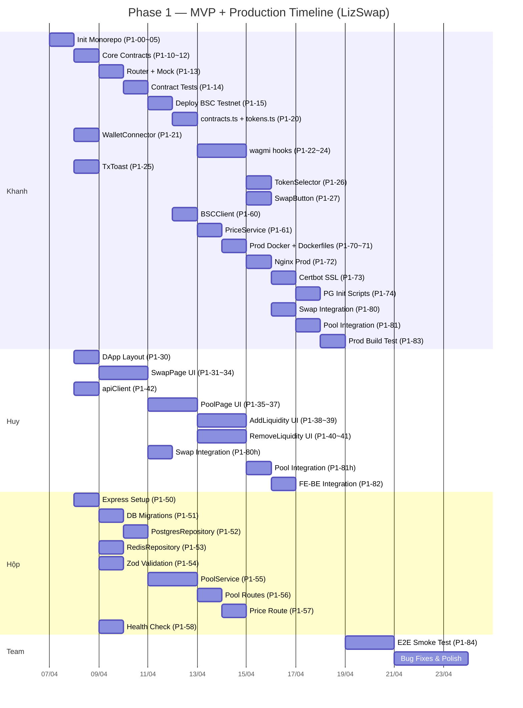

# 🔵 GIAI ĐOẠN 1 — MVP: Swap & Pool trên BSC Testnet + Production Ready

> **Mục tiêu**: DEX chạy được với chức năng **Swap token** và **Tạo/Quản lý Pool (Add/Remove Liquidity)** trên BSC Testnet, **sẵn sàng deploy production** trên VPS.
> **Thời gian ước tính**: ~4 tuần (4 Sprints × 1 tuần)

---

## Phạm vi Phase 1

**✅ Bao gồm:**
- Smart Contracts: Factory, Pair, ERC20, Router, MockERC20, Library, Math
- Frontend DApp: `/swap` (không chart), `/pool`, `/pool/add`, `/pool/remove`
- Backend API: `GET /api/prices/:token`, `GET /api/pools`, `GET /api/pools/:pair/stats`
- Shared: WalletConnector, TokenSelector, TxToast, contracts.ts, tokens.ts, apiClient.ts
- Infrastructure: Docker Compose dev mode **+ Production mode** (PostgreSQL + Redis)
- Database: Bảng `tokens`, `pools` (migration cơ bản)
- **Production Deployment**: Docker Compose prod, Dockerfiles (multi-stage build), Nginx reverse proxy, Certbot SSL, Init SQL scripts

**❌ KHÔNG bao gồm:**
- Candlestick Chart / OHLCV
- Staking (contract + frontend)
- Admin Dashboard (toàn bộ)
- BSC Indexer
- Auth system (JWT, wallet signature login)
- WebSocket realtime

---

## Bảng Phân Công Công Việc

### 🏗️ Nhóm 0: Khởi tạo Dự án (BLOCKING — Ưu tiên cao nhất)

> Tất cả task nhóm này do **Khanh** thực hiện. Huy và Hộp đợi nhóm này hoàn thành mới bắt đầu code.

| # | Task | Người thực hiện | Git Branch | Thời gian | Mô tả chi tiết | Dependencies | Deliverables | Tiêu chí hoàn thành |
|---|------|-----------------|------------|-----------|-----------------|-------------|-------------|---------------------|
| P1-00 | Init Monorepo + Git repo | Khanh | `feat/p1/khanh/init-monorepo` | 1 ngày | - Khởi tạo monorepo LizSwap với cấu trúc thư mục chuẩn theo `project-structure.md`<br>- Thư mục gốc chứa: `contracts/`, `apps/dapp/`, `apps/admin/`, `packages/backend/`, `packages/indexer/`, `infra/nginx/`, `infra/postgres/init/`, `infra/certbot/`<br>- Tạo Git repository, thiết lập nhánh `main` và `develop`<br>- Đặt nhánh `develop` làm default branch<br>- Tạo `README.md` mô tả tổng quan dự án, hướng dẫn cài đặt, và cách chạy dev mode | Không có (task đầu tiên) | - `README.md` mô tả dự án + hướng dẫn setup<br>- Toàn bộ cấu trúc thư mục monorepo: `contracts/`, `apps/dapp/`, `apps/admin/`, `packages/backend/`, `packages/indexer/`, `infra/nginx/`, `infra/postgres/init/`, `infra/certbot/`<br>- Git repository với nhánh `main` và `develop` | - `git clone` repo về máy thành công, cấu trúc thư mục khớp với `project-structure.md`<br>- Nhánh `develop` tồn tại và là default branch<br>- `README.md` có nội dung hướng dẫn cài đặt và chạy dự án |
| P1-01 | Setup Foundry project (`contracts/`) | Khanh | `feat/p1/khanh/init-monorepo` | (cùng P1-00) | - Khởi tạo Foundry project trong `contracts/` bằng `forge init`<br>- Cấu hình `foundry.toml`: Solidity version `>=0.8.19`, optimizer enabled, BSC chain config cho deploy<br>- Tạo `remappings.txt` cho import paths<br>- Thiết lập cấu trúc thư mục theo architecture: `src/core/`, `src/periphery/`, `src/interfaces/`, `src/libraries/`, `src/test-helpers/`, `test/core/`, `test/periphery/`, `test/integration/`, `script/`<br>- Tạo file placeholder `.gitkeep` trong mỗi thư mục trống | P1-00 (cùng branch) | - `contracts/foundry.toml` — Solidity >=0.8.19, optimizer 200 runs, BSC testnet/mainnet RPC config<br>- `contracts/remappings.txt`<br>- Cấu trúc thư mục: `src/core/`, `src/periphery/`, `src/interfaces/`, `src/libraries/`, `src/test-helpers/`, `test/core/`, `test/periphery/`, `test/integration/`, `script/` | - `cd contracts && forge build` chạy thành công (exit code 0)<br>- `forge test` chạy thành công (0 test, 0 failure)<br>- `foundry.toml` có cấu hình `solc_version`, `optimizer`, `evm_version`<br>- Tất cả thư mục `src/core/`, `src/periphery/`, `src/interfaces/`, `src/libraries/`, `test/core/`, `test/periphery/`, `test/integration/`, `script/` tồn tại |
| P1-02 | Init Next.js DApp (`apps/dapp/`) + shadcn/ui + Tailwind CSS + wagmi/viem config | Khanh | `feat/p1/khanh/init-monorepo` | (cùng P1-00) | - Khởi tạo Next.js 14+ App Router project trong `apps/dapp/` bằng `npx create-next-app@latest` (TypeScript, Tailwind CSS, App Router)<br>- Cài đặt và cấu hình shadcn/ui (`npx shadcn init`), tạo `components.json`<br>- Cài và cấu hình wagmi v2 + viem v2 cho BSC (Chain ID 97 testnet / 56 mainnet): tạo `src/lib/wagmi.ts` với WagmiConfig (connectors: MetaMask)<br>- Cấu hình `next.config.ts` cho standalone output (chuẩn bị Docker)<br>- Tạo các thư mục chuẩn theo project-structure: `src/app/swap/`, `src/app/pool/add/`, `src/app/pool/remove/`, `src/app/stake/`, `src/components/swap/`, `src/components/pool/`, `src/components/chart/`, `src/components/stake/`, `src/components/shared/`, `src/components/ui/`, `src/hooks/`, `src/lib/`, `src/constants/`<br>- Tạo `.env.local.example` chứa các biến: `NEXT_PUBLIC_API_URL`, `NEXT_PUBLIC_WS_URL`, `NEXT_PUBLIC_FACTORY_ADDR`, `NEXT_PUBLIC_ROUTER_ADDR`, `NEXT_PUBLIC_CHAIN_ID` | P1-00 (cùng branch) | - `apps/dapp/package.json` — Next.js 14+, wagmi v2, viem v2, tailwindcss, shadcn deps<br>- `apps/dapp/components.json` — shadcn/ui config<br>- `apps/dapp/tailwind.config.ts`<br>- `apps/dapp/next.config.ts` — standalone output<br>- `apps/dapp/tsconfig.json`<br>- `apps/dapp/src/lib/wagmi.ts` — WagmiConfig + MetaMask connector + BSC chain<br>- `apps/dapp/.env.local.example`<br>- Thư mục: `src/app/swap/`, `src/app/pool/add/`, `src/app/pool/remove/`, `src/components/swap/`, `src/components/pool/`, `src/components/chart/`, `src/components/shared/`, `src/components/ui/`, `src/hooks/`, `src/lib/`, `src/constants/` | - `cd apps/dapp && npm install` thành công, không có peer dependency conflict<br>- `npm run dev` khởi động dev server trên port 3001, truy cập `http://localhost:3001` hiện trang mặc định<br>- `npm run build` thành công (standalone output)<br>- `package.json` có dependencies: `next@14+`, `wagmi@2`, `viem@2`, `tailwindcss`<br>- `components.json` tồn tại với shadcn config hợp lệ<br>- `src/lib/wagmi.ts` export WagmiConfig với BSC chain và MetaMask connector<br>- Tất cả thư mục theo project-structure.md tồn tại |
| P1-03 | Init Express Backend boilerplate (`packages/backend/`) + tsconfig | Khanh | `feat/p1/khanh/init-monorepo` | (cùng P1-00) | - Khởi tạo Node.js + TypeScript project trong `packages/backend/`<br>- Cài đặt dependencies: `express`, `typescript`, `ts-node-dev` (dev), `pg`, `ioredis`, `zod`, `helmet`, `cors`, `express-rate-limit`, `jsonwebtoken`, `viem`, `socket.io`, `dotenv`<br>- Cấu hình `tsconfig.json`: target ES2022, module NodeNext, strict mode<br>- Tạo entry point `src/index.ts` chứa Express app boilerplate tối thiểu: listen port 3000, health check `GET /`, JSON body parser<br>- Tạo cấu trúc thư mục chuẩn theo project-structure: `src/routes/`, `src/routes/admin/`, `src/middleware/`, `src/services/`, `src/repositories/`, `src/clients/`, `src/websocket/`, `src/db/migrations/`<br>- Thêm npm scripts: `dev` (ts-node-dev hot reload), `build` (tsc), `start` (node dist) | P1-00 (cùng branch) | - `packages/backend/package.json` — express, pg, ioredis, zod, helmet, cors, express-rate-limit, jsonwebtoken, viem, socket.io, dotenv<br>- `packages/backend/tsconfig.json` — strict, ES2022, NodeNext<br>- `packages/backend/src/index.ts` — Express app boilerplate: listen :3000, JSON parser, health check `/`<br>- Thư mục: `src/routes/`, `src/routes/admin/`, `src/middleware/`, `src/services/`, `src/repositories/`, `src/clients/`, `src/websocket/`, `src/db/migrations/`<br>- npm scripts: `dev`, `build`, `start` | - `cd packages/backend && npm install` thành công<br>- `npm run dev` khởi động Express server trên port 3000, `curl http://localhost:3000/` trả về 200 OK<br>- `npm run build` compile TypeScript thành công, tạo thư mục `dist/`<br>- `tsconfig.json` có `strict: true`, target `ES2022`<br>- `package.json` chứa tất cả dependencies: `express`, `pg`, `ioredis`, `zod`, `helmet`, `cors`, `jsonwebtoken`, `viem`, `socket.io`<br>- Tất cả thư mục `src/routes/`, `src/middleware/`, `src/services/`, `src/repositories/`, `src/clients/`, `src/websocket/`, `src/db/migrations/` tồn tại |
| P1-04 | Docker Compose dev mode (`docker-compose.dev.yml`) + PostgreSQL + Redis containers | Khanh | `feat/p1/khanh/init-monorepo` | (cùng P1-00) | - Tạo/cập nhật `docker-compose.dev.yml` cho môi trường development<br>- Cấu hình **PostgreSQL 15**: service `lizswap-postgres-dev`, image `postgres:15-alpine`, port `5432:5432`, volume mount `lizswap-postgres-dev-data`, health check `pg_isready`<br>- Cấu hình **Redis 7**: service `lizswap-redis-dev`, image `redis:7-alpine`, port `6379:6379`, volume mount `lizswap-redis-dev-data`, health check `redis-cli ping`<br>- Tạo Docker network `lizswap-dev-network`<br>- Cấu hình env vars cho PostgreSQL: `POSTGRES_DB=lizswap_dev`, `POSTGRES_USER`, `POSTGRES_PASSWORD` (đọc từ `.env`)<br>- Đảm bảo containers có `restart: unless-stopped` và health checks theo `c4-deployment.md`<br>- **KHONG** chạy app containers (Backend/Frontend chạy native trên host với hot-reload) | P1-00 (cùng branch) | - `docker-compose.dev.yml` với 2 services:<br>&ensp;&ensp;- `lizswap-postgres-dev` — `postgres:15-alpine`<br>&ensp;&ensp;- `lizswap-redis-dev` — `redis:7-alpine`<br>- Docker network `lizswap-dev-network`<br>- Named volumes cho data persistence | - `docker compose -f docker-compose.dev.yml up -d` khởi động thành công, cả 2 containers running<br>- `docker compose ps` hiển thị cả 2 containers ở trạng thái `healthy`<br>- Kết nối PostgreSQL: `docker exec lizswap-postgres-dev pg_isready` trả về `accepting connections`<br>- Kết nối Redis: `docker exec lizswap-redis-dev redis-cli ping` trả về `PONG`<br>- Data persist sau khi `docker compose down && docker compose up` (volume không bị mất) |
| P1-05 | `.env.example`, `.gitignore`, `.dockerignore`, ESLint, Prettier config toàn monorepo | Khanh | `feat/p1/khanh/init-monorepo` | (cùng P1-00) | 1. **`.env.example`**: Template chứa tất cả biến môi trường theo `project-structure.md`:<br>&ensp;&ensp;- Backend/Indexer: `DB_URL`, `REDIS_URL`, `BSC_RPC_URL`, `BSC_RPC_WS`, `JWT_SECRET`, `FACTORY_ADDR`, `ROUTER_ADDR`, `STAKING_ADDR`<br>&ensp;&ensp;- Docker: `POSTGRES_DB`, `POSTGRES_USER`, `POSTGRES_PASSWORD`<br>&ensp;&ensp;- Frontend: ghi chú tham chiếu `apps/dapp/.env.local.example`<br>2. **`.gitignore`**: Ignore `node_modules/`, `dist/`, `.env`, `.env.local`, `contracts/out/`, `contracts/cache/`, `contracts/broadcast/`, Docker volumes, OS files<br>3. **`.dockerignore`**: Exclude `node_modules`, `.git`, `docs/`, `.env`, test files, `.agents/` khỏi Docker build context<br>4. **ESLint**: Cấu hình cho TypeScript (`@typescript-eslint`), tích hợp với Next.js (`eslint-config-next` trong `apps/dapp/`)<br>5. **Prettier**: `.prettierrc` thống nhất — singleQuote, trailingComma, printWidth 100, semi true | P1-00 (cùng branch) | - `.env.example` — tất cả biến môi trường cho Backend, Indexer, Docker, có comment mô tả từng biến<br>- `.gitignore` — ignore node_modules, dist, .env, contracts/out, contracts/cache, broadcast<br>- `.dockerignore` — exclude node_modules, .git, docs, test files<br>- `.prettierrc` — singleQuote, trailingComma all, printWidth 100<br>- ESLint config (`.eslintrc.json` hoặc `eslint.config.mjs`) — TypeScript rules | - `.env.example` chứa tất cả biến: `DB_URL`, `REDIS_URL`, `BSC_RPC_URL`, `BSC_RPC_WS`, `JWT_SECRET`, `FACTORY_ADDR`, `ROUTER_ADDR`, `STAKING_ADDR`, `POSTGRES_DB`, `POSTGRES_USER`, `POSTGRES_PASSWORD` — mỗi biến có comment mô tả<br>- `cp .env.example .env` rồi `docker compose -f docker-compose.dev.yml up -d` chạy được (env vars hợp lệ)<br>- `.gitignore` hoạt động đúng: file `.env` không bị Git track<br>- `.dockerignore` tồn tại, chứa `node_modules`, `.git`, `docs/`<br>- `.prettierrc` tồn tại với cấu hình chuẩn<br>- ESLint config tồn tại, `npx eslint --version` chạy được |

---

### ⛓️ Nhóm 1: Smart Contracts (Khanh)

| # | Task | Người thực hiện | Git Branch | Thời gian | Mô tả chi tiết | Dependencies | Deliverables | Tiêu chí hoàn thành |
|---|------|-----------------|------------|-----------|-----------------|-------------|-------------|---------------------|
| P1-10 | Viết Core Contracts: `LizSwapERC20.sol`, `LizSwapFactory.sol`, `LizSwapPair.sol` | Khanh | `feat/p1/khanh/smart-contracts-core` | 1 ngày | Triển khai 3 Core Contracts theo mô hình Uniswap V2 trong `contracts/src/core/` (theo `project-structure.md`). Solidity version `>=0.8.19`, sử dụng Foundry (theo `techstack.md`).<br>1. **`LizSwapERC20.sol`**: Base LP Token kế thừa ERC-20 chuẩn, bao gồm `transfer`, `approve`, `permit` (EIP-2612 gasless approve với signature `v, r, s`), biến `DOMAIN_SEPARATOR` và `PERMIT_TYPEHASH`<br>2. **`LizSwapFactory.sol`**: Quản lý danh sách Pair — hàm `createPair(tokenA, tokenB)` deploy Pair mới bằng CREATE2, mapping `getPair(tokenA, tokenB)`, mảng `allPairs[]`, hàm `allPairsLength()`, biến `feeTo` / `feeToSetter` cho protocol fee, hàm `setFeeTo()` và `setFeeToSetter()` (chỉ `feeToSetter` gọi được), event `PairCreated(token0, token1, pair, allPairsLength)`<br>3. **`LizSwapPair.sol`**: AMM pool kế thừa `LizSwapERC20`:<br>&ensp;&ensp;- Biến `reserve0`, `reserve1` (uint112), `kLast` (uint256), `price0CumulativeLast`, `price1CumulativeLast` (uint224 cho TWAP oracle nội bộ)<br>&ensp;&ensp;- Hàm `mint(to)` (add liquidity, tính LP token, mintFee nếu `feeTo != address(0)`), `burn(to)` (remove liquidity, đốt LP token), `swap(amount0Out, amount1Out, to, data)` (kiểm tra invariant x*y=k sau swap, hỗ trợ flash loan), `getReserves()` (trả reserve0, reserve1, blockTimestampLast)<br>&ensp;&ensp;- Hàm private `_update()` (cập nhật reserves, tích luỹ price cumulative)<br>&ensp;&ensp;- Modifier `lock` (reentrancy guard) cho `mint`, `burn`, `swap`<br>&ensp;&ensp;- Events `Swap`, `Mint`, `Burn`, `Sync` (theo `c4-components-smart-contracts.md`) | P1-00 merged | - `contracts/src/core/LizSwapERC20.sol` — Base LP Token: ERC-20 + EIP-2612 permit<br>- `contracts/src/core/LizSwapFactory.sol` — createPair (CREATE2), getPair, allPairs, feeTo/feeToSetter, event PairCreated<br>- `contracts/src/core/LizSwapPair.sol` — AMM pool: reserves, x*y=k, mint/burn/swap, lock modifier, price cumulative, events Swap/Mint/Burn/Sync | - `forge build` compile thành công, 0 errors, 0 warnings<br>- `LizSwapFactory.createPair()` deploy Pair mới bằng CREATE2, `getPair(tokenA, tokenB)` trả đúng địa chỉ<br>- `LizSwapPair` kế thừa `LizSwapERC20`, có `permit()` hoạt động (EIP-2612)<br>- `LizSwapPair.swap()` kiểm tra invariant: `balance0 * balance1 >= reserve0 * reserve1` sau swap<br>- Modifier `lock` ngăn reentrancy trên `mint`, `burn`, `swap`<br>- `LizSwapPair.getReserves()` trả về `(reserve0, reserve1, blockTimestampLast)` đúng sau mỗi `_update()` |
| P1-11 | Viết Libraries: `LizSwapLibrary.sol`, `Math.sol` | Khanh | `feat/p1/khanh/smart-contracts-core` | (cùng P1-10) | Triển khai 2 thư viện Solidity trong `contracts/src/libraries/` (theo `project-structure.md`).<br>1. **`LizSwapLibrary.sol`**: Thư viện tính toán AMM:<br>&ensp;&ensp;- `sortTokens(tokenA, tokenB)` sắp xếp token theo thứ tự address<br>&ensp;&ensp;- `pairFor(factory, tokenA, tokenB)` tính địa chỉ Pair bằng CREATE2 hash<br>&ensp;&ensp;- `getReserves(factory, tokenA, tokenB)` lấy reserves đã sắp xếp<br>&ensp;&ensp;- `quote(amountA, reserveA, reserveB)` tính tỷ lệ<br>&ensp;&ensp;- `getAmountOut(amountIn, reserveIn, reserveOut)` tính output amount với fee 0.3%<br>&ensp;&ensp;- `getAmountIn(amountOut, reserveIn, reserveOut)` tính input amount ngược<br>&ensp;&ensp;- `getAmountsOut(factory, amountIn, path)` tính toán qua path nhiều Pair<br>&ensp;&ensp;- `getAmountsIn(factory, amountOut, path)` tương tự chiều ngược<br>2. **`Math.sol`**: Hàm `sqrt(uint y)` tính căn bậc hai (dùng cho `mint()` tính LP token khởi tạo), hàm `min(uint x, uint y)` trả giá trị nhỏ hơn<br>- Tham chiếu: `c4-components-smart-contracts.md` — mục LizSwapRouter sử dụng `LizSwapLibrary` | P1-10 (cùng branch) | - `contracts/src/libraries/LizSwapLibrary.sol` — sortTokens, pairFor (CREATE2 hash), getReserves, quote, getAmountOut (fee 0.3%), getAmountIn, getAmountsOut, getAmountsIn<br>- `contracts/src/libraries/Math.sol` — sqrt, min | - `forge build` compile `LizSwapLibrary.sol` va `Math.sol` thành công<br>- `LizSwapLibrary.getAmountOut()` tính đúng: với amountIn=1000, reserveIn=10000, reserveOut=10000, output approx 906 (trừ 0.3% fee)<br>- `LizSwapLibrary.sortTokens()` luôn trả token0 < token1<br>- `Math.sqrt()` trả đúng kết quả: sqrt(4) = 2, sqrt(10000) = 100 |
| P1-12 | Viết Interfaces: `ILizSwapFactory.sol`, `ILizSwapPair.sol`, `ILizSwapRouter.sol` | Khanh | `feat/p1/khanh/smart-contracts-core` | (cùng P1-10) | Định nghĩa 3 interface Solidity trong `contracts/src/interfaces/` (theo `project-structure.md`).<br>1. **`ILizSwapFactory.sol`**: Interface cho Factory — `createPair(address, address)`, `getPair(address, address)`, `allPairs(uint)`, `allPairsLength()`, `feeTo()`, `feeToSetter()`, `setFeeTo(address)`, `setFeeToSetter(address)`, event `PairCreated`<br>2. **`ILizSwapPair.sol`**: Interface cho Pair — `mint(address)`, `burn(address)`, `swap(uint, uint, address, bytes)`, `getReserves()`, `token0()`, `token1()`, `price0CumulativeLast()`, `price1CumulativeLast()`, `kLast()`, `permit(...)`, events `Swap`, `Mint`, `Burn`, `Sync`. Kế thừa IERC20<br>3. **`ILizSwapRouter.sol`**: Interface cho Router — `factory()`, `swapExactTokensForTokens(...)`, `swapTokensForExactTokens(...)`, `addLiquidity(...)`, `removeLiquidity(...)`, `getAmountsOut(...)`, `getAmountsIn(...)`<br>- Tham chiếu: `c4-components-smart-contracts.md` — bảng tổng hợp Functions & Events | P1-10 (cùng branch) | - `contracts/src/interfaces/ILizSwapFactory.sol` — interface Factory: createPair, getPair, allPairs, feeTo, setFeeTo, event PairCreated<br>- `contracts/src/interfaces/ILizSwapPair.sol` — interface Pair: mint, burn, swap, getReserves, permit, events Swap/Mint/Burn/Sync<br>- `contracts/src/interfaces/ILizSwapRouter.sol` — interface Router: swapExactTokensForTokens, addLiquidity, removeLiquidity, getAmountsOut | - `forge build` compile tất cả 3 interfaces thành công<br>- `LizSwapFactory` implement đầy đủ `ILizSwapFactory`<br>- `LizSwapPair` implement đầy đủ `ILizSwapPair`<br>- Không có hàm nào trong interface bị thiếu trong implementation |
| P1-13 | Viết Periphery: `LizSwapRouter.sol`, `MockERC20.sol` | Khanh | `feat/p1/khanh/smart-contracts-periphery` | 0.5 ngày | Triển khai Periphery contracts trong `contracts/src/periphery/` (theo `project-structure.md`).<br>1. **`LizSwapRouter.sol`**: Entry point an toàn cho user:<br>&ensp;&ensp;- Constructor nhận `factory` address<br>&ensp;&ensp;- Modifier `ensure(deadline)` từ chối tx quá hạn (chống MEV front-running)<br>&ensp;&ensp;- Hàm `addLiquidity(tokenA, tokenB, amountADesired, amountBDesired, amountAMin, amountBMin, to, deadline)` tính optimal amounts bằng `LizSwapLibrary`, gọi `Pair.mint()`<br>&ensp;&ensp;- Hàm `removeLiquidity(...)` approve LP token, gọi `Pair.burn()`<br>&ensp;&ensp;- Hàm `swapExactTokensForTokens(amountIn, amountOutMin, path, to, deadline)` kiểm tra slippage `amountOutMin`<br>&ensp;&ensp;- Hàm `swapTokensForExactTokens(amountOut, amountInMax, path, to, deadline)` kiểm tra `amountInMax`<br>&ensp;&ensp;- Hàm pure `getAmountsOut()` / `getAmountsIn()` delegate sang `LizSwapLibrary`<br>&ensp;&ensp;- Router tham chiếu Factory qua `getPair()` để tìm Pair address. Theo `c4-components-smart-contracts.md` diagram 4<br>2. **`MockERC20.sol`**: Token thử nghiệm trong `contracts/src/test-helpers/` — ERC-20 đơn giản với `mint(address to, uint256 amount)` public (không giới hạn), constructor nhận `name`, `symbol`, `decimals`. Dùng cho dev/testnet demo | P1-10 merged | - `contracts/src/periphery/LizSwapRouter.sol` — addLiquidity, removeLiquidity, swapExactTokensForTokens, swapTokensForExactTokens, getAmountsOut/In, ensure(deadline) modifier<br>- `contracts/src/test-helpers/MockERC20.sol` — ERC-20 test token: constructor(name, symbol, decimals), public mint() | - `forge build` compile Router va MockERC20 thành công<br>- Router.swapExactTokensForTokens() revert khi `amountOut < amountOutMin` (slippage protection)<br>- Router.swapTokensForExactTokens() revert khi `amountIn > amountInMax`<br>- Router.addLiquidity() revert khi `block.timestamp > deadline` (ensure modifier)<br>- Router.removeLiquidity() trả đúng token0 + token1 khi burn LP<br>- MockERC20 có thể mint token tự do, `balanceOf` cập nhật đúng sau mint |
| P1-14 | Viết Foundry tests: `Factory.t.sol`, `Pair.t.sol`, `Router.t.sol`, `SwapFlow.t.sol` | Khanh | `feat/p1/khanh/smart-contracts-tests` | 1 ngày | Viết Foundry test suite trong `contracts/test/` (theo `project-structure.md` va `test-strategy.md`). Coverage target: Core >= 90%, Periphery >= 80%.<br>1. **`contracts/test/core/Factory.t.sol`**: Test `createPair()` deploy Pair mới dung CREATE2, test `getPair()` tra cứu đúng, test `createPair` revert khi pair đã tồn tại hoặc 2 token trùng, test `setFeeTo()` / `setFeeToSetter()` chỉ `feeToSetter` gọi được, test event `PairCreated` emit đúng<br>2. **`contracts/test/core/Pair.t.sol`**:<br>&ensp;&ensp;- Test AMM logic `mint()` — thêm liquidity lần đầu (trừ MINIMUM_LIQUIDITY), thêm lần 2 tính LP proportional<br>&ensp;&ensp;- Test `burn()` — rút liquidity trả đúng token, đốt LP<br>&ensp;&ensp;- Test `swap()` — kiểm tra invariant x*y=k luôn tăng/giữ nguyên sau swap, test fee 0.3%<br>&ensp;&ensp;- Test reentrancy guard (lock modifier)<br>&ensp;&ensp;- Test `permit()` EIP-2612<br>&ensp;&ensp;- Test protocol fee khi `feeTo != address(0)` (1/6 của 0.3% ~ 0.05%)<br>3. **`contracts/test/periphery/Router.t.sol`**: Test slippage protection (`amountOutMin`, `amountInMax`), test deadline (revert khi quá hạn), test `addLiquidity` / `removeLiquidity` qua Router, test routing path nhiều Pair<br>4. **`contracts/test/integration/SwapFlow.t.sol`**: Integration test E2E: deploy Factory → deploy MockERC20 tokens → Router.addLiquidity → Router.swapExactTokensForTokens → Router.removeLiquidity, verify reserves va balances xuyên suốt<br>- Tham chiếu: `test-strategy.md` mục Smart Contract Tests | P1-13 merged | - `contracts/test/core/Factory.t.sol` — unit tests: createPair, getPair, setFeeTo, event PairCreated<br>- `contracts/test/core/Pair.t.sol` — unit tests: mint (initial + subsequent), burn, swap (invariant x*y=k), reentrancy guard, permit EIP-2612, protocol fee<br>- `contracts/test/periphery/Router.t.sol` — unit tests: slippage protection, deadline, addLiquidity, removeLiquidity, routing path<br>- `contracts/test/integration/SwapFlow.t.sol` — E2E: deploy → createPair → addLiquidity → swap → removeLiquidity | - `forge test` chạy thành công, tất cả test cases PASS<br>- `forge test --gas-report` hiển thị gas report cho từng hàm<br>- Coverage Core contracts (Factory + Pair) >= 90% khi chạy `forge coverage`<br>- Coverage Periphery (Router) >= 80%<br>- Test swap invariant: sau mỗi swap, `reserve0 * reserve1 >= k_before`<br>- Test reentrancy: gọi swap/mint/burn lồng nhau phải revert<br>- Test slippage: swap revert khi output < amountOutMin<br>- Test deadline: tx revert khi block.timestamp > deadline<br>- SwapFlow.t.sol E2E pass: deploy → addLiquidity → swap → removeLiquidity xuyên suốt |
| P1-15 | Deploy script (`DeployAll.s.sol`) + Deploy lên BSC Testnet + Export ABI & addresses | Khanh | `feat/p1/khanh/smart-contracts-deploy` | 0.5 ngày | Viết Foundry deploy script va thực hiện deploy lên BSC Testnet (Chain ID 97).<br>1. **`contracts/script/DeployAll.s.sol`**: Script Solidity dùng `forge script` — deploy theo thứ tự:<br>&ensp;&ensp;- Deploy `LizSwapFactory(feeToSetter)`<br>&ensp;&ensp;- Deploy `LizSwapRouter(factory)`<br>&ensp;&ensp;- Deploy MockERC20 tokens (WBNB mock, USDT mock, 2-3 test tokens với decimals 18)<br>&ensp;&ensp;- Gọi `Factory.createPair()` tạo pool mẫu (WBNB/USDT)<br>&ensp;&ensp;- Log tất cả addresses deploy ra console<br>&ensp;&ensp;- Script dùng `vm.broadcast()` / `vm.startBroadcast()` cho on-chain deploy<br>2. **Deploy BSC Testnet**: Chạy `forge script script/DeployAll.s.sol --rpc-url BSC_TESTNET --broadcast --verify` (verify trên BscScan). Cần private key deployer wallet có BNB testnet<br>3. **Export**: Lưu tất cả contract addresses vào `contracts/script/addresses.json` theo format `{ "factory": "0x...", "router": "0x...", "wbnb": "0x...", "usdt": "0x...", "chainId": 97 }`. Copy ABI files từ `contracts/out/` (JSON artifacts chứa ABI) để frontend import<br>- Tham chiếu: `c4-deployment.md` diagram 3 va `project-structure.md` | P1-14 merged | - `contracts/script/DeployAll.s.sol` — deploy script: Factory → Router → MockERC20 tokens → createPair pool mau<br>- `contracts/script/addresses.json` — contract addresses: factory, router, mock tokens, chainId<br>- ABI files exported từ `contracts/out/` (LizSwapFactory.sol/LizSwapFactory.json, LizSwapRouter.sol/LizSwapRouter.json, LizSwapPair.sol/LizSwapPair.json)<br>- Contracts deployed va verified trên BSC Testnet (Chain ID 97) | - `forge script script/DeployAll.s.sol --rpc-url BSC_TESTNET --broadcast` chạy thành công, tất cả contracts được deploy<br>- `addresses.json` chứa đúng các trường: `factory`, `router`, `wbnb`, `usdt`, `chainId`<br>- Verify trên BscScan: truy cập `https://testnet.bscscan.com/address/<factory_address>` thấy source code verified<br>- Gọi `cast call <factory_address> "allPairsLength()" --rpc-url BSC_TESTNET` trả > 0 (pool mau đã tạo)<br>- ABI files tồn tại trong `contracts/out/` sau `forge build`, chứa mảng `abi` hợp lệ<br>- Tất cả MockERC20 tokens mint được trên testnet: `cast send <token> "mint(address,uint256)" <addr> 1000000000000000000000 --rpc-url BSC_TESTNET` thành công |

---

### 🎨 Nhóm 2: Frontend — Shared Components & Blockchain Hooks (Khanh)

| # | Task | Người thực hiện | Git Branch | Thời gian | Mô tả chi tiết | Dependencies | Deliverables | Tiêu chí hoàn thành |
|---|------|-----------------|------------|-----------|-----------------|-------------|-------------|---------------------|
| P1-20 | `contracts.ts` (ABI + addresses theo chainId) + `tokens.ts` (danh sách token mặc định) | Khanh | `feat/p1/khanh/contracts-constants` | 0.5 ngày | Tạo 2 file constants trong `apps/dapp/src/constants/` (theo `project-structure.md`).<br>1. **`contracts.ts`**: Export ABI và contract addresses theo chainId:<br>&ensp;&ensp;- Import ABI JSON từ `contracts/out/` (Foundry artifacts) cho `LizSwapFactory`, `LizSwapRouter`, `LizSwapPair`, `MockERC20`<br>&ensp;&ensp;- Tạo object `CONTRACT_ADDRESSES` dạng `Record<chainId, { factory, router, wbnb, usdt }>` hỗ trợ BSC Testnet (97) và BSC Mainnet (56)<br>&ensp;&ensp;- Đọc addresses từ `contracts/script/addresses.json` (output của P1-15)<br>&ensp;&ensp;- Export type-safe ABI constants để wagmi v2 `useContractRead`/`useContractWrite` sử dụng<br>2. **`tokens.ts`**: Danh sách token mặc định cho `TokenSelector`:<br>&ensp;&ensp;- Mỗi token gồm: `address`, `symbol`, `name`, `decimals`, `logoUrl`<br>&ensp;&ensp;- Bao gồm ít nhất: WBNB, USDT, và các MockERC20 tokens đã deploy trên testnet<br>&ensp;&ensp;- Phân loại theo chainId (97 testnet / 56 mainnet)<br>- Tham chiếu: `c4-components-frontend.md` — mục "wagmi + viem", `project-structure.md` mục `apps/dapp/src/constants/` | P1-15 merged | - `apps/dapp/src/constants/contracts.ts` — ABI imports từ Foundry artifacts (Factory, Router, Pair, MockERC20), `CONTRACT_ADDRESSES` theo chainId (97, 56)<br>- `apps/dapp/src/constants/tokens.ts` — danh sách token mặc định: address, symbol, name, decimals, logoUrl, phân theo chainId | - `contracts.ts` export được ABI cho Factory, Router, Pair, ERC20 — mỗi ABI là mảng hợp lệ<br>- `CONTRACT_ADDRESSES[97]` chứa đầy đủ: `factory`, `router`, `wbnb`, `usdt` — khớp với `addresses.json`<br>- `tokens.ts` export danh sách có ít nhất 3 tokens (WBNB, USDT, 1 mock token) với đầy đủ fields: address, symbol, name, decimals<br>- `npm run build` trong `apps/dapp/` thành công, không lỗi TypeScript liên quan đến imports contracts/tokens<br>- File không chứa hardcoded ABI — phải import từ JSON artifacts hoặc khai báo `as const` |
| P1-21 | `WalletConnector.tsx` (wagmi useConnect, quản lý account/chain state) | Khanh | `feat/p1/khanh/wallet-connector` | 1 ngày | Tạo shared component `WalletConnector.tsx` trong `apps/dapp/src/components/shared/` (theo `project-structure.md`).<br>- Sử dụng wagmi v2 hooks: `useConnect` (kết nối MetaMask), `useAccount` (lấy account address, connection status), `useDisconnect` (ngắt kết nối), `useChainId` / `useSwitchChain` (kiểm tra và chuyển sang BSC Testnet chainId 97 / Mainnet 56)<br>- Hiển thị UI: nút "Connect Wallet" khi chưa kết nối, hiển thị địa chỉ ví dạng rút gọn (`0x1234...abcd`) và nút "Disconnect" khi đã kết nối<br>- Xử lý lỗi khi user từ chối kết nối hoặc MetaMask chưa cài đặt<br>- Hiển thị thông báo yêu cầu chuyển mạng nếu user đang ở chain khác BSC<br>- Sử dụng shadcn/ui `Button`, `DropdownMenu` cho UI<br>- Tham chiếu: `c4-components-frontend.md` diagram 1 — "WalletConnector", `techstack.md` — wagmi v2, viem v2, MetaMask | P1-00 merged | - `apps/dapp/src/components/shared/WalletConnector.tsx` — component: nút Connect/Disconnect, hiển thị address rút gọn, chain detection, switch chain BSC | - Component render thành công trong trình duyệt, không lỗi console<br>- Click "Connect Wallet" mở MetaMask popup (hoặc thông báo "MetaMask chưa được cài đặt" nếu không có extension)<br>- Sau kết nối: hiển thị địa chỉ ví dạng `0x1234...abcd` và nút Disconnect<br>- Click Disconnect ngắt kết nối ví, UI trở lại trạng thái "Connect Wallet"<br>- Khi user ở chain khác BSC (vd Ethereum mainnet): hiển thị cảnh báo và nút "Switch to BSC"<br>- `npm run build` thành công, không lỗi TypeScript |
| P1-22 | `useContractHooks.ts` — wagmi read/write wrappers, approve flow, getReserves, getPair | Khanh | `feat/p1/khanh/wagmi-hooks` | 1.5 ngày | Tạo file custom hooks trong `apps/dapp/src/hooks/useContractHooks.ts` (theo `project-structure.md`). Xây dựng các wagmi v2 wrapper hooks tái sử dụng cho toàn bộ DApp:<br>1. **`useGetReserves(pairAddress)`**: Gọi `LizSwapPair.getReserves()` (wagmi `useContractRead`) — trả về `{ reserve0, reserve1, blockTimestampLast }`<br>2. **`useGetPair(tokenA, tokenB)`**: Gọi `LizSwapFactory.getPair(tokenA, tokenB)` — trả về địa chỉ Pair contract<br>3. **`useApproveToken(tokenAddress, spenderAddress)`**: Gọi `ERC20.approve(spender, amount)` (wagmi `useContractWrite`). Bao gồm kiểm tra `allowance` hiện tại bằng `useContractRead` gọi `ERC20.allowance(owner, spender)`, chỉ hiển thị nút Approve khi `allowance < amount`<br>4. **`useBalanceOf(tokenAddress, account)`**: Gọi `ERC20.balanceOf(account)` — lấy số dư token hiện tại<br>5. **`useTotalSupply(pairAddress)`**: Gọi `LizSwapPair.totalSupply()` — lấy tổng LP token supply<br>- Tất cả hooks import ABI và addresses từ `src/constants/contracts.ts` (P1-20)<br>- Sử dụng wagmi v2 `useContractRead` cho view calls, `useContractWrite` cho write transactions<br>- Format BigInt thành human-readable string (xử lý decimals)<br>- Tham chiếu: `c4-components-frontend.md` — "ContractHooks", `techstack.md` — wagmi v2, viem v2 | P1-20 merged | - `apps/dapp/src/hooks/useContractHooks.ts` — export hooks: `useGetReserves`, `useGetPair`, `useApproveToken`, `useBalanceOf`, `useTotalSupply`<br>- Mỗi hook sử dụng ABI/addresses từ `src/constants/contracts.ts`<br>- Approve flow: kiểm tra `allowance` trước, chỉ gọi `approve` khi cần | - `useGetReserves(pairAddress)` trả về object có `reserve0`, `reserve1`, `blockTimestampLast` khi gọi với pair address hợp lệ<br>- `useGetPair(tokenA, tokenB)` trả về địa chỉ Pair (hoặc `address(0)` nếu chưa tạo)<br>- `useApproveToken` kiểm tra `allowance` trước khi approve — nếu `allowance >= amount` thì không gọi `approve`<br>- `useBalanceOf` trả về số dư token đúng của account hiện tại<br>- `npm run build` thành công, không lỗi TypeScript<br>- Hooks hoạt động trên BSC Testnet (Chain ID 97) khi kết nối MetaMask |
| P1-23 | `useSwap.ts` — hook swap logic: getAmountsOut, slippage calc, executeSwap | Khanh | `feat/p1/khanh/wagmi-hooks` | (cùng P1-22) | Tạo custom hook `useSwap` trong `apps/dapp/src/hooks/useSwap.ts` (theo `project-structure.md`). Hook đóng gói toàn bộ logic swap token cho SwapPage:<br>1. **`getAmountsOut(amountIn, path)`**: Gọi `LizSwapRouter.getAmountsOut(amountIn, path)` (wagmi `useContractRead`) để tính toán số lượng token output qua path (vd: path = [tokenA, tokenB] hoặc [tokenA, WBNB, tokenB])<br>2. **Slippage calculation**: Nhận `slippageTolerance` (vd: 0.5%, 1%) từ SwapPage, tính `amountOutMin = amountOut * (1 - slippage/100)`<br>3. **Price impact**: Tính price impact = `(midPrice - executionPrice) / midPrice * 100%`, sử dụng reserves từ `useGetReserves`<br>4. **`executeSwap()`**: Gọi `LizSwapRouter.swapExactTokensForTokens(amountIn, amountOutMin, path, to, deadline)` (wagmi `useContractWrite`). `deadline` = `block.timestamp + 20 minutes` (configurable). Đợi `useApproveToken` hoàn thành trước khi gọi swap nếu `allowance < amountIn`<br>5. **Transaction state**: Trả về `{ isPending, isConfirming, isSuccess, isError, txHash, error }` để `TxToast` (P1-25) hiển thị<br>- Tham chiếu: `c4-components-frontend.md` diagram 2, `c4-components-smart-contracts.md` diagram 4, `test-strategy.md` mục Frontend Tests | P1-22 (cùng branch) | - `apps/dapp/src/hooks/useSwap.ts` — export `useSwap` hook: getAmountsOut, slippage calculation (amountOutMin), price impact, executeSwap (swapExactTokensForTokens), transaction state<br>- Tính `deadline` mặc định = current timestamp + 20 minutes<br>- Trả về tx state: isPending, isConfirming, isSuccess, isError, txHash | - `useSwap` gọi `Router.getAmountsOut()` đúng với path và amountIn truyền vào<br>- Slippage tính đúng: với slippage 0.5% và amountOut = 1000, amountOutMin = 995<br>- `executeSwap()` gọi `Router.swapExactTokensForTokens` với đúng tham số: amountIn, amountOutMin, path, to (user address), deadline<br>- Hook trả về transaction state (`isPending`, `isSuccess`, `txHash`) để UI cập nhật<br>- Price impact được tính và trả về đúng (> 0% khi amountIn lớn)<br>- `npm run build` thành công, không lỗi TypeScript |
| P1-24 | `useLiquidity.ts` — hook addLiquidity/removeLiquidity: optimal amounts, approve flow | Khanh | `feat/p1/khanh/wagmi-hooks` | (cùng P1-22) | Tạo custom hook `useLiquidity` trong `apps/dapp/src/hooks/useLiquidity.ts` (theo `project-structure.md`). Hook đóng gói logic add/remove liquidity:<br>1. **`calcOptimalAmounts(amountA, reserveA, reserveB)`**: Tính optimal amountB theo công thức `amountB = amountA * reserveB / reserveA` (Library.quote), đảm bảo tỷ lệ token đúng với reserves hiện tại. Sử dụng `useGetReserves` từ `useContractHooks.ts`<br>2. **`addLiquidity(tokenA, tokenB, amountADesired, amountBDesired, slippage, deadline)`**: Tính `amountAMin`, `amountBMin` từ slippage tolerance. Gọi `LizSwapRouter.addLiquidity(...)` (wagmi `useContractWrite`). Trước đó gọi approve cho cả tokenA và tokenB nếu `allowance < amount`<br>3. **`removeLiquidity(tokenA, tokenB, liquidity, slippage, deadline)`**: Tính `amountAMin`, `amountBMin` từ LP token amount và reserves. Approve LP token cho Router trước. Gọi `LizSwapRouter.removeLiquidity(...)`<br>4. **`estimateLP(amountA, amountB, reserveA, reserveB, totalSupply)`**: Ước tính số LP token nhận được khi add liquidity — `LP = min(amountA * totalSupply / reserveA, amountB * totalSupply / reserveB)`<br>5. **`estimateReceive(liquidity, reserveA, reserveB, totalSupply)`**: Ước tính token nhận lại khi remove — `amountA = liquidity * reserveA / totalSupply`<br>- Trả về transaction state tương tự `useSwap`<br>- Tham chiếu: `c4-components-frontend.md` diagram 3, `c4-components-smart-contracts.md` diagram 4, `test-strategy.md` | P1-22 (cùng branch) | - `apps/dapp/src/hooks/useLiquidity.ts` — export `useLiquidity` hook: calcOptimalAmounts, addLiquidity, removeLiquidity, estimateLP, estimateReceive, transaction state<br>- Approve flow cho cả 2 tokens trước addLiquidity, approve LP trước removeLiquidity<br>- Tính amountMin từ slippage tolerance | - `calcOptimalAmounts` trả về amountB đúng tỷ lệ reserves: với reserves (100, 200) và amountA = 10, amountB = 20<br>- `addLiquidity()` gọi `Router.addLiquidity` với đúng tham số, bao gồm amountAMin và amountBMin từ slippage<br>- Approve flow: gọi approve tokenA và tokenB trước khi add liquidity<br>- `removeLiquidity()` approve LP token cho Router trước khi gọi Router.removeLiquidity<br>- `estimateLP` tính đúng: với amountA=10, amountB=20, totalSupply=100, reserves=(100,200) => LP = 10<br>- `estimateReceive` tính đúng: với liquidity=10, totalSupply=100, reserves=(100,200) => amountA=10, amountB=20<br>- `npm run build` thành công, không lỗi TypeScript |
| P1-25 | `TxToast.tsx` — thông báo tx pending/confirming/success/failed | Khanh | `feat/p1/khanh/tx-toast` | 0.5 ngày | Tạo shared component `TxToast.tsx` trong `apps/dapp/src/components/shared/` (theo `project-structure.md`). Component hiển thị thông báo trạng thái giao dịch on-chain theo pipeline 4 bước (theo `error-handling.md` mục 3.5):<br>1. **`pending`**: Hiển thị khi MetaMask popup mở, chờ user ký giao dịch — icon loading, text "Đang chờ xác nhận từ ví..."<br>2. **`confirming`**: Hiển thị khi tx hash đã gửi lên blockchain, đang chờ block confirm — spinner + text "Giao dịch đang xử lý..." + link tx hash đến BscScan (`https://testnet.bscscan.com/tx/{txHash}`)<br>3. **`success`**: Hiển thị khi tx đã confirm thành công — màu xanh, text "Giao dịch thành công!" + link BscScan<br>4. **`failed`**: Hiển thị khi tx thất bại — màu đỏ, hiển thị thông báo lỗi thân thiện bằng tiếng Việt (theo `error-handling.md` mục 3.1): dịch các lỗi on-chain như `execution reverted`, `insufficient liquidity` thành message dễ hiểu. Hiển thị nút "Thử lại" hoặc "Tăng slippage"<br>- Sử dụng shadcn/ui `toast` component làm base, thêm custom styles cho 4 trạng thái<br>- Component nhận props: `{ status, txHash, chainId, error }`<br>- Tham chiếu: `error-handling.md` mục 3.5, `c4-components-frontend.md` — "TxToast" | P1-00 merged | - `apps/dapp/src/components/shared/TxToast.tsx` — component hiển thị 4 trạng thái giao dịch: pending, confirming, success, failed<br>- Link tx hash đến BscScan (testnet/mainnet từ chainId)<br>- Dịch lỗi on-chain thành tiếng Việt thân thiện<br>- Sử dụng shadcn/ui toast làm base | - Component render đúng 4 trạng thái: pending (spinner), confirming (spinner + txHash link), success (màu xanh + link BscScan), failed (màu đỏ + thông báo lỗi)<br>- Link BscScan đúng format: chainId 97 -> `testnet.bscscan.com/tx/{hash}`, chainId 56 -> `bscscan.com/tx/{hash}`<br>- Khi status = failed: hiển thị thông báo tiếng Việt (không hiển thị hex error code)<br>- Toast tự động đóng sau 5-10 giây (trừ khi failed — giữ hiển thị cho user đọc)<br>- `npm run build` thành công, không lỗi TypeScript |
| P1-26 | `TokenSelector.tsx` — Modal chọn token, tìm kiếm, hiển thị balance on-chain | Khanh | `feat/p1/khanh/token-selector` | 1 ngày | Tạo shared component `TokenSelector.tsx` trong `apps/dapp/src/components/shared/` (theo `project-structure.md`). Component là modal cho phép user chọn token trong các form Swap và Pool:<br>1. **Danh sách token**: Hiển thị danh sách token từ `src/constants/tokens.ts` (P1-20) — mỗi dòng gồm: logo (hình ảnh từ `logoUrl`), symbol, name, và balance on-chain của user (gọi `ERC20.balanceOf` qua `useBalanceOf` từ P1-22)<br>2. **Tìm kiếm**: Ô input search, filter theo `symbol` hoặc `name` (case-insensitive, client-side filter)<br>3. **Chọn token**: Khi user click vào một token, emit callback `onSelect(token)` trả về object token đã chọn (address, symbol, decimals). Modal đóng lại sau khi chọn<br>4. **UI**: Sử dụng shadcn/ui `Dialog` / `Command` component làm base. Hiển thị balance format với đúng decimals (vd: 1.234567 WBNB, không hiển thị đủ 18 số thập phân). Disable token đã được chọn ở field còn lại<br>- Tham chiếu: `c4-components-frontend.md` diagram 1 — "TokenSelector", diagram 2 — "TokenInSelector, TokenOutSelector" | P1-22 merged | - `apps/dapp/src/components/shared/TokenSelector.tsx` — modal component: danh sách token từ tokens.ts, tìm kiếm theo symbol/name, hiển thị balance on-chain (useBalanceOf), callback onSelect(token)<br>- Sử dụng shadcn/ui Dialog/Command<br>- Disable token đã chọn ở field khác | - Modal mở/đóng đúng khi click trigger button<br>- Hiển thị danh sách token với logo, symbol, name, balance on-chain<br>- Tìm kiếm hoạt động: nhập "WBN" filter chỉ còn WBNB<br>- Click chọn token gọi callback `onSelect({ address, symbol, name, decimals })` và đóng modal<br>- Balance hiển thị đúng với decimals của token (format human-readable, không hiển thị raw BigInt)<br>- Token đã chọn ở field khác bị disable (màu xám, không click được)<br>- `npm run build` thành công, không lỗi TypeScript |
| P1-27 | `SwapButton.tsx` — on-chain logic: check allowance -> approve -> swap | Khanh | `feat/p1/khanh/swap-button` | 0.5 ngày | Tạo component `SwapButton.tsx` trong `apps/dapp/src/components/swap/` (theo `project-structure.md`). Component đóng gói toàn bộ flow on-chain cho SwapPage:<br>1. **Check wallet connection**: Nếu chưa kết nối ví -> hiển thị "Connect Wallet" (gọi WalletConnector)<br>2. **Validation**: Kiểm tra user đã chọn token in/out và nhập amount > 0. Nếu chưa -> disable nút, hiển thị "Chọn token" hoặc "Nhập số lượng"<br>3. **Check allowance**: Gọi `ERC20.allowance(user, routerAddress)` qua `useContractRead`. Nếu `allowance < amountIn` -> hiển thị nút "Approve {symbol}" và đợi user approve trước<br>4. **Approve**: Gọi `ERC20.approve(routerAddress, amountIn)` qua `useContractWrite`, hiển thị trạng thái pending/confirming qua TxToast (P1-25)<br>5. **Execute swap**: Sau khi approve xong (hoặc allowance đã đủ), hiển thị nút "Swap". Click -> gọi `useSwap.executeSwap()` (P1-23). Hiển thị trạng thái giao dịch qua TxToast<br>6. **Button states**: "Connect Wallet" -> "Chọn token" -> "Nhập số lượng" -> "Approve {TOKEN}" -> "Swap" -> "Đang xử lý..." (disabled khi pending)<br>- Tham chiếu: `c4-components-frontend.md` diagram 2, `error-handling.md` mục 3.1 | P1-22, P1-25 merged | - `apps/dapp/src/components/swap/SwapButton.tsx` — component: check wallet connection, validate inputs, check allowance, approve flow, execute swap, các button states<br>- Tích hợp `useSwap` (P1-23) và `TxToast` (P1-25)<br>- 6 trạng thái nút: Connect Wallet -> Chọn token -> Nhập số lượng -> Approve -> Swap -> Đang xử lý | - Khi chưa kết nối ví: nút hiển thị "Connect Wallet"<br>- Khi chưa chọn token: nút hiển thị "Chọn token" (disabled)<br>- Khi chưa nhập amount: nút hiển thị "Nhập số lượng" (disabled)<br>- Khi allowance < amountIn: nút hiển thị "Approve {SYMBOL}", click gọi ERC20.approve<br>- Sau approve thành công: nút chuyển sang "Swap", click gọi Router.swapExactTokensForTokens<br>- Trong khi giao dịch pending: nút disabled, hiển thị "Đang xử lý..."<br>- TxToast hiển thị đúng trạng thái pending/confirming/success/failed<br>- `npm run build` thành công, không lỗi TypeScript |

---

### 🖥️ Nhóm 3: Frontend — DApp UI Pages (Huy)

| # | Task | Người thực hiện | Git Branch | Thời gian | Mô tả chi tiết | Dependencies | Deliverables | Tiêu chí hoàn thành |
|---|------|-----------------|------------|-----------|-----------------|-------------|-------------|---------------------|
| P1-30 | DApp Root Layout: `layout.tsx` + WagmiProvider + ThemeProvider + global styles | Huy | `feat/p1/huy/dapp-layout` | 1 ngày | Tạo root layout cho DApp Frontend tại `apps/dapp/src/app/layout.tsx` (theo `project-structure.md`).<br>1. **WagmiProvider**: Wrap toàn bộ app bằng `WagmiProvider` sử dụng config từ `src/lib/wagmi.ts` (đã tạo ở P1-02)<br>&ensp;&ensp;- Bao gồm `QueryClientProvider` của `@tanstack/react-query` để wagmi v2 hoạt động<br>2. **ThemeProvider**: Cấu hình dark/light theme sử dụng `next-themes` (`ThemeProvider` với attribute `class`, defaultTheme `dark`)<br>&ensp;&ensp;- Tích hợp với Tailwind CSS dark mode (`darkMode: 'class'` trong `tailwind.config.ts`)<br>3. **Global styles**: Cấu hình `globals.css` với CSS variables cho color palette:<br>&ensp;&ensp;- background, foreground, card, primary, secondary, muted, accent, destructive, border, ring<br>&ensp;&ensp;- Tương thích với shadcn/ui theming convention<br>&ensp;&ensp;- Đặt font chữ mặc định từ Google Fonts (Inter hoặc Outfit) qua `next/font`<br>4. **Root page**: Tạo `apps/dapp/src/app/page.tsx` redirect đến `/swap` (dùng `redirect()` của Next.js)<br>5. **Metadata**: Cấu hình `metadata` export trong `layout.tsx` với title "LizSwap - DEX on BSC", description, viewport<br>6. **Navigation**: Tạo Navbar component cơ bản:<br>&ensp;&ensp;- Các link `/swap`, `/pool`<br>&ensp;&ensp;- Tích hợp `WalletConnector` (P1-21, Khanh) vào header — hiện tại có thể dùng placeholder nếu P1-21 chưa merge<br>- Tham chiếu: `c4-components-frontend.md` diagram 1, `project-structure.md` mục `apps/dapp/src/app/`, `techstack.md` — Next.js 14+ App Router, Tailwind CSS, shadcn/ui | | P1-00 merged | - `apps/dapp/src/app/layout.tsx` — WagmiProvider + QueryClientProvider + ThemeProvider (next-themes) + font Inter/Outfit + metadata<br>- `apps/dapp/src/app/globals.css` — CSS variables cho shadcn/ui theming (dark/light), font import<br>- `apps/dapp/src/app/page.tsx` — redirect đến `/swap`<br>- `apps/dapp/src/components/shared/Navbar.tsx` — navigation links: /swap, /pool, slot cho WalletConnector<br>- `apps/dapp/tailwind.config.ts` — cập nhật `darkMode: 'class'`, extend colors từ CSS variables | - `cd apps/dapp && npm run dev` khởi động thành công, truy cập `http://localhost:3001` redirect đến `/swap`<br>- Dark mode toggle hoạt động: chuyển giữa dark/light theme, CSS variables thay đổi tương ứng<br>- Navbar hiển thị các link `/swap`, `/pool` — click chuyển trang đúng<br>- `npm run build` thành công, không lỗi TypeScript<br>- Layout không bị lỗi hydration (SSR/CSR consistent)<br>- Font Inter/Outfit được load từ Google Fonts, hiển thị đúng trong browser |
| P1-31 | SwapPage layout + styling (`/swap`): form layout, TokenInSelector, TokenOutSelector | Huy | `feat/p1/huy/swap-page-ui` | 2 ngày | Tạo SwapPage tại `apps/dapp/src/app/swap/page.tsx` (theo `project-structure.md`). Xây dựng giao diện swap token theo `c4-components-frontend.md` diagram 2.<br>1. **Layout chính**: Card/Panel trung tâm chứa form swap — header "Swap", nút Settings (mở SlippageControl)<br>2. **TokenInSelector**: Component tại `apps/dapp/src/components/swap/TokenInSelector.tsx`<br>&ensp;&ensp;- Hiển thị token đầu vào đã chọn (logo, symbol)<br>&ensp;&ensp;- Nút bấm mở `TokenSelector` modal (P1-26, Khanh)<br>&ensp;&ensp;- Ô input nhập amount (số lượng token)<br>&ensp;&ensp;- Hiển thị balance hiện tại của user (placeholder, sẽ tích hợp `useBalanceOf` từ P1-22 khi integration)<br>3. **TokenOutSelector**: Component tại `apps/dapp/src/components/swap/TokenOutSelector.tsx`<br>&ensp;&ensp;- Tương tự TokenInSelector nhưng cho token đầu ra<br>&ensp;&ensp;- Hiển thị estimated output amount (placeholder, sẽ nhận từ `useSwap.getAmountsOut` khi integration)<br>4. **Swap arrow**: Nút đổi vị trí tokenIn và tokenOut (reverse pair)<br>5. **Swap info panel**: Hiển thị các thông tin:<br>&ensp;&ensp;- Rate (1 TokenA = X TokenB)<br>&ensp;&ensp;- Minimum received<br>&ensp;&ensp;- Price Impact<br>&ensp;&ensp;- Route — các giá trị placeholder, sẽ tích hợp với hooks khi integration (P1-80)<br>6. **SwapButton slot**: Dùng slot/placeholder cho `SwapButton.tsx` (P1-27, Khanh)<br>7. **Styling**: Sử dụng shadcn/ui `Card`, `Input`, `Button`. Responsive mobile-first<br>- Tham chiếu: `c4-components-frontend.md` diagram 2 — SwapPage chi tiết, `project-structure.md` mục `src/components/swap/` | | P1-30 merged | - `apps/dapp/src/app/swap/page.tsx` — SwapPage layout: Card chứa form swap, header, Settings button<br>- `apps/dapp/src/components/swap/TokenInSelector.tsx` — chọn token input, nhập amount, hiển thị balance<br>- `apps/dapp/src/components/swap/TokenOutSelector.tsx` — chọn token output, hiển thị estimated amount<br>- Swap info panel: Rate, Minimum received, Price Impact, Route (placeholder values)<br>- Responsive layout cho mobile và desktop | - Truy cập `http://localhost:3001/swap` hiển thị SwapPage với form đầy đủ<br>- TokenInSelector và TokenOutSelector render đúng: hiển thị logo, symbol, ô nhập amount<br>- Nút reverse (đổi vị trí token) hoạt động: swap tokenIn và tokenOut<br>- Swap info panel hiển thị các dòng: Rate, Minimum received, Price Impact, Route<br>- Layout responsive: trên mobile (375px) form vẫn hiển thị đầy đủ, không bị tràn<br>- `npm run build` thành công, không lỗi TypeScript |
| P1-32 | `SlippageControl.tsx` — UI cài đặt slippage tolerance (0.5%, 1%, custom) | Huy | `feat/p1/huy/swap-page-ui` | (cùng P1-31) | Tạo component `SlippageControl.tsx` trong `apps/dapp/src/components/swap/` (theo `project-structure.md`). Component cho phép user cài đặt slippage tolerance cho giao dịch swap và add liquidity.<br>1. **Preset buttons**: 3 nút preset: 0.1%, 0.5% (default), 1.0% — click chọn nhanh<br>2. **Custom input**:<br>&ensp;&ensp;- Ô input cho phép nhập % tự do (vd: 2.5%)<br>&ensp;&ensp;- Validate: chỉ chấp nhận số dương, tối đa 50%<br>&ensp;&ensp;- Hiển thị cảnh báo nhẹ khi > 5% ("Giao dịch có thể bị front-run")<br>&ensp;&ensp;- Hiển thị cảnh báo đỏ khi > 20% ("Slippage rất cao")<br>3. **State management**: Lưu slippage value vào React state (hoặc Context) để SwapPage và AddLiquidityPage sử dụng<br>4. **UI**: Sử dụng shadcn/ui `Popover` hoặc `Dialog` để hiển thị panel settings. Nút gear icon trên SwapPage header để mở SlippageControl<br>- Tham chiếu: `c4-components-frontend.md` diagram 2 — "SlippageControl: Cài đặt slippage tolerance (default 0.5%)" | | P1-30 merged (cùng branch P1-31) | - `apps/dapp/src/components/swap/SlippageControl.tsx` — component: 3 preset buttons (0.1%, 0.5%, 1.0%), custom input, validation, cảnh báo khi slippage cao<br>- Sử dụng shadcn/ui Popover/Dialog | - 3 nút preset (0.1%, 0.5%, 1.0%) hoạt động: click chọn, highlight nút đã chọn<br>- Custom input chấp nhận giá trị số hợp lệ (vd: 2.5), từ chối giá trị âm hoặc ký tự<br>- Hiển thị cảnh báo khi slippage > 5%<br>- Hiển thị cảnh báo đỏ khi slippage > 20%<br>- Giá trị slippage mặc định là 0.5% khi lần đầu render<br>- `npm run build` thành công, không lỗi TypeScript |
| P1-33 | `PriceImpactBadge.tsx` — hiển thị cảnh báo price impact | Huy | `feat/p1/huy/swap-page-ui` | (cùng P1-31) | Tạo component `PriceImpactBadge.tsx` trong `apps/dapp/src/components/swap/` (theo `project-structure.md`). Component hiển thị mức độ ảnh hưởng giá (price impact) của giao dịch swap.<br>1. **Hiển thị %**: Nhận prop `priceImpact` (số, vd: 0.5, 2.3, 15.0) và hiển thị dạng "0.50%", "2.30%", "15.00%"<br>2. **Color coding**:<br>&ensp;&ensp;- Price impact < 1% — màu xanh (an toàn)<br>&ensp;&ensp;- 1% - 3% — màu cam (cảnh báo nhẹ)<br>&ensp;&ensp;- > 3% — màu đỏ (cảnh báo mạnh), kèm text "Price Impact cao!"<br>&ensp;&ensp;- > 10% — màu đỏ đậm + icon warning + text "Price Impact rất cao — giao dịch có thể không lời!"<br>&ensp;&ensp;- Theo `c4-components-frontend.md` diagram 2: "PriceImpactBadge: Hiển thị cảnh báo nếu price impact > 2%"<br>3. **UI**: Sử dụng shadcn/ui `Badge` component, thay đổi variant (default/secondary/destructive) theo mức price impact | | P1-30 merged (cùng branch P1-31) | - `apps/dapp/src/components/swap/PriceImpactBadge.tsx` — component: nhận prop priceImpact (number), hiển thị % với color coding theo mức độ (xanh/cam/đỏ), cảnh báo khi > 3%<br>- Sử dụng shadcn/ui Badge | - Hiển thị đúng %: với priceImpact = 0.5, hiển thị "0.50%"<br>- Màu xanh khi priceImpact < 1%<br>- Màu cam khi 1% <= priceImpact <= 3%<br>- Màu đỏ khi priceImpact > 3%, hiển thị text cảnh báo<br>- Màu đỏ đậm + icon warning khi priceImpact > 10%<br>- `npm run build` thành công, không lỗi TypeScript |
| P1-34 | `RouteDisplay.tsx` — hiển thị lộ trình swap A → B hoặc A → BNB → B | Huy | `feat/p1/huy/swap-page-ui` | (cùng P1-31) | Tạo component `RouteDisplay.tsx` trong `apps/dapp/src/components/swap/` (theo `project-structure.md`). Component hiển thị lộ trình (path) mà Router sử dụng để thực hiện swap.<br>- **Direct route**: Khi có direct pool giữa tokenA và tokenB, hiển thị: "TokenA → TokenB" (2 token, 1 mũi tên)<br>- **Multi-hop route**: Khi phải routing qua token trung gian (vd: WBNB), hiển thị: "TokenA → WBNB → TokenB" (3 token, 2 mũi tên)<br>- **UI**:<br>&ensp;&ensp;- Mỗi token trong path hiển thị bằng icon/logo nhỏ + symbol<br>&ensp;&ensp;- Các mũi tên "→" nối giữa các token<br>&ensp;&ensp;- Layout ngang (horizontal), có thể scroll nếu path dài<br>- **Props**: Nhận `path: string[]` — mảng địa chỉ token trong routing path (từ `useSwap` hook getAmountsOut result, P1-23). Hiện tại có thể nhận placeholder path<br>- Tham chiếu: `c4-components-frontend.md` diagram 2 — "RouteDisplay", `c4-components-smart-contracts.md` diagram 4 — Router getAmountsOut/getAmountsIn hỗ trợ path nhiều Pair | | P1-30 merged (cùng branch P1-31) | - `apps/dapp/src/components/swap/RouteDisplay.tsx` — component: nhận prop path (string[]), hiển thị lộ trình swap với icon/logo + symbol cho mỗi token, mũi tên nối giữa các token<br>- Hỗ trợ direct route (2 tokens) và multi-hop route (3+ tokens) | - Direct route: với path = [tokenA, tokenB] hiển thị "TokenA → TokenB"<br>- Multi-hop: với path = [tokenA, WBNB, tokenB] hiển thị "TokenA → WBNB → TokenB"<br>- Mỗi token hiển thị symbol (và logo nếu có)<br>- Component render đúng khi path rỗng (không hiển thị gì hoặc hiển thị placeholder)<br>- `npm run build` thành công, không lỗi TypeScript |
| P1-35 | PoolPage layout (`/pool`): danh sách pools | Huy | `feat/p1/huy/pool-page-ui` | 1.5 ngày | Tạo PoolPage tại `apps/dapp/src/app/pool/page.tsx` (theo `project-structure.md`). Xây dựng giao diện danh sách pools theo `c4-components-frontend.md` diagram 3.<br>1. **Layout chính**: Header "Pools" + nút "Add Liquidity" (navigate đến `/pool/add`)<br>2. **Tabs/Sections**: 2 phần chính:<br>&ensp;&ensp;- "All Pools" (hiển thị PoolList component)<br>&ensp;&ensp;- "My Positions" (hiển thị MyPositions component)<br>3. **PoolList integration**: Nhúng `PoolList.tsx` (P1-36) hiển thị danh sách tất cả pools với thông tin TVL, APR, volume<br>&ensp;&ensp;- Dữ liệu sẽ lấy từ `apiClient.ts` (P1-42) gọi `GET /api/pools` khi integration. Hiện tại dùng mock data<br>4. **MyPositions integration**: Nhúng `MyPositions.tsx` (P1-37) hiển thị LP token balance của user hiện tại<br>5. **Navigation**: Mỗi pool có nút:<br>&ensp;&ensp;- "Add" (navigate `/pool/add?token0=X&token1=Y`)<br>&ensp;&ensp;- "Remove" (navigate `/pool/remove?pair=X`)<br>6. **Styling**: Sử dụng shadcn/ui `Tabs`, `Table`, `Button`. Responsive mobile-first<br>- Tham chiếu: `c4-components-frontend.md` diagram 3, `rest-api.md` — `GET /api/pools` response format, `project-structure.md` mục `src/app/pool/`, `src/components/pool/` | | P1-30 merged | - `apps/dapp/src/app/pool/page.tsx` — PoolPage layout: header, nút Add Liquidity, tabs All Pools / My Positions<br>- Tích hợp PoolList (P1-36) và MyPositions (P1-37) vào page<br>- Navigation buttons cho mỗi pool: Add, Remove<br>- Responsive layout mobile và desktop | - Truy cập `http://localhost:3001/pool` hiển thị PoolPage với header và nút "Add Liquidity"<br>- Tab/Section "All Pools" hiển thị danh sách pools (mock data hoặc placeholder)<br>- Tab/Section "My Positions" hiển thị placeholder cho LP positions<br>- Nút "Add Liquidity" navigate đến `/pool/add`<br>- Layout responsive: trên mobile (375px) bảng pools có thể scroll ngang<br>- `npm run build` thành công, không lỗi TypeScript |
| P1-36 | `PoolList.tsx` — hiển thị pair name, TVL, APR, 24h volume | Huy | `feat/p1/huy/pool-page-ui` | (cùng P1-35) | Tạo component `PoolList.tsx` trong `apps/dapp/src/components/pool/` (theo `project-structure.md`). Component hiển thị danh sách pools dưới dạng bảng.<br>1. **Columns**:<br>&ensp;&ensp;- Pair (logo + symbol token0/token1, vd: "WBNB / USDT")<br>&ensp;&ensp;- TVL (Total Value Locked, format USD vd: "$9,372,077")<br>&ensp;&ensp;- Volume 24h (format USD)<br>&ensp;&ensp;- APR (format %, vd: "42.50%")<br>&ensp;&ensp;- Tx Count 24h (số giao dịch)<br>2. **Data source**: Nhận props `pools` (mảng pool objects) từ PoolPage<br>&ensp;&ensp;- Dữ liệu lấy từ `apiClient.ts` gọi `GET /api/pools` (theo `rest-api.md`)<br>&ensp;&ensp;- Response format: `{ pair_address, token0: { address, symbol, decimals }, token1: {...}, tvl_usd, volume_24h_usd, apr, tx_count_24h }`<br>&ensp;&ensp;- Hiện tại dùng mock data<br>3. **Sort**: Hỗ trợ sort theo TVL (default, giảm dần), Volume, APR — click header column để sort<br>4. **Action column**: Mỗi row có nút "Add" (navigate `/pool/add?token0=X&token1=Y`) và "Details"<br>5. **Formatting**: Dùng `Intl.NumberFormat` hoặc utility function để format số USD, %<br>6. **UI**: Sử dụng shadcn/ui `Table` component<br>- Tham chiếu: `c4-components-frontend.md` diagram 3 — "PoolList", `rest-api.md` — `GET /api/pools` response, `database/schema.md` — bảng `pools` | | P1-30 merged (cùng branch P1-35) | - `apps/dapp/src/components/pool/PoolList.tsx` — component: bảng danh sách pools với columns: Pair (logo + symbol), TVL, Volume 24h, APR, Tx Count, Action buttons<br>- Sort theo TVL/Volume/APR<br>- Format số USD và %<br>- Sử dụng shadcn/ui Table | - Bảng hiển thị đúng các columns: Pair, TVL, Volume 24h, APR, Tx Count<br>- TVL format đúng: "9,372,077.00" hoặc "$9.37M"<br>- APR format đúng: "42.50%"<br>- Click header column TVL/Volume/APR thay đổi thứ tự sort<br>- Nút "Add" navigate đến `/pool/add` với query params token0, token1<br>- Component render đúng với mock data (ít nhất 2-3 pools)<br>- `npm run build` thành công, không lỗi TypeScript |
| P1-37 | `MyPositions.tsx` — LP token balance & pool share của user | Huy | `feat/p1/huy/pool-page-ui` | (cùng P1-35) | Tạo component `MyPositions.tsx` trong `apps/dapp/src/components/pool/` (theo `project-structure.md`). Component hiển thị các vị thế thanh khoản (LP token) của user hiện tại.<br>1. **Data source**:<br>&ensp;&ensp;- Với mỗi pool trong danh sách, gọi `useBalanceOf(pairAddress, userAddress)` (P1-22, Khanh) để lấy số dư LP token của user<br>&ensp;&ensp;- Chỉ hiển thị pool nào có LP balance > 0<br>&ensp;&ensp;- Hiện tại có thể dùng placeholder/mock<br>2. **Columns**:<br>&ensp;&ensp;- Pair (logo + symbol token0/token1)<br>&ensp;&ensp;- LP Balance (số LP token user đang giữ, format human-readable)<br>&ensp;&ensp;- Pool Share (% = userLP / totalSupply * 100, lấy từ `useTotalSupply` P1-22)<br>&ensp;&ensp;- Value (ước tính giá trị USD của LP position)<br>3. **Action buttons**: Mỗi row có nút:<br>&ensp;&ensp;- "Add More" (navigate `/pool/add?token0=X&token1=Y`)<br>&ensp;&ensp;- "Remove" (navigate `/pool/remove?pair=X`)<br>4. **Empty state**: Khi user chưa có LP token nào, hiển thị thông báo "Bạn chưa có vị thế thanh khoản nào" và nút "Thêm thanh khoản"<br>5. **Wallet check**: Nếu chưa kết nối ví, hiển thị thông báo "Kết nối ví để xem vị thế của bạn"<br>6. **UI**: Sử dụng shadcn/ui `Card`, `Table`<br>- Tham chiếu: `c4-components-frontend.md` diagram 3 — "MyPositions: LP token balance & pool share của user hiện tại" | | P1-30 merged (cùng branch P1-35) | - `apps/dapp/src/components/pool/MyPositions.tsx` — component: danh sách LP positions của user: Pair, LP Balance, Pool Share %, Value USD, action buttons<br>- Empty state khi không có LP<br>- Wallet check: thông báo kết nối ví nếu chưa connect | - Hiển thị danh sách pools mà user có LP balance > 0 (với mock data)<br>- Mỗi row hiển thị: Pair name, LP Balance (format human-readable), Pool Share %<br>- Nút "Add More" navigate đến `/pool/add`, nút "Remove" navigate đến `/pool/remove`<br>- Khi không có LP position: hiển thị empty state với thông báo và nút CTA<br>- Khi chưa kết nối ví: hiển thị thông báo "Kết nối ví để xem vị thế của bạn"<br>- `npm run build` thành công, không lỗi TypeScript |
| P1-38 | AddLiquidityPage (`/pool/add`): form chọn token, nhập amounts, approve buttons | Huy | `feat/p1/huy/add-liquidity-ui` | 1.5 ngày | Tạo AddLiquidityPage tại `apps/dapp/src/app/pool/add/page.tsx` (theo `project-structure.md`). Xây dựng giao diện thêm thanh khoản theo `c4-components-frontend.md` diagram 3.<br>1. **Token pickers**: 2 ô chọn token (TokenA và TokenB) — mỗi ô gồm:<br>&ensp;&ensp;- Nút chọn token (mở `TokenSelector` modal P1-26)<br>&ensp;&ensp;- Ô input nhập amount<br>&ensp;&ensp;- Hiển thị balance hiện tại của user<br>&ensp;&ensp;- Đọc query params `?token0=X&token1=Y` từ URL để pre-select tokens<br>2. **Auto-calculate**: Khi user nhập amountA, tự động tính amountB theo tỷ lệ reserves hiện tại<br>&ensp;&ensp;- Sử dụng `useLiquidity.calcOptimalAmounts` (P1-24) khi integration. Hiện tại dùng placeholder logic<br>3. **Approve buttons**: 2 nút Approve riêng cho tokenA và tokenB<br>&ensp;&ensp;- Hiển thị khi allowance < amount (tích hợp `useApproveToken` P1-22 khi integration)<br>4. **Confirm button**: Nút "Add Liquidity"<br>&ensp;&ensp;- Disabled cho đến khi cả 2 token đã chọn, amounts > 0, và cả 2 approve xong<br>&ensp;&ensp;- Sẽ gọi `useLiquidity.addLiquidity()` khi integration<br>5. **LP Token Preview**: Nhúng `LPTokenPreview.tsx` (P1-39) hiển thị ước tính LP token sẽ nhận<br>6. **Back button**: Navigate về `/pool`<br>7. **Styling**: Sử dụng shadcn/ui `Card`, `Input`, `Button`<br>- Tham chiếu: `c4-components-frontend.md` diagram 3 — "AddLiquidityPage", `c4-components-smart-contracts.md` diagram 4 — Router addLiquidity | | P1-35 merged | - `apps/dapp/src/app/pool/add/page.tsx` — AddLiquidityPage: form 2 token pickers với amount inputs, balance display, approve buttons, confirm button<br>- Đọc query params `?token0=X&token1=Y` để pre-select tokens<br>- Tích hợp LPTokenPreview (P1-39)<br>- Back button navigate về `/pool`<br>- Responsive layout | - Truy cập `http://localhost:3001/pool/add` hiển thị form Add Liquidity đầy đủ<br>- 2 token pickers hiển thị: nút chọn token, ô nhập amount, balance<br>- Nhập amountA hiển thị giá trị (placeholder hoặc auto-calc amountB)<br>- Approve buttons hiển thị cho mỗi token<br>- Confirm button disabled khi chưa chọn đủ token hoặc chưa nhập amount<br>- Query params `?token0=X&token1=Y` pre-select đúng tokens<br>- `npm run build` thành công, không lỗi TypeScript |
| P1-39 | `LPTokenPreview.tsx` — hiển thị LP token sẽ nhận, pool share % | Huy | `feat/p1/huy/add-liquidity-ui` | (cùng P1-38) | Tạo component `LPTokenPreview.tsx` trong `apps/dapp/src/components/pool/` (theo `project-structure.md`). Component hiển thị ước tính (preview) số LP token user sẽ nhận khi add liquidity.<br>- **LP token amount**: Hiển thị số LP token ước tính:<br>&ensp;&ensp;- Công thức: `LP = min(amountA * totalSupply / reserveA, amountB * totalSupply / reserveB)`<br>&ensp;&ensp;- Lần đầu: `LP = sqrt(amountA * amountB) - MINIMUM_LIQUIDITY`<br>&ensp;&ensp;- Sẽ tích hợp `useLiquidity.estimateLP()` (P1-24) khi integration. Hiện tại sử dụng placeholder<br>- **Pool share %**: Hiển thị % share của user sau khi add — `newShare = userLP / (totalSupply + newLP) * 100%`<br>- **Price info**: Hiển thị tỷ giá hiện tại: "1 TokenA = X TokenB" và "1 TokenB = Y TokenA" tính từ reserves<br>- **UI**: Sử dụng shadcn/ui `Card` với border nhẹ, background muted. Hiển thị bên dưới form Add Liquidity<br>- Tham chiếu: `c4-components-frontend.md` diagram 3 — "LP Token Preview: Hiển thị LP token sẽ nhận, pool share %" | | P1-35 merged (cùng branch P1-38) | - `apps/dapp/src/components/pool/LPTokenPreview.tsx` — component: hiển thị LP token ước tính, pool share %, tỷ giá token pair<br>- Sử dụng shadcn/ui Card | - Hiển thị số LP token ước tính (placeholder hoặc tính từ props)<br>- Hiển thị pool share % (vd: "0.05%")<br>- Hiển thị tỷ giá: "1 TokenA = X TokenB" và ngược lại<br>- Component render đúng khi chưa có dữ liệu (hiển thị "—" hoặc 0)<br>- `npm run build` thành công, không lỗi TypeScript |
| P1-40 | RemoveLiquidityPage (`/pool/remove`): LP slider, preview, approve, confirm | Huy | `feat/p1/huy/remove-liquidity-ui` | 1.5 ngày | Tạo RemoveLiquidityPage tại `apps/dapp/src/app/pool/remove/page.tsx` (theo `project-structure.md`). Xây dựng giao diện rút thanh khoản theo `c4-components-frontend.md` diagram 3.<br>1. **Pair info**: Đọc query param `?pair=X` để xác định pool. Hiển thị Pair name (token0/token1), LP balance của user<br>2. **LP Amount Slider**: Nhúng `LPAmountSlider.tsx` (P1-41)<br>&ensp;&ensp;- User chọn % LP muốn rút (25%, 50%, 75%, 100%)<br>&ensp;&ensp;- Hiển thị số LP token tương ứng<br>3. **Receive preview**: Component `ReceivePreview` hiển thị số token0 và token1 user sẽ nhận lại<br>&ensp;&ensp;- Tính theo `amountA = liquidity * reserveA / totalSupply`, `amountB = liquidity * reserveB / totalSupply`<br>&ensp;&ensp;- Sẽ tích hợp `useLiquidity.estimateReceive()` (P1-24) khi integration. Hiện tại dùng placeholder<br>4. **Approve LP**: Nút approve LP token cho Router contract<br>&ensp;&ensp;- Hiển thị khi LP allowance < amount<br>&ensp;&ensp;- Sẽ tích hợp `useApproveToken` (P1-22)<br>5. **Confirm button**: Nút "Remove Liquidity"<br>&ensp;&ensp;- Disabled cho đến khi approve xong và amount > 0<br>&ensp;&ensp;- Sẽ gọi `useLiquidity.removeLiquidity()` khi integration<br>6. **Minimum received**: Hiển thị amountAMin, amountBMin tính từ slippage<br>7. **Back button**: Navigate về `/pool`<br>8. **Styling**: Sử dụng shadcn/ui `Card`, `Slider`, `Button`<br>- Tham chiếu: `c4-components-frontend.md` diagram 3 — "RemoveLiquidityPage", `c4-components-smart-contracts.md` diagram 4 — Router removeLiquidity | | P1-35 merged | - `apps/dapp/src/app/pool/remove/page.tsx` — RemoveLiquidityPage: pair info, LP slider, receive preview, approve LP button, confirm button<br>- Đọc query param `?pair=X` để xác định pool<br>- Receive preview: hiển thị token0 + token1 sẽ nhận lại<br>- Back button navigate về `/pool`<br>- Responsive layout | - Truy cập `http://localhost:3001/pool/remove?pair=0x...` hiển thị form Remove Liquidity<br>- Hiển thị pair name và LP balance của user (placeholder)<br>- LP slider hoạt động: kéo slider thay đổi % và số LP token tương ứng<br>- Receive preview hiển thị số token0 và token1 sẽ nhận (placeholder)<br>- Approve button hiển thị cho LP token<br>- Confirm button disabled khi amount = 0<br>- `npm run build` thành công, không lỗi TypeScript |
| P1-41 | `LPAmountSlider.tsx` — chọn % LP token (25/50/75/100%) | Huy | `feat/p1/huy/remove-liquidity-ui` | (cùng P1-40) | Tạo component `LPAmountSlider.tsx` trong `apps/dapp/src/components/pool/` (theo `project-structure.md`). Component cho phép user chọn số lượng LP token muốn rút thanh khoản.<br>- **Slider**: shadcn/ui `Slider` component — kéo từ 0% đến 100%, hiển thị giá trị % hiện tại<br>- **Preset buttons**: 4 nút nhanh: 25%, 50%, 75%, 100% — click để set slider đến giá trị tương ứng<br>- **LP amount display**: Hiển thị số LP token tương ứng với % đã chọn — `lpAmount = totalLPBalance * percentage / 100`. Nhận prop `totalBalance` (tổng LP token của user)<br>- **Callback**: Emit `onChange(percentage, lpAmount)` khi user thay đổi giá trị<br>- **UI**:<br>&ensp;&ensp;- Slider track có gradient color<br>&ensp;&ensp;- Hiển thị % lớn ở giữa<br>&ensp;&ensp;- 4 nút preset xếp ngang bên dưới slider<br>- Tham chiếu: `c4-components-frontend.md` diagram 3 — "LP Amount Slider: Chọn % LP token muốn rút (25/50/75/100%)" | | P1-35 merged (cùng branch P1-40) | - `apps/dapp/src/components/pool/LPAmountSlider.tsx` — component: slider 0-100%, 4 nút preset (25/50/75/100%), hiển thị LP amount tương ứng, callback onChange<br>- Sử dụng shadcn/ui Slider | - Slider kéo từ 0% đến 100%, hiển thị giá trị % hiện tại<br>- 4 nút preset (25%, 50%, 75%, 100%) hoạt động: click set slider đến giá trị đúng<br>- LP amount hiển thị đúng: với totalBalance = 100 và slider = 50% thì lpAmount = 50<br>- Callback onChange được gọi mỗi khi user thay đổi slider hoặc click preset<br>- `npm run build` thành công, không lỗi TypeScript |
| P1-42 | `apiClient.ts` — axios instance, base URL config, error interceptor | Huy | `feat/p1/huy/api-client` | 0.5 ngày | Tạo file `apiClient.ts` trong `apps/dapp/src/lib/` (theo `project-structure.md`). Xây dựng axios instance dùng chung cho toàn bộ DApp Frontend để gọi Backend API.<br>1. **Base URL**: Đọc biến môi trường `NEXT_PUBLIC_API_URL` (vd: `https://lizswap.xyz/api` hoặc `http://localhost:3000/api` cho dev)<br>2. **Axios instance**: Tạo axios instance với `baseURL`, `timeout: 10000ms` (10s), `headers: { 'Content-Type': 'application/json' }`<br>3. **Response interceptor**: Transform response<br>&ensp;&ensp;- Extract `response.data.data` (theo REST API format `{ success: true, data: {...} }` — xem `rest-api.md`)<br>&ensp;&ensp;- Khi `success === false`, throw Error với `error.code` và `error.message` từ response<br>4. **Error interceptor**: Xử lý các lỗi HTTP:<br>&ensp;&ensp;- `429` (Rate Limit) — hiển thị thông báo "Quá nhiều request, vui lòng thử lại sau"<br>&ensp;&ensp;- `500` (Internal Error) — hiển thị thông báo "Lỗi hệ thống, vui lòng thử lại"<br>&ensp;&ensp;- Network error (mất kết nối) — hiển thị thông báo "Không thể kết nối đến server"<br>&ensp;&ensp;- Map error codes từ backend (theo `error-handling.md` mục 3.2) sang thông báo tiếng Việt<br>5. **Retry**: Cấu hình retry 1-2 lần cho network errors (theo `error-handling.md` mục 3.3)<br>6. **Export functions**: Export các hàm gọi API cụ thể:<br>&ensp;&ensp;- `getTokenPrice(token)` — `GET /api/prices/:token`<br>&ensp;&ensp;- `getPools(page, limit)` — `GET /api/pools`<br>&ensp;&ensp;- `getPoolStats(pair)` — `GET /api/pools/:pair/stats`<br>- Tham chiếu: `c4-components-frontend.md` diagram 1 — "APIClient", `rest-api.md` — response format và error codes, `error-handling.md` mục 3.2, 3.3, `project-structure.md` mục `src/lib/apiClient.ts` | | P1-00 merged | - `apps/dapp/src/lib/apiClient.ts` — axios instance: baseURL từ NEXT_PUBLIC_API_URL, timeout 10s, response interceptor (extract data), error interceptor (map error codes sang tiếng Việt)<br>- Export functions: `getTokenPrice(token)`, `getPools(page, limit)`, `getPoolStats(pair)`<br>- Retry logic cho network errors | - `apiClient` khởi tạo thành công với baseURL từ `NEXT_PUBLIC_API_URL`<br>- Response interceptor extract `response.data.data` đúng (trả về data trực tiếp, không cần `.data.data` khi gọi)<br>- Error interceptor bắt lỗi `429`: throw Error với message tiếng Việt<br>- Error interceptor bắt lỗi `500`: throw Error với message tiếng Việt<br>- Hàm `getTokenPrice`, `getPools`, `getPoolStats` export đúng, gọi đúng endpoint<br>- `npm run build` thành công, không lỗi TypeScript<br>- Types/interfaces cho response data được định nghĩa (TypeScript strict) |

---

### 🔧 Nhóm 4: Backend API & Database (Hộp)

| # | Task | Người thực hiện | Git Branch | Thời gian | Mô tả chi tiết | Dependencies | Deliverables | Tiêu chí hoàn thành |
|---|------|-----------------|------------|-----------|-----------------|-------------|-------------|---------------------|
| P1-50 | Express app setup: entry point `index.ts`, error middleware, CORS, Helmet, rate limiting | Hộp | `feat/p1/hop/backend-express-setup` | 1 ngày | Cấu hình Express app production-ready trong `packages/backend/src/` (theo `project-structure.md`).<br>1. **Entry point `index.ts`**: Mở rộng boilerplate từ P1-03<br>&ensp;&ensp;- Import và mount tất cả middleware theo thứ tự: `helmet()`, `cors()`, `express.json()`, `express-rate-limit`, routes<br>&ensp;&ensp;- Listen port 3000 (đọc từ `process.env.PORT`)<br>2. **Error middleware**: Tạo `src/middleware/error.middleware.ts`<br>&ensp;&ensp;- Express error handler trung tâm theo `error-handling.md` mục 1.3<br>&ensp;&ensp;- Phân loại lỗi, gán HTTP status (400/401/403/404/429/500)<br>&ensp;&ensp;- Transform sang format chuẩn `{ success: false, error: { code, message } }` (theo `rest-api.md`)<br>&ensp;&ensp;- Ghi log stack trace cho lỗi 500<br>3. **CORS**: Cấu hình CORS trong `index.ts`<br>&ensp;&ensp;- Development: cho phép `http://localhost:3001` (DApp dev)<br>&ensp;&ensp;- Production: chỉ cho phép `https://lizswap.xyz` và `https://admin.lizswap.xyz` (theo `error-handling.md` mục 1.5)<br>&ensp;&ensp;- Tuyệt đối không dùng `Access-Control-Allow-Origin: *`<br>4. **Helmet**: Mount `helmet()` middleware mặc định để cài đặt security headers (theo `error-handling.md` mục 1.5, `techstack.md`)<br>5. **Rate limiting**: Cấu hình `express-rate-limit` theo `rest-api.md`:<br>&ensp;&ensp;- Public endpoints 100 req/phút/IP<br>&ensp;&ensp;- Auth endpoints 10 req/phút/IP<br>&ensp;&ensp;- Trả response `429` với format `{ success: false, error: { code: "RATE_LIMIT_EXCEEDED", message } }`<br>&ensp;&ensp;- Thêm headers `X-RateLimit-Limit`, `X-RateLimit-Remaining`<br>6. **Routing skeleton**: Tạo `src/routes/index.ts` mount router prefix `/api` — placeholder cho routes sẽ tạo ở các task sau (prices, pools, health) | P1-00 merged | - `packages/backend/src/index.ts` — Express app: helmet, cors, json parser, rate-limit, error middleware, listen :3000<br>- `packages/backend/src/middleware/error.middleware.ts` — error handler: phân loại lỗi, format `{ success: false, error: { code, message } }`, log stack trace cho 500<br>- `packages/backend/src/routes/index.ts` — router skeleton mount prefix `/api`<br>- Cấu hình CORS whitelist origins (dev + prod)<br>- Cấu hình rate-limit: 100 req/phút public, 10 req/phút auth | - `cd packages/backend && npm run dev` khởi động server port 3000 thành công<br>- `curl http://localhost:3000/` trả về 200 OK (health check cơ bản)<br>- `curl http://localhost:3000/api/nonexistent` trả về `{ "success": false, "error": { "code": "NOT_FOUND", "message": "..." } }` với status 404<br>- CORS: request từ origin không nằm trong whitelist bị từ chối<br>- Rate limit: gửi > 100 requests/phút trả về 429 với `RATE_LIMIT_EXCEEDED`<br>- Response headers chứa `X-RateLimit-Limit` và `X-RateLimit-Remaining`<br>- Helmet headers hiện diện: `X-Content-Type-Options`, `X-Frame-Options`, v.v.<br>- `npm run build` compile TypeScript thành công |
| P1-51 | Database migrations: `create_tokens.sql`, `create_pools.sql` + seed data tokens | Hộp | `feat/p1/hop/database-migrations-p1` | 1 ngày | Tạo SQL migration files trong `packages/backend/src/db/migrations/` (theo `project-structure.md` và `database/schema.md`).<br>- Tên file theo convention: `YYYYMMDDHHMMSS_description.sql`<br>- Migration phải idempotent (dùng `IF NOT EXISTS`)<br>1. **`create_tokens.sql`**: Tạo bảng `tokens` theo schema trong `schema.md`<br>&ensp;&ensp;- Columns: `address VARCHAR(42) PRIMARY KEY`, `name VARCHAR(100) NOT NULL`, `symbol VARCHAR(20) NOT NULL`, `decimals SMALLINT NOT NULL DEFAULT 18`, `logo_url TEXT`, `is_active BOOLEAN NOT NULL DEFAULT true`, `created_at TIMESTAMP NOT NULL DEFAULT NOW()`, `updated_at TIMESTAMP NOT NULL DEFAULT NOW()`<br>&ensp;&ensp;- Indexes: `idx_tokens_symbol (symbol)`, `idx_tokens_is_active (is_active) WHERE is_active = true`<br>2. **`create_pools.sql`**: Tạo bảng `pools` theo `schema.md`<br>&ensp;&ensp;- Columns: `pair_address VARCHAR(42) PRIMARY KEY`, `token0_address VARCHAR(42) NOT NULL REFERENCES tokens(address)`, `token1_address VARCHAR(42) NOT NULL REFERENCES tokens(address)`, `reserve0 NUMERIC(38,18)`, `reserve1 NUMERIC(38,18)`, `tvl_usd NUMERIC(24,2)`, `volume_24h_usd NUMERIC(24,2)`, `fee_24h_usd NUMERIC(24,2)`, `apr NUMERIC(8,2)`, `tx_count_24h INT`, `total_supply_lp NUMERIC(38,18)`, `created_at BIGINT NOT NULL`, `last_updated TIMESTAMP NOT NULL DEFAULT NOW()`<br>&ensp;&ensp;- Indexes: `idx_pools_token0`, `idx_pools_token1`, `idx_pools_tvl (tvl_usd DESC)`<br>3. **`seed_tokens.sql`**: Seed data cho tokens mẫu trên BSC Testnet<br>&ensp;&ensp;- Ít nhất WBNB và USDT mock tokens (addresses lấy từ `contracts/script/addresses.json` sau khi deploy P1-15)<br>&ensp;&ensp;- Dùng `INSERT ... ON CONFLICT DO NOTHING` để idempotent<br>4. **Migration runner**: Tạo script `src/db/migrate.ts`<br>&ensp;&ensp;- Đọc tất cả `.sql` files trong `migrations/` theo thứ tự timestamp, chạy tuần tự bằng `pg` client<br>&ensp;&ensp;- Thêm npm script `db:migrate` trong `package.json`<br>- Tham chiếu: `schema.md` — Migration Convention, `project-structure.md` mục `src/db/migrations/` | P1-04 merged (Docker PG) | - `packages/backend/src/db/migrations/YYYYMMDD_create_tokens.sql` — CREATE TABLE tokens theo schema.md, indexes<br>- `packages/backend/src/db/migrations/YYYYMMDD_create_pools.sql` — CREATE TABLE pools theo schema.md, indexes, FK references tokens<br>- `packages/backend/src/db/migrations/YYYYMMDD_seed_tokens.sql` — INSERT tokens mẫu: WBNB, USDT (ON CONFLICT DO NOTHING)<br>- `packages/backend/src/db/migrate.ts` — migration runner: đọc SQL files theo thứ tự, chạy bằng pg client<br>- npm script `db:migrate` trong `package.json` | - Docker PostgreSQL đang chạy (`docker compose -f docker-compose.dev.yml up -d`)<br>- `cd packages/backend && npm run db:migrate` chạy thành công, không lỗi SQL<br>- Kết nối DB: `docker exec lizswap-postgres-dev psql -U postgres -d lizswap_dev -c "\dt"` hiển thị bảng `tokens` và `pools`<br>- Bảng `tokens` có đúng schema: `\d tokens` hiển thị tất cả columns và indexes<br>- Bảng `pools` có FK reference đến `tokens(address)`: `\d pools` hiển thị foreign keys<br>- Seed data: `SELECT * FROM tokens` trả về ít nhất 2 rows (WBNB, USDT)<br>- Chạy migration lần 2 không lỗi (idempotent — `IF NOT EXISTS` hoạt động) |
| P1-52 | `PostgresRepository.ts` — CRUD bảng `tokens`, `pools` (SELECT, INSERT, UPDATE) | Hộp | `feat/p1/hop/postgres-repository` | 1 ngày | Tạo `packages/backend/src/repositories/PostgresRepository.ts` (theo `project-structure.md`). Class/module đóng gói toàn bộ tương tác với PostgreSQL sử dụng thư viện `pg` (node-postgres).<br>1. **Connection pool**: Khởi tạo `pg.Pool` với connection string từ `process.env.DB_URL` (theo `project-structure.md` mục Environment Variables)<br>2. **Tokens CRUD**:<br>&ensp;&ensp;- `getAllTokens(isActive?: boolean)` — SELECT * FROM tokens (filter by is_active nếu truyền)<br>&ensp;&ensp;- `getTokenByAddress(address)` — SELECT token theo PK<br>&ensp;&ensp;- `insertToken(token)` — INSERT INTO tokens ... ON CONFLICT DO NOTHING<br>&ensp;&ensp;- `updateToken(address, data)` — UPDATE tokens SET ... WHERE address = $1<br>3. **Pools CRUD**:<br>&ensp;&ensp;- `getAllPools(page, limit, sortBy)` — SELECT * FROM pools JOIN tokens cho token0/token1 metadata (symbol, decimals), phân trang, sort theo tvl_usd DESC (default), trả về format khớp với `GET /api/pools` response trong `rest-api.md`<br>&ensp;&ensp;- `getPoolByPair(pairAddress)` — SELECT pool theo PK, JOIN tokens cho metadata<br>&ensp;&ensp;- `insertPool(pool)` — INSERT INTO pools ... ON CONFLICT DO UPDATE (upsert)<br>&ensp;&ensp;- `updatePoolStats(pairAddress, stats)` — UPDATE pools SET tvl_usd, volume_24h_usd, apr, tx_count_24h, last_updated WHERE pair_address = $1<br>4. **Count**: `getPoolsCount()` — SELECT COUNT(*) FROM pools (cho pagination `total` field)<br>5. **Type safety**: Định nghĩa TypeScript interfaces: `TokenRow`, `PoolRow`, `PoolWithTokens` khớp với database schema và API response format<br>6. **Error handling**: Wrap pg errors thành custom errors với code `DB_ERROR` (theo `error-handling.md` mục 1.2)<br>- Tham chiếu: `schema.md` — bảng tokens và pools, `rest-api.md` — response format `GET /api/pools`, `c4-components-backend.md` — PostgresRepository component | P1-51 merged | - `packages/backend/src/repositories/PostgresRepository.ts` — pg.Pool connection, CRUD functions: getAllTokens, getTokenByAddress, insertToken, updateToken, getAllPools (JOIN tokens, phân trang, sort), getPoolByPair (JOIN tokens), insertPool (upsert), updatePoolStats, getPoolsCount<br>- TypeScript interfaces: `TokenRow`, `PoolRow`, `PoolWithTokens`<br>- Error handling: wrap pg errors thanh `DB_ERROR` | - `getAllTokens()` trả về mảng tokens từ database, mỗi token có đủ fields: address, name, symbol, decimals, logo_url, is_active<br>- `getAllPools(1, 20, 'tvl_usd')` trả về danh sách pools JOIN tokens, mỗi pool có `token0: { address, symbol, decimals }` và `token1: { ... }` — khớp với response format trong rest-api.md<br>- `getPoolByPair(pairAddress)` trả về 1 pool hoặc null nếu không tồn tại<br>- `insertPool(pool)` upsert thành công — INSERT lần đầu, UPDATE khi gọi lại với cùng pair_address<br>- `getPoolsCount()` trả về số lượng pools chính xác<br>- Khi DB connection lỗi, throw error với code `DB_ERROR`<br>- `npm run build` thành công, không lỗi TypeScript |
| P1-53 | `RedisRepository.ts` — Get/Set cache: prices, pool stats (ioredis client) | Hộp | `feat/p1/hop/redis-repository` | 1 ngày | Tạo `packages/backend/src/repositories/RedisRepository.ts` (theo `project-structure.md`). Class/module đóng gói toàn bộ tương tác với Redis sử dụng thư viện `ioredis`.<br>1. **Connection**: Khởi tạo `ioredis` client với connection string từ `process.env.REDIS_URL`<br>&ensp;&ensp;- Xử lý event `error` và `connect` — log status<br>2. **Price cache**:<br>&ensp;&ensp;- `getPriceCache(tokenAddress)` — GET key `price:{tokenAddress}`, parse JSON, trả về `PriceData` hoặc null<br>&ensp;&ensp;- `setPriceCache(tokenAddress, data, ttl)` — SET key `price:{tokenAddress}` với value JSON stringify, TTL mặc định 2 giây (theo `rest-api.md` note — PriceService cache TTL ~2s)<br>3. **Pool stats cache**:<br>&ensp;&ensp;- `getPoolStatsCache(pairAddress)` — GET key `pool:{pairAddress}`, parse JSON<br>&ensp;&ensp;- `setPoolStatsCache(pairAddress, data, ttl)` — SET key `pool:{pairAddress}`, TTL 30 giây<br>4. **Pool list cache**:<br>&ensp;&ensp;- `getPoolListCache(page, limit, sortBy)` — GET key `pools:list:{page}:{limit}:{sortBy}`<br>&ensp;&ensp;- `setPoolListCache(page, limit, sortBy, data, ttl)` — SET với TTL 30 giây<br>5. **Generic methods**:<br>&ensp;&ensp;- `get(key)`, `set(key, value, ttlSeconds)`, `del(key)` — wrappers cho các thao tác cơ bản<br>&ensp;&ensp;- `ping()` — kiểm tra kết nối Redis (dùng cho health check P1-58)<br>6. **Graceful shutdown**: Method `disconnect()` để đóng kết nối khi app shutdown<br>7. **Error handling**: Wrap ioredis errors thành custom errors với code `REDIS_ERROR` (theo `error-handling.md` mục 1.2)<br>8. **Type safety**: Định nghĩa interfaces `PriceData`, `PoolStatsData` cho cached values<br>- Tham chiếu: `c4-components-backend.md` — RedisRepository component, `techstack.md` — ioredis | P1-04 merged (Docker Redis) | - `packages/backend/src/repositories/RedisRepository.ts` — ioredis client connection, functions: getPriceCache / setPriceCache (TTL 2s), getPoolStatsCache / setPoolStatsCache (TTL 30s), getPoolListCache / setPoolListCache, get / set / del, ping, disconnect<br>- TypeScript interfaces: `PriceData`, `PoolStatsData`<br>- Error handling: wrap ioredis errors thanh `REDIS_ERROR` | - Docker Redis đang chạy (`docker compose -f docker-compose.dev.yml up -d`)<br>- `setPriceCache("0xtoken", { price_usd: "312.45" }, 2)` ghi thành công, `getPriceCache("0xtoken")` trả về đúng data<br>- Sau 2 giây chờ, `getPriceCache("0xtoken")` trả về null (key đã hết TTL)<br>- `setPoolStatsCache("0xpair", data, 30)` ghi thành công, `getPoolStatsCache("0xpair")` trả về đúng data<br>- `ping()` trả về `"PONG"` khi Redis đang chạy<br>- Khi Redis connection lỗi, throw error với code `REDIS_ERROR`<br>- `disconnect()` đóng kết nối ioredis không lỗi<br>- `npm run build` thành công, không lỗi TypeScript |
| P1-54 | Zod validation schemas cho tất cả Phase 1 request params/query | Hộp | `feat/p1/hop/zod-validation` | 0.5 ngày | Tạo Zod validation schemas và validation middleware trong `packages/backend/src/` (theo `project-structure.md`, `error-handling.md` mục 1.4).<br>1. **Validation middleware**: Tạo `src/middleware/validate.middleware.ts`<br>&ensp;&ensp;- Express middleware nhận Zod schema, validate `req.params`, `req.query`, `req.body`<br>&ensp;&ensp;- Khi validation thất bại, trả về `400 INVALID_PARAMS` format chuẩn `{ success: false, error: { code: "INVALID_PARAMS", message: "..." } }` với danh sách fields lỗi cụ thể (theo `rest-api.md`)<br>2. **Schema files**: Tạo `src/schemas/` thư mục chứa tất cả Zod schemas cho Phase 1 endpoints:<br>&ensp;&ensp;- `prices.schema.ts`: Schema cho `GET /api/prices/:token` — validate `params.token` là BSC address hợp lệ (42 ký tự, bắt đầu `0x`, hex characters). Nếu sai trả `INVALID_ADDRESS`<br>&ensp;&ensp;- `pools.schema.ts`: Schema cho `GET /api/pools` — validate `query.page` (integer >= 1, default 1), `query.limit` (integer 1-100, default 20). Schema cho `GET /api/pools/:pair/stats` — validate `params.pair` là BSC address hợp lệ<br>&ensp;&ensp;- `health.schema.ts`: Schema cho `GET /api/health` — không có params, chỉ define response type<br>3. **Utility validators**: Hàm `isValidBSCAddress(address: string)` — kiểm tra address đúng format `0x` + 40 hex chars. Zod custom refinement dùng hàm này<br>4. **Integration**: Export middleware functions để route handlers mount:<br>&ensp;&ensp;- `validateParams(schema)`<br>&ensp;&ensp;- `validateQuery(schema)`<br>&ensp;&ensp;- `validateBody(schema)`<br>- Tham chiếu: `error-handling.md` mục 1.4, `rest-api.md` — Error Codes `INVALID_PARAMS`, `INVALID_ADDRESS`, `techstack.md` — Zod | P1-50 merged | - `packages/backend/src/middleware/validate.middleware.ts` — Express validation middleware: nhận Zod schema, validate params/query/body, trả 400 INVALID_PARAMS khi lỗi<br>- `packages/backend/src/schemas/prices.schema.ts` — Zod schema: validate token address (BSC format)<br>- `packages/backend/src/schemas/pools.schema.ts` — Zod schema: validate page/limit (GET /api/pools), validate pair address (GET /api/pools/:pair/stats)<br>- `packages/backend/src/schemas/health.schema.ts` — Zod schema cho health endpoint<br>- Utility function `isValidBSCAddress()` | - Validation middleware trả đúng format khi input sai: `{ "success": false, "error": { "code": "INVALID_PARAMS", "message": "..." } }` với status 400<br>- `GET /api/prices/invalid-address` trả về 400 với code `INVALID_ADDRESS`<br>- `GET /api/prices/0xbb4CdB9CBd36B01bD1cBaEBF2De08d9173bc095c` pass validation (42 ký tự, 0x prefix, hex)<br>- `GET /api/pools?page=0` trả về 400 (page phải >= 1)<br>- `GET /api/pools?limit=200` trả về 400 (limit tối đa 100)<br>- `GET /api/pools?page=1&limit=20` pass validation<br>- `isValidBSCAddress("0x" + "a".repeat(40))` trả true, `isValidBSCAddress("abc")` trả false<br>- `npm run build` thành công, không lỗi TypeScript |
| P1-55 | `PoolService.ts` — logic TVL, volume, APR, danh sách pools | Hộp | `feat/p1/hop/pool-service` | 1.5 ngày | Tạo `packages/backend/src/services/PoolService.ts` (theo `project-structure.md`). Service đóng gói nghiệp vụ tính toán và truy xuất dữ liệu pool cho các route `GET /api/pools` và `GET /api/pools/:pair/stats`.<br>1. **`getPoolList(page, limit)`**:<br>&ensp;&ensp;- Kiểm tra Redis cache (`RedisRepository.getPoolListCache`)<br>&ensp;&ensp;- Cache miss → gọi `PostgresRepository.getAllPools(page, limit, 'tvl_usd')` lấy danh sách pools + `getPoolsCount()` lấy total<br>&ensp;&ensp;- Cache kết quả vào Redis (TTL 30s)<br>&ensp;&ensp;- Trả về format khớp `GET /api/pools` response trong `rest-api.md`: `{ data: [...], pagination: {page, limit, total} }`<br>2. **`getPoolStats(pairAddress)`**:<br>&ensp;&ensp;- Kiểm tra Redis cache (`getPoolStatsCache`)<br>&ensp;&ensp;- Cache miss → gọi `PostgresRepository.getPoolByPair(pairAddress)`<br>&ensp;&ensp;- Nếu không tìm thấy → throw error code `POOL_NOT_FOUND` (HTTP 404)<br>&ensp;&ensp;- Trả về format khớp `GET /api/pools/:pair/stats` response → cache vào Redis (TTL 30s)<br>3. **TVL calculation**:<br>&ensp;&ensp;- `tvl_usd = reserve0 * price0_usd + reserve1 * price1_usd`<br>&ensp;&ensp;- Sử dụng PriceService (P1-61, Khanh) để lấy giá token. Trong Phase 1, có thể dùng giá từ Redis cache hoặc hardcode cho testnet<br>4. **APR calculation**:<br>&ensp;&ensp;- `apr = (fee_24h_usd * 365 / tvl_usd) * 100%`<br>&ensp;&ensp;- Fee 24h = 0.3% * volume_24h_usd<br>5. **Error handling**: Throw custom errors với codes `POOL_NOT_FOUND`, `DB_ERROR`, `REDIS_ERROR` theo `error-handling.md`<br>- Tham chiếu: `c4-components-backend.md` diagram 1 — PoolService component, `rest-api.md` — response format, `schema.md` — bảng pools | P1-52, P1-53 merged | - `packages/backend/src/services/PoolService.ts` — export functions: getPoolList(page, limit), getPoolStats(pairAddress)<br>- Cache strategy: Redis cache hit → trả ngay, cache miss → query PostgreSQL → cache kết quả (TTL 30s)<br>- TVL calculation: reserve0 * price0 + reserve1 * price1<br>- APR calculation: (fee_24h * 365 / tvl_usd) * 100<br>- Error handling: throw POOL_NOT_FOUND (404), DB_ERROR, REDIS_ERROR | - `getPoolList(1, 20)` trả về object có `data` (mảng pools) và `pagination` (page, limit, total) — format khớp rest-api.md<br>- Mỗi pool trong `data` có đầy đủ: pair_address, token0 (address, symbol, decimals), token1, tvl_usd, volume_24h_usd, apr, tx_count_24h<br>- `getPoolStats("0xpair_valid")` trả về thông tin chi tiết pool bao gồm fee_24h_usd, total_supply_lp<br>- `getPoolStats("0xpair_invalid")` throw error với code `POOL_NOT_FOUND`<br>- Cache hoạt động: lần gọi thứ 2 trong 30s lấy từ Redis, không query PostgreSQL<br>- APR tính đúng: với fee_24h = 3750, tvl = 9372077 → apr ~ 14.6%<br>- `npm run build` thành công, không lỗi TypeScript |
| P1-56 | Route `GET /api/pools` + `GET /api/pools/:pair/stats` | Hộp | `feat/p1/hop/pool-routes` | 1 ngày | Tạo `packages/backend/src/routes/pools.ts` (theo `project-structure.md`). Định nghĩa Express routes cho 2 pool endpoints, mount vào router `/api/pools`.<br>1. **`GET /api/pools`**:<br>&ensp;&ensp;- Mount validation middleware (P1-54) validate query params `page`, `limit` bằng `pools.schema.ts`<br>&ensp;&ensp;- Gọi `PoolService.getPoolList(page, limit)` (P1-55)<br>&ensp;&ensp;- Trả response `200 OK` format `{ success: true, data: [...], pagination: {...} }` (theo `rest-api.md`)<br>&ensp;&ensp;- Khi PoolService throw error `DB_ERROR` → forward `next(err)` để error middleware xử lý (trả 500 `INTERNAL_ERROR`)<br>2. **`GET /api/pools/:pair/stats`**:<br>&ensp;&ensp;- Mount validation middleware validate `params.pair` là BSC address hợp lệ (`pools.schema.ts`)<br>&ensp;&ensp;- Gọi `PoolService.getPoolStats(pairAddress)`<br>&ensp;&ensp;- Trả response `200 OK` format `{ success: true, data: {...} }`<br>&ensp;&ensp;- Khi `POOL_NOT_FOUND` → trả 404. Khi `INVALID_ADDRESS` → trả 400<br>3. **Rate limiting**: Sử dụng rate limiter đã cấu hình ở P1-50 (100 req/phút cho public endpoints)<br>4. **Mount route**: Export router, mount vào `src/routes/index.ts` tại path `/pools`<br>- Tham chiếu: `rest-api.md` — full specification, `c4-components-backend.md` diagram 1 — HTTP Router → PoolService, `error-handling.md` mục 1.3 | P1-55 merged | - `packages/backend/src/routes/pools.ts` — Express router: GET `/api/pools` (query: page, limit), GET `/api/pools/:pair/stats` (params: pair address)<br>- Validation middleware mount cho cả 2 routes (Zod schemas từ P1-54)<br>- Gọi PoolService (P1-55) cho business logic<br>- Response format theo rest-api.md: `{ success: true, data, pagination }` | - `curl http://localhost:3000/api/pools` trả về `200 OK` với `{ "success": true, "data": [...], "pagination": { "page": 1, "limit": 20, "total": N } }`<br>- `curl http://localhost:3000/api/pools?page=1&limit=10` trả về tối đa 10 pools<br>- `curl http://localhost:3000/api/pools/0xabc.../stats` trả về `200 OK` với `{ "success": true, "data": { "pair_address": "...", "tvl_usd": "...", ... } }`<br>- `curl http://localhost:3000/api/pools/invalid/stats` trả về `400` với code `INVALID_ADDRESS`<br>- `curl http://localhost:3000/api/pools/0x0000.../stats` (pair không tồn tại) trả về `404` với code `POOL_NOT_FOUND`<br>- Response Content-Type là `application/json`<br>- `npm run build` thành công, không lỗi TypeScript |
| P1-57 | Route `GET /api/prices/:token` | Hộp | `feat/p1/hop/price-route` | 0.5 ngày | Tạo `packages/backend/src/routes/prices.ts` (theo `project-structure.md`). Định nghĩa Express route cho price endpoint.<br>1. **`GET /api/prices/:token`**:<br>&ensp;&ensp;- Mount validation middleware (P1-54) validate `params.token` là BSC address hợp lệ — nếu sai trả `400 INVALID_ADDRESS`<br>&ensp;&ensp;- Gọi `PriceService.getTokenPrice(tokenAddress)` (P1-61, do Khanh tạo)<br>&ensp;&ensp;- PriceService: kiểm tra Redis cache (TTL 2s), cache miss → đọc reserves on-chain qua `BSCClient` → tính giá → cache → trả về<br>&ensp;&ensp;- Trả response `200 OK` format `{ success: true, data: { token, symbol, decimals, price_usd, price_bnb, last_updated, source } }` (theo `rest-api.md`)<br>2. **Error handling**:<br>&ensp;&ensp;- Token không tìm thấy trong bất kỳ pool nào → trả `404 TOKEN_NOT_FOUND`<br>&ensp;&ensp;- BSC RPC lỗi → trả `500 INTERNAL_ERROR` "Failed to fetch token price from BSC RPC."<br>&ensp;&ensp;- Validate sai → `400 INVALID_ADDRESS`<br>3. **Rate limiting**: Sử dụng public rate limiter 100 req/phút/IP (P1-50)<br>4. **Mount route**: Export router, mount vào `src/routes/index.ts` tại path `/prices`<br>- Tham chiếu: `rest-api.md` — `GET /api/prices/:token` full specification, `c4-components-backend.md` diagram 1, `error-handling.md` mục 1.2 | P1-60 merged (BSCClient, Khanh) | - `packages/backend/src/routes/prices.ts` — Express router: GET `/api/prices/:token` (params: token address)<br>- Validation middleware: validate BSC address format<br>- Gọi PriceService.getTokenPrice() (P1-61, Khanh)<br>- Response format theo rest-api.md: `{ success: true, data: { token, symbol, decimals, price_usd, price_bnb, last_updated, source } }` | - `curl http://localhost:3000/api/prices/0xbb4CdB9CBd36B01bD1cBaEBF2De08d9173bc095c` trả về `200 OK` với `{ "success": true, "data": { "token": "0x...", "symbol": "WBNB", "price_usd": "...", "source": "pool_reserves" } }`<br>- `curl http://localhost:3000/api/prices/invalid` trả về `400` với code `INVALID_ADDRESS`<br>- `curl http://localhost:3000/api/prices/0x0000000000000000000000000000000000000000` (token không có pool) trả về `404` với code `TOKEN_NOT_FOUND`<br>- Response data chứa đầy đủ fields: token, symbol, decimals, price_usd, price_bnb, last_updated, source<br>- `npm run build` thành công, không lỗi TypeScript |
| P1-58 | Health check endpoint `GET /api/health` | Hộp | `feat/p1/hop/health-check` | 0.5 ngày | Tạo `packages/backend/src/routes/health.ts` (theo `project-structure.md`). Định nghĩa health check endpoint cung cấp real-time status của dependencies (theo `error-handling.md` mục 4).<br>1. **`GET /api/health`**: Không cần authentication. Kiểm tra trạng thái của 2 dependencies chính:<br>&ensp;&ensp;- **PostgreSQL**: Gọi `PostgresRepository` chạy query `SELECT 1`. Thành công → `db: true`. Timeout/lỗi kết nối → `db: false`<br>&ensp;&ensp;- **Redis**: Gọi `RedisRepository.ping()` — trả về `"PONG"` → `redis: true`, lỗi → `redis: false`<br>2. **Response**:<br>&ensp;&ensp;- Tất cả healthy → `{ "status": "ok", "db": true, "redis": true }` (HTTP 200)<br>&ensp;&ensp;- Có dependency lỗi → `{ "status": "degraded", "db": false, "redis": true }` (HTTP 200)<br>&ensp;&ensp;- Tất cả down → HTTP 503 với `{ "status": "error", "db": false, "redis": false }`<br>3. **Timeout**: Mỗi health check query có timeout 5 giây — nếu quá hạn coi như lỗi<br>4. **Docker health check**: Endpoint này được Docker Compose sử dụng cho container health check (test: `curl -f http://localhost:3000/api/health`)<br>5. **Mount route**: Export router, mount vào `src/routes/index.ts` tại path `/health`<br>6. **Rate limiting**: Không áp dụng rate limit cho health check (hoặc rate limit cao 600 req/phút) để monitoring tools gọi liên tục<br>- Tham chiếu: `error-handling.md` mục 4 — Health Check specification, `c4-deployment.md` — Docker health checks | P1-50 merged | - `packages/backend/src/routes/health.ts` — Express router: GET `/api/health`<br>- Check PostgreSQL: `SELECT 1` qua pg.Pool (timeout 5s)<br>- Check Redis: `ping()` qua ioredis (timeout 5s)<br>- Response format: `{ status: "ok"/"degraded", db: true/false, redis: true/false }` | - `curl http://localhost:3000/api/health` trả về `200 OK` với `{ "status": "ok", "db": true, "redis": true }` khi cả 2 dependencies đang chạy<br>- Tắt PostgreSQL container → `curl /api/health` trả về `{ "status": "degraded", "db": false, "redis": true }`<br>- Tắt Redis container → `curl /api/health` trả về `{ "status": "degraded", "db": true, "redis": false }`<br>- Tắt cả 2 → trả về 503 với `{ "status": "error", "db": false, "redis": false }`<br>- Response time < 5 giây (không bị treo khi dependency timeout)<br>- Endpoint không yêu cầu authentication<br>- `npm run build` thành công, không lỗi TypeScript |

---

### 🌐 Nhóm 5: Backend — BSCClient & PriceService (Khanh)

| # | Task | Người thực hiện | Git Branch | Thời gian | Mô tả chi tiết | Dependencies | Deliverables | Tiêu chí hoàn thành |
|---|------|-----------------|------------|-----------|-----------------|-------------|-------------|---------------------|
| P1-60 | `BSCClient.ts` — viem PublicClient: readContract (getReserves, getPair, balanceOf) | Khanh | `feat/p1/khanh/bsc-client` | 1 ngày | Tạo `packages/backend/src/clients/BSCClient.ts` (theo `project-structure.md` mục `packages/backend/src/clients/`). Module đóng gói toàn bộ tương tác đọc on-chain (read-only) với BSC qua thư viện `viem` v2 (`PublicClient`).<br>1. **Khởi tạo PublicClient**: Tạo `viem` `PublicClient` với transport `http(process.env.BSC_RPC_URL)` (theo `techstack.md` — viem v2, Backend API section)<br>&ensp;&ensp;- Hỗ trợ BSC Testnet (Chain ID 97) và BSC Mainnet (Chain ID 56)<br>&ensp;&ensp;- Sử dụng chain config từ `viem/chains` (`bsc`, `bscTestnet`)<br>&ensp;&ensp;- Đọc RPC URL từ `process.env.BSC_RPC_URL` (theo `project-structure.md` mục Environment Variables)<br>2. **`getReserves(pairAddress)`**: Gọi `readContract` trên `LizSwapPair.getReserves()` — trả về `{ reserve0: bigint, reserve1: bigint, blockTimestampLast: number }`. Import ABI từ Foundry artifacts `contracts/out/LizSwapPair.sol/LizSwapPair.json` (theo `c4-components-smart-contracts.md` diagram 3)<br>3. **`getPair(factoryAddress, tokenA, tokenB)`**: Gọi `readContract` trên `LizSwapFactory.getPair(tokenA, tokenB)` — trả về địa chỉ Pair contract (hoặc `address(0)` nếu chưa tạo). Dùng cho PriceService tìm pool chứa token (theo `c4-components-backend.md` diagram 1 — BSCClient → Factory getPair)<br>4. **`getTokenDecimals(tokenAddress)`**: Gọi `readContract` trên `ERC20.decimals()` — trả về `number`. Dùng để chuẩn hoá giá trị reserves theo decimals<br>5. **`getTokenSymbol(tokenAddress)`**: Gọi `readContract` trên `ERC20.symbol()` — trả về `string`. Dùng cho PriceService trả response field `symbol`<br>6. **`getBalanceOf(tokenAddress, account)`**: Gọi `readContract` trên `ERC20.balanceOf(account)` — trả về `bigint`<br>7. **`getAllPairsLength(factoryAddress)`**: Gọi `readContract` trên `LizSwapFactory.allPairsLength()` — trả về `number`. Dùng để biết tổng số pools đã tạo<br>8. **`getAllPairs(factoryAddress, index)`**: Gọi `readContract` trên `LizSwapFactory.allPairs(index)` — trả về địa chỉ Pair tại index<br>9. **Error handling**: Wrap viem errors thành custom errors với code `BSC_RPC_ERROR` (theo `error-handling.md` mục 1.2 — `BSC_RPC_ERROR: Node BSC không phản hồi hoặc timeout`). Timeout mặc định 10 giây cho mỗi RPC call<br>10. **Type safety**: Định nghĩa TypeScript interfaces: `ReservesData`, `PairInfo` cho return types<br>- Tham chiếu: `c4-components-backend.md` diagram 1 — BSCClient component, `techstack.md` — viem v2 PublicClient, `project-structure.md` mục `src/clients/BSCClient.ts` | P1-00, P1-15 merged | - `packages/backend/src/clients/BSCClient.ts` — viem PublicClient: khởi tạo với BSC RPC URL, chain config (testnet 97 / mainnet 56)<br>- Export functions: `getReserves(pairAddress)`, `getPair(factoryAddress, tokenA, tokenB)`, `getTokenDecimals(tokenAddress)`, `getTokenSymbol(tokenAddress)`, `getBalanceOf(tokenAddress, account)`, `getAllPairsLength(factoryAddress)`, `getAllPairs(factoryAddress, index)`<br>- TypeScript interfaces: `ReservesData`, `PairInfo`<br>- Error handling: wrap viem errors thanh `BSC_RPC_ERROR` | - `getReserves(pairAddress)` trả về object có `reserve0`, `reserve1`, `blockTimestampLast` khi gọi với pair address đã deploy trên BSC Testnet<br>- `getPair(factoryAddress, tokenA, tokenB)` trả về địa chỉ Pair hợp lệ (khớp với `addresses.json`) hoặc `0x0000000000000000000000000000000000000000` khi pair chưa tạo<br>- `getTokenDecimals(tokenAddress)` trả về `18` khi gọi với MockERC20 token đã deploy<br>- `getTokenSymbol(tokenAddress)` trả về symbol đúng (vd: `"WBNB"`, `"USDT"`)<br>- `getBalanceOf(tokenAddress, account)` trả về số dư token dạng `bigint`<br>- Khi BSC RPC URL không hợp lệ hoặc timeout, throw error với code `BSC_RPC_ERROR`<br>- `npm run build` thành công, không lỗi TypeScript<br>- Tất cả functions hoạt động trên BSC Testnet (Chain ID 97) với contracts đã deploy ở P1-15 |
| P1-61 | `PriceService.ts` — lấy giá token từ pool reserves on-chain, cache Redis (TTL 2s) | Khanh | `feat/p1/khanh/price-service` | 1 ngày | Tạo `packages/backend/src/services/PriceService.ts` (theo `project-structure.md` mục `packages/backend/src/services/`). Service đóng gói nghiệp vụ lấy giá token, phục vụ route `GET /api/prices/:token` (P1-57, Hộp).<br>1. **`getTokenPrice(tokenAddress)`**: Hàm chính, trả về dữ liệu giá token theo format `rest-api.md` — `GET /api/prices/:token` response: `{ token, symbol, decimals, price_usd, price_bnb, last_updated, source }`<br>2. **Cache strategy (Redis → BSC RPC)**:<br>&ensp;&ensp;- Kiểm tra Redis cache trước: gọi `RedisRepository.getPriceCache(tokenAddress)` (P1-53, Hộp)<br>&ensp;&ensp;- Cache hit → trả kết quả ngay (không gọi on-chain)<br>&ensp;&ensp;- Cache miss → đọc reserves on-chain qua `BSCClient` (P1-60) → tính giá → cache vào Redis với TTL 2 giây (theo `rest-api.md` note — PriceService cache TTL ~2s)<br>3. **Tính giá từ pool reserves**:<br>&ensp;&ensp;- Tìm pool chứa token: gọi `BSCClient.getPair(factoryAddress, tokenAddress, stablecoinAddress)` — thử với USDT, sau đó WBNB nếu không có direct pool với stablecoin<br>&ensp;&ensp;- Gọi `BSCClient.getReserves(pairAddress)` lấy reserve0 và reserve1<br>&ensp;&ensp;- Gọi `BSCClient.getTokenDecimals()` cho cả 2 token trong pair để chuẩn hoá<br>&ensp;&ensp;- Tính `price = reserveStablecoin / reserveToken` (chuẩn hoá theo decimals)<br>&ensp;&ensp;- Nếu token có pool trực tiếp với stablecoin (USDT) → `price_usd` = giá trực tiếp, `source = "pool_reserves"`<br>&ensp;&ensp;- Nếu token chỉ có pool với WBNB → tính `price_bnb` từ reserves → `price_usd = price_bnb * wbnb_price_usd` (cần gọi đệ quy lấy giá WBNB trước)<br>4. **Lấy metadata token**: Gọi `BSCClient.getTokenSymbol(tokenAddress)` và `BSCClient.getTokenDecimals(tokenAddress)` để trả fields `symbol` và `decimals` trong response<br>5. **Error handling**:<br>&ensp;&ensp;- Token không có trong bất kỳ pool nào → throw error code `TOKEN_NOT_FOUND` (HTTP 404, theo `rest-api.md` — `TOKEN_NOT_FOUND: Token not found in any active pool`)<br>&ensp;&ensp;- BSC RPC lỗi → throw error code `INTERNAL_ERROR` (HTTP 500, message `Failed to fetch token price from BSC RPC.` theo `rest-api.md`)<br>&ensp;&ensp;- Redis lỗi → fallback đọc trực tiếp từ BSC RPC (không crash, theo `schema.md` ghi chú — Redis down thì fallback)<br>6. **Dependency injection**: Nhận `BSCClient` (P1-60) và `RedisRepository` (P1-53, Hộp) qua constructor hoặc function params<br>7. **Config**: Đọc `FACTORY_ADDR` từ `process.env.FACTORY_ADDR` (theo `project-structure.md` mục Environment Variables) để biết Factory address cho `getPair`<br>- Tham chiếu: `c4-components-backend.md` diagram 1 — PriceService component (cache hit: Redis, cache miss: BSCClient → tính giá), `rest-api.md` — `GET /api/prices/:token` full specification, `error-handling.md` mục 1.2 — Error Codes | P1-60 merged | - `packages/backend/src/services/PriceService.ts` — export function `getTokenPrice(tokenAddress)`: trả về `{ token, symbol, decimals, price_usd, price_bnb, last_updated, source }`<br>- Cache strategy: Redis cache hit → trả ngay, cache miss → BSCClient đọc reserves on-chain → tính giá → cache Redis (TTL 2s)<br>- Tính giá: tìm pool (USDT direct hoặc qua WBNB), lấy reserves, chuẩn hoá decimals, tính price_usd và price_bnb<br>- Error handling: throw TOKEN_NOT_FOUND (404), INTERNAL_ERROR (500), fallback khi Redis down | - `getTokenPrice(wbnbAddress)` trả về object có đầy đủ fields: `token`, `symbol` ("WBNB"), `decimals` (18), `price_usd` (string số dương), `price_bnb` ("1.0"), `last_updated` (Unix timestamp), `source` ("pool_reserves") — format khớp rest-api.md<br>- `getTokenPrice(usdtAddress)` trả về `price_usd` hợp lệ (xấp xỉ "1.0"), `source` = "pool_reserves"<br>- Cache hoạt động: lần gọi thứ 1 query BSC RPC (cache miss), lần gọi thứ 2 trong 2 giây lấy từ Redis (cache hit), không gọi BSC RPC lần 2<br>- Sau 2 giây, cache hết hạn → lần gọi tiếp theo query BSC RPC lại<br>- `getTokenPrice("0x0000000000000000000000000000000000000000")` throw error với code `TOKEN_NOT_FOUND`<br>- Khi BSC RPC không phản hồi, throw error với code `INTERNAL_ERROR` và message chứa "Failed to fetch token price"<br>- Khi Redis down, service vẫn hoạt động (fallback đọc từ BSC RPC trực tiếp), không crash<br>- `npm run build` thành công, không lỗi TypeScript |

---

### 🏗️ Nhóm 6: Production Infrastructure (Khanh)

| # | Task | Người thực hiện | Git Branch | Thời gian | Mô tả chi tiết | Dependencies | Deliverables | Tiêu chí hoàn thành |
|---|------|-----------------|------------|-----------|-----------------|-------------|-------------|---------------------|
| P1-70 | Production `docker-compose.yml` — multi-stage build, restart policies, network config, health checks | Khanh | `feat/p1/khanh/prod-docker` | 1 ngày | Tạo file `docker-compose.yml` ở root monorepo cho môi trường production, orchestrate toàn bộ services theo `c4-deployment.md` diagram 2.<br>1. **Services definition**: Khai báo 8 services theo bảng ánh xạ Container → Infrastructure trong `c4-deployment.md`:<br>&ensp;&ensp;- `lizswap-dapp` — build từ `apps/dapp/Dockerfile`, port `:3001` (internal), depends_on `lizswap-nginx`<br>&ensp;&ensp;- `lizswap-backend` — build từ `packages/backend/Dockerfile`, port `:3000` (internal), depends_on `lizswap-postgres`, `lizswap-redis`<br>&ensp;&ensp;- `lizswap-postgres` — image `postgres:15-alpine`, port `:5432` (internal only), volume `lizswap-postgres-data`, mount `infra/postgres/init/` vào `/docker-entrypoint-initdb.d/`<br>&ensp;&ensp;- `lizswap-redis` — image `redis:7-alpine`, port `:6379` (internal only), volume `lizswap-redis-data`, AOF persistence<br>&ensp;&ensp;- `lizswap-nginx` — image `nginx:alpine`, port `80:80` và `443:443` (exposed), mount `infra/nginx/` configs<br>&ensp;&ensp;- `lizswap-certbot` — image `certbot/certbot`, volume shared với nginx cho certificates<br>2. **Network**: Tạo Docker network `lizswap-network` (bridge), tất cả services join network này. Chỉ nginx expose port ra ngoài (theo `c4-deployment.md` ghi chú — Nginx là entry point duy nhất)<br>3. **Restart policies**: Tất cả services có `restart: unless-stopped` (theo `c4-deployment.md` ghi chú Docker Compose)<br>4. **Health checks**: Cấu hình health check cho từng service:<br>&ensp;&ensp;- PostgreSQL: `pg_isready -U postgres` (interval 10s, timeout 5s, retries 5)<br>&ensp;&ensp;- Redis: `redis-cli ping` (interval 10s, timeout 5s, retries 5)<br>&ensp;&ensp;- Backend: `curl -f http://localhost:3000/api/health` (interval 30s, timeout 10s, retries 3) — sử dụng health endpoint P1-58<br>&ensp;&ensp;- DApp: `curl -f http://localhost:3001` (interval 30s, timeout 10s, retries 3)<br>5. **Environment variables**: Sử dụng `env_file: .env` cho tất cả services. Biến môi trường theo `project-structure.md` mục Environment Variables: `DB_URL`, `REDIS_URL`, `BSC_RPC_URL`, `BSC_RPC_WS`, `JWT_SECRET`, `FACTORY_ADDR`, `ROUTER_ADDR`, `STAKING_ADDR`, `POSTGRES_DB`, `POSTGRES_USER`, `POSTGRES_PASSWORD`<br>6. **Volumes**: Khai báo named volumes `lizswap-postgres-data` và `lizswap-redis-data` cho data persistence<br>7. **depends_on**: Cấu hình thứ tự khởi động: postgres + redis → backend → dapp → nginx. Dùng `depends_on` với `condition: service_healthy` để đảm bảo dependencies sẵn sàng trước<br>- Tham chiếu: `c4-deployment.md` diagram 1 và 2, `project-structure.md` mục root files | P1-00 merged | - `docker-compose.yml` — production orchestration: 6 services (lizswap-dapp, lizswap-backend, lizswap-postgres, lizswap-redis, lizswap-nginx, lizswap-certbot)<br>- Docker network `lizswap-network` (bridge)<br>- Named volumes: `lizswap-postgres-data`, `lizswap-redis-data`<br>- Health checks cho PostgreSQL, Redis, Backend, DApp<br>- `restart: unless-stopped` cho tất cả services<br>- `env_file: .env` cho environment variables<br>- `depends_on` với `condition: service_healthy` cho thứ tự khởi động | - `docker compose config` chạy thành công, không lỗi syntax YAML<br>- File khai báo đủ 6 services: `lizswap-dapp`, `lizswap-backend`, `lizswap-postgres`, `lizswap-redis`, `lizswap-nginx`, `lizswap-certbot`<br>- Network `lizswap-network` được khai báo trong `networks:` section<br>- Volumes `lizswap-postgres-data` và `lizswap-redis-data` được khai báo trong `volumes:` section<br>- Tất cả services có `restart: unless-stopped`<br>- PostgreSQL service có health check `pg_isready`, Redis có `redis-cli ping`<br>- Backend service có health check `curl -f http://localhost:3000/api/health`<br>- Chỉ nginx service expose ports `80` và `443` ra ngoài, các services khác chỉ internal<br>- `depends_on` cấu hình đúng: backend depends_on postgres (healthy) + redis (healthy), nginx depends_on dapp + backend |
| P1-71 | Dockerfiles cho mỗi service: `apps/dapp/Dockerfile`, `packages/backend/Dockerfile` (multi-stage: build → prod) | Khanh | `feat/p1/khanh/prod-docker` | (cùng P1-70) | Tạo Dockerfiles multi-stage build cho mỗi service application, tối ưu size image và bảo mật cho production.<br>1. **`apps/dapp/Dockerfile`**: Multi-stage build cho DApp Frontend (Next.js standalone):<br>&ensp;&ensp;- Stage 1 `deps`: Base `node:20-alpine`, copy `package.json` + `package-lock.json`, chạy `npm ci` cài dependencies<br>&ensp;&ensp;- Stage 2 `builder`: Copy source code, chạy `npm run build` (Next.js standalone output theo `next.config.ts` đã cấu hình ở P1-02)<br>&ensp;&ensp;- Stage 3 `runner`: Base `node:20-alpine`, copy chỉ thư mục `.next/standalone`, `.next/static`, `public/` từ builder. Chạy `node server.js` port 3001. Set `ENV NODE_ENV=production`, `NEXT_TELEMETRY_DISABLED=1`<br>&ensp;&ensp;- Expose port 3001. User non-root `nextjs` (security best practice)<br>2. **`packages/backend/Dockerfile`**: Multi-stage build cho Backend API (Express + TypeScript):<br>&ensp;&ensp;- Stage 1 `deps`: Base `node:20-alpine`, copy `package.json` + `package-lock.json`, chạy `npm ci`<br>&ensp;&ensp;- Stage 2 `builder`: Copy source `src/`, `tsconfig.json`, chạy `npm run build` (tsc compile sang `dist/`)<br>&ensp;&ensp;- Stage 3 `runner`: Base `node:20-alpine`, copy `dist/`, `node_modules/` (production only — `npm ci --omit=dev`), `package.json`. Chạy `node dist/index.js` port 3000. Set `ENV NODE_ENV=production`<br>&ensp;&ensp;- Expose port 3000. User non-root `backend`<br>3. **`.dockerignore`**: Đảm bảo `.dockerignore` ở root exclude `node_modules`, `.git`, `docs/`, `test/`, `.env`, `.env.local` khỏi Docker build context (đã cấu hình ở P1-05, verify lại)<br>- Tham chiếu: `c4-deployment.md` bảng ánh xạ Container → Infrastructure — `apps/dapp/Dockerfile (Next.js SSR)`, `packages/backend/Dockerfile (Express)`, `techstack.md` — Node.js v20 LTS | P1-70 (cùng branch) | - `apps/dapp/Dockerfile` — multi-stage build: deps → builder → runner. Next.js standalone output, port 3001, user non-root `nextjs`, NODE_ENV=production<br>- `packages/backend/Dockerfile` — multi-stage build: deps → builder → runner. TypeScript compile sang dist/, port 3000, user non-root `backend`, NODE_ENV=production<br>- Cả 2 Dockerfiles dùng base `node:20-alpine` | - `docker build -t lizswap-dapp apps/dapp/` build thành công, image size < 500MB<br>- `docker build -t lizswap-backend packages/backend/` build thành công, image size < 300MB<br>- `docker run lizswap-dapp` khởi động Next.js server trên port 3001, truy cập `http://localhost:3001` trả về HTML<br>- `docker run lizswap-backend` khởi động Express server trên port 3000, `curl http://localhost:3000/` trả về 200 OK<br>- Cả 2 images chạy với user non-root (không phải root): `docker exec <container> whoami` trả về `nextjs` hoặc `backend`<br>- Node_modules test/dev dependencies không có trong runner stage (image nhẹ hơn)<br>- `docker compose up -d --build` build và khởi động tất cả services thành công |
| P1-72 | Nginx production config: virtual host `lizswap.xyz → :3001`, `/api → :3000` proxy, gzip, security headers | Khanh | `feat/p1/khanh/nginx-prod` | 0.5 ngày | Tạo cấu hình Nginx production trong `infra/nginx/` (theo `project-structure.md` mục `infra/nginx/`).<br>1. **`infra/nginx/nginx.conf`**: Cấu hình main Nginx:<br>&ensp;&ensp;- `worker_processes auto` (auto-detect CPU cores)<br>&ensp;&ensp;- `worker_connections 1024`<br>&ensp;&ensp;- Bật `gzip on` với `gzip_types text/plain text/css application/json application/javascript text/xml`<br>&ensp;&ensp;- Security headers: `server_tokens off` (ẩn version Nginx)<br>2. **`infra/nginx/conf.d/default.conf`**: Virtual host configuration:<br>&ensp;&ensp;- **DApp Frontend**: `server_name lizswap.xyz` → `proxy_pass http://lizswap-dapp:3001` (theo `c4-deployment.md` diagram 2 — Proxy lizswap.xyz → :3001)<br>&ensp;&ensp;- **Backend API**: `location /api` → `proxy_pass http://lizswap-backend:3000` (theo `c4-deployment.md` — Proxy /api → :3000)<br>&ensp;&ensp;- **WebSocket upgrade**: `location /socket.io` → proxy_pass với `proxy_http_version 1.1`, `proxy_set_header Upgrade $http_upgrade`, `proxy_set_header Connection "upgrade"` (theo `c4-deployment.md` — WSS upgrade)<br>&ensp;&ensp;- **HTTP → HTTPS redirect**: Port 80 redirect 301 sang HTTPS (comment out ban đầu, bật sau khi SSL cấu hình xong ở P1-73)<br>&ensp;&ensp;- **SSL config placeholder**: Block `listen 443 ssl` với paths tới certificate files (comment out ban đầu, theo `c4-deployment.md` ghi chú SSL — uncomment sau khi certbot chạy)<br>&ensp;&ensp;- **Proxy headers**: `proxy_set_header Host $host`, `proxy_set_header X-Real-IP $remote_addr`, `proxy_set_header X-Forwarded-For $proxy_add_x_forwarded_for`, `proxy_set_header X-Forwarded-Proto $scheme`<br>&ensp;&ensp;- **Security headers**: `add_header X-Frame-Options DENY`, `add_header X-Content-Type-Options nosniff`, `add_header Referrer-Policy strict-origin-when-cross-origin`<br>&ensp;&ensp;- **Static file caching**: `location ~* \.(js,css,png,jpg, svg, ico)$` → `expires 30d`, `add_header Cache-Control public`<br>3. **Upstream blocks**: Định nghĩa upstream cho `lizswap-dapp` (port 3001) và `lizswap-backend` (port 3000) — tên upstream khớp với service names trong `docker-compose.yml` (P1-70)<br>- Tham chiếu: `c4-deployment.md` diagram 2, bảng ánh xạ Container → Infrastructure — `lizswap-nginx`, `project-structure.md` mục `infra/nginx/` | P1-70 merged | - `infra/nginx/nginx.conf` — main config: worker_processes auto, gzip on, server_tokens off<br>- `infra/nginx/conf.d/default.conf` — virtual hosts:<br>&ensp;&ensp;- `lizswap.xyz` → proxy `http://lizswap-dapp:3001`<br>&ensp;&ensp;- `/api` → proxy `http://lizswap-backend:3000`<br>&ensp;&ensp;- `/socket.io` → WebSocket upgrade proxy<br>&ensp;&ensp;- HTTP → HTTPS redirect (commented, bật sau SSL)<br>&ensp;&ensp;- SSL config placeholder (commented)<br>&ensp;&ensp;- Security headers: X-Frame-Options, X-Content-Type-Options<br>&ensp;&ensp;- Static file caching 30d | - `docker exec lizswap-nginx nginx -t` trả về `syntax is ok` và `test is successful`<br>- Truy cập `http://<VPS_IP>` (port 80) được Nginx serve, proxy đến DApp Frontend<br>- `curl http://localhost/api/health` proxy đúng đến Backend (trả về JSON health check)<br>- Response headers chứa: `X-Frame-Options: DENY`, `X-Content-Type-Options: nosniff`<br>- Response không chứa `Server: nginx/<version>` (server_tokens off)<br>- Gzip hoạt động: `curl -H "Accept-Encoding: gzip" -I http://localhost/` response chứa `Content-Encoding: gzip`<br>- WebSocket proxy hoạt động: kết nối `ws://localhost/socket.io/` không bị reject bởi Nginx (upgrade thành công)<br>- Static files (js, css) có header `Cache-Control: public` và `Expires` |
| P1-73 | Certbot SSL setup: `init-letsencrypt.sh`, auto-renew config, staging → production LE | Khanh | `feat/p1/khanh/certbot-ssl` | 0.5 ngày | Cấu hình Certbot SSL certificate cho production trong `infra/certbot/` (theo `project-structure.md` mục `infra/certbot/` và `c4-deployment.md` ghi chú SSL/TLS).<br>1. **`infra/certbot/init-letsencrypt.sh`**: Shell script chạy lần đầu để lấy SSL certificate từ Let's Encrypt:<br>&ensp;&ensp;- Nhận domain names từ biến (vd: `lizswap.xyz`)<br>&ensp;&ensp;- Tạo dummy certificate trước (self-signed) để Nginx có thể khởi động với SSL config<br>&ensp;&ensp;- Khởi động Nginx container với dummy cert<br>&ensp;&ensp;- Gọi `certbot certonly --webroot -w /var/www/certbot -d lizswap.xyz` để lấy certificate thật từ Let's Encrypt<br>&ensp;&ensp;- Hỗ trợ tham số `--staging` để test với Let's Encrypt staging server trước (tránh rate limit), sau đó chuyển production<br>&ensp;&ensp;- Reload Nginx sau khi certificate được cấp: `docker compose exec nginx nginx -s reload`<br>2. **Volume mounts**: Cấu hình trong `docker-compose.yml` (P1-70):<br>&ensp;&ensp;- `infra/certbot/conf:/etc/letsencrypt` — lưu certificates<br>&ensp;&ensp;- `infra/certbot/www:/var/www/certbot` — ACME challenge directory<br>&ensp;&ensp;- Nginx mount cùng volumes để đọc certificates<br>3. **Auto-renew**: Certbot container trong `docker-compose.yml` chạy command `certbot renew --quiet` với `entrypoint: "/bin/sh -c 'trap exit TERM; while :; do certbot renew; sleep 12h; done'"` — tự động renew mỗi 12 giờ (theo `c4-deployment.md` ghi chú — Certbot container tự động renew mỗi 12 giờ)<br>4. **Nginx SSL config**: Cập nhật `infra/nginx/conf.d/default.conf` (P1-72) uncomment SSL block:<br>&ensp;&ensp;- `listen 443 ssl http2`<br>&ensp;&ensp;- `ssl_certificate /etc/letsencrypt/live/lizswap.xyz/fullchain.pem`<br>&ensp;&ensp;- `ssl_certificate_key /etc/letsencrypt/live/lizswap.xyz/privkey.pem`<br>&ensp;&ensp;- SSL params: `ssl_protocols TLSv1.2 TLSv1.3`, `ssl_prefer_server_ciphers on`<br>&ensp;&ensp;- ACME challenge location: `location /.well-known/acme-challenge/ { root /var/www/certbot; }`<br>- Tham chiếu: `c4-deployment.md` Deploy Checklist — SSL Certificate section, `project-structure.md` mục `infra/certbot/` | P1-72 merged | - `infra/certbot/init-letsencrypt.sh` — script khởi tạo SSL: tạo dummy cert → khởi động Nginx → lấy cert thật từ Let's Encrypt → reload Nginx. Hỗ trợ `--staging` flag<br>- Certbot container trong `docker-compose.yml` với auto-renew mỗi 12h<br>- Volume mounts: `infra/certbot/conf` → `/etc/letsencrypt`, `infra/certbot/www` → `/var/www/certbot`<br>- Nginx SSL config: listen 443 ssl, TLSv1.2/1.3, ACME challenge location<br>- Thư mục `infra/certbot/conf/` và `infra/certbot/www/` tồn tại | - `chmod +x infra/certbot/init-letsencrypt.sh` thành công, script có execute permission<br>- `bash infra/certbot/init-letsencrypt.sh --staging` chạy thành công trên VPS — lấy được staging certificate từ Let's Encrypt (không lỗi)<br>- Sau khi chạy init script, `docker compose restart nginx` thành công, Nginx khởi động với SSL config<br>- Truy cập `https://lizswap.xyz` (staging cert) được serve bởi Nginx, không lỗi 502<br>- Certbot container running: `docker compose ps lizswap-certbot` hiển thị status running<br>- Auto-renew hoạt động: `docker compose logs lizswap-certbot` hiển thị log certbot renew<br>- Nginx config có ACME challenge location: `curl http://lizswap.xyz/.well-known/acme-challenge/test` trả về 404 (not 403/500)<br>- Volume mounts đúng: certificate files tồn tại tại `infra/certbot/conf/live/lizswap.xyz/` |
| P1-74 | Init SQL scripts: `infra/postgres/init/01_init_schema.sql` — auto-create `tokens` + `pools` + seed on first run | Khanh | `feat/p1/khanh/pg-init-scripts` | 0.5 ngày | Tạo SQL init script trong `infra/postgres/init/` để PostgreSQL container tự động tạo schema khi khởi tạo lần đầu (theo `project-structure.md` mục `infra/postgres/init/` và `c4-deployment.md` ghi chú Database Init).<br>1. **`infra/postgres/init/01_init_schema.sql`**: Hợp nhất các migration files của Hộp (P1-51) thành 1 file init script chạy tự động:<br>&ensp;&ensp;- `CREATE TABLE IF NOT EXISTS tokens (...)` — schema theo `schema.md` bảng tokens: `address VARCHAR(42) PRIMARY KEY`, `name VARCHAR(100) NOT NULL`, `symbol VARCHAR(20) NOT NULL`, `decimals SMALLINT NOT NULL DEFAULT 18`, `logo_url TEXT`, `is_active BOOLEAN NOT NULL DEFAULT true`, `created_at TIMESTAMP NOT NULL DEFAULT NOW()`, `updated_at TIMESTAMP NOT NULL DEFAULT NOW()`<br>&ensp;&ensp;- `CREATE INDEX IF NOT EXISTS idx_tokens_symbol ON tokens (symbol)`<br>&ensp;&ensp;- `CREATE INDEX IF NOT EXISTS idx_tokens_is_active ON tokens (is_active) WHERE is_active = true`<br>&ensp;&ensp;- `CREATE TABLE IF NOT EXISTS pools (...)` — schema theo `schema.md` bảng pools: `pair_address VARCHAR(42) PRIMARY KEY`, `token0_address VARCHAR(42) NOT NULL REFERENCES tokens(address)`, `token1_address VARCHAR(42) NOT NULL REFERENCES tokens(address)`, reserves, tvl, volume, apr, tx_count, total_supply_lp, created_at, last_updated<br>&ensp;&ensp;- `CREATE INDEX IF NOT EXISTS idx_pools_token0`, `idx_pools_token1`, `idx_pools_tvl`<br>&ensp;&ensp;- Tất cả dùng `IF NOT EXISTS` để idempotent (theo `schema.md` Migration Convention — mỗi migration phải idempotent)<br>2. **Seed data**: Insert tokens mẫu cho BSC Testnet:<br>&ensp;&ensp;- WBNB mock token (address từ `contracts/script/addresses.json`)<br>&ensp;&ensp;- USDT mock token (address từ `contracts/script/addresses.json`)<br>&ensp;&ensp;- Dùng `INSERT INTO tokens (...) VALUES (...) ON CONFLICT (address) DO NOTHING` (idempotent)<br>3. **Docker mount**: File được mount vào PostgreSQL container qua `volumes: - ./infra/postgres/init/:/docker-entrypoint-initdb.d/` trong `docker-compose.yml` (P1-70). PostgreSQL auto-execute `.sql` files trong `/docker-entrypoint-initdb.d/` khi database được tạo lần đầu<br>4. **Comment rollback**: Thêm comment `-- DOWN` cuối file với các `DROP TABLE IF EXISTS` statements cho rollback thủ công (theo `schema.md` quy tắc — mỗi migration nên có phần DOWN comment)<br>- Tham chiếu: `schema.md` — bảng tokens, pools, Migration Convention, `c4-deployment.md` ghi chú Database Init, `project-structure.md` mục `infra/postgres/init/` | P1-51 merged (Hộp's migrations) | - `infra/postgres/init/01_init_schema.sql` — SQL script: CREATE TABLE tokens + indexes, CREATE TABLE pools + indexes + FK references tokens, INSERT seed tokens (WBNB, USDT mock) ON CONFLICT DO NOTHING, comment DOWN section<br>- Tất cả statements dùng `IF NOT EXISTS` (idempotent)<br>- Mount vào PostgreSQL container qua `docker-entrypoint-initdb.d/` | - `docker compose up -d lizswap-postgres` lần đầu: PostgreSQL tự động chạy `01_init_schema.sql`, tạo bảng `tokens` và `pools`<br>- `docker exec lizswap-postgres psql -U postgres -d lizswap -c "\dt"` hiển thị bảng `tokens` và `pools`<br>- `docker exec lizswap-postgres psql -U postgres -d lizswap -c "\d tokens"` hiển thị đúng schema: address, name, symbol, decimals, logo_url, is_active, created_at, updated_at<br>- `docker exec lizswap-postgres psql -U postgres -d lizswap -c "\d pools"` hiển thị đúng schema với FK references đến tokens(address)<br>- `docker exec lizswap-postgres psql -U postgres -d lizswap -c "SELECT * FROM tokens"` trả về ít nhất 2 rows (WBNB, USDT)<br>- Xóa volume và chạy lại: `docker compose down -v && docker compose up -d lizswap-postgres` — schema và seed data được tạo lại tự động<br>- Indexes tồn tại: `idx_tokens_symbol`, `idx_tokens_is_active`, `idx_pools_token0`, `idx_pools_token1`, `idx_pools_tvl` |

---

### 🔗 Nhóm 7: Integration & Testing (Tất cả)

| # | Task | Người thực hiện | Git Branch | Thời gian | Mô tả chi tiết | Dependencies | Deliverables | Tiêu chí hoàn thành |
|---|------|-----------------|------------|-----------|-----------------|-------------|-------------|---------------------|
| P1-80 | Integration: Kết nối SwapPage (Huy) + useSwap hook (Khanh) + SwapButton (Khanh) | Huy + Khanh | `feat/p1/huy/swap-integration` | 1 ngày | Tích hợp toàn bộ on-chain logic vào SwapPage UI, kết nối các component của Huy (UI) với hooks và logic của Khanh (blockchain). Theo `c4-components-frontend.md` diagram 2.<br>1. **Tích hợp `useSwap` hook vào SwapPage**:<br>&ensp;&ensp;- Import `useSwap` (P1-23) vào `apps/dapp/src/app/swap/page.tsx`<br>&ensp;&ensp;- Khi user nhập amountIn tại `TokenInSelector` (P1-31), gọi `useSwap.getAmountsOut(amountIn, [tokenIn, tokenOut])` để tính estimated output<br>&ensp;&ensp;- Truyền kết quả vào `TokenOutSelector` hiển thị estimated amount<br>&ensp;&ensp;- Tính và hiển thị price impact qua `PriceImpactBadge` (P1-33)<br>&ensp;&ensp;- Hiển thị routing path qua `RouteDisplay` (P1-34) từ `useSwap` path result<br>2. **Tích hợp `SwapButton` (P1-27) vào SwapPage**:<br>&ensp;&ensp;- Thay thế placeholder button bằng `SwapButton.tsx` thực tế<br>&ensp;&ensp;- Truyền props: tokenIn, tokenOut, amountIn, slippage (từ `SlippageControl` P1-32)<br>&ensp;&ensp;- `SwapButton` tự xử lý approve flow + execute swap qua `useSwap.executeSwap()`<br>3. **Tích hợp `TokenSelector` modal (P1-26)**:<br>&ensp;&ensp;- Kết nối `TokenInSelector` và `TokenOutSelector` với `TokenSelector` modal thực tế<br>&ensp;&ensp;- `TokenSelector` hiển thị balance on-chain qua `useBalanceOf` (P1-22)<br>&ensp;&ensp;- Disable token đã chọn ở field khác<br>4. **Tích hợp `TxToast` (P1-25)**:<br>&ensp;&ensp;- Hiển thị trạng thái giao dịch pending/confirming/success/failed từ `useSwap` transaction state<br>&ensp;&ensp;- Link tx hash đến BscScan theo chainId<br>5. **Tích hợp `SlippageControl` (P1-32)**:<br>&ensp;&ensp;- Truyền giá trị slippage từ `SlippageControl` state vào `useSwap` để tính `amountOutMin`<br>6. **Swap info panel**: Cập nhật các giá trị thực từ hooks — Rate, Minimum received, Price Impact, Route — thay thế placeholder values<br>- Tham chiếu: `c4-components-frontend.md` diagram 2, `c4-components-smart-contracts.md` diagram 4 | P1-31, P1-22, P1-27 merged | - `apps/dapp/src/app/swap/page.tsx` — cập nhật: tích hợp `useSwap` hook, `SwapButton`, `TokenSelector`, `TxToast`, `SlippageControl` thực tế<br>- `apps/dapp/src/components/swap/TokenInSelector.tsx` — cập nhật: kết nối `TokenSelector` modal + `useBalanceOf` hiển thị balance on-chain<br>- `apps/dapp/src/components/swap/TokenOutSelector.tsx` — cập nhật: hiển thị estimated output từ `useSwap.getAmountsOut`<br>- Swap info panel hiển thị giá trị thực: Rate, Minimum received, Price Impact, Route | - Truy cập `/swap`, chọn token input và output qua `TokenSelector` modal — modal mở/đóng đúng, hiển thị balance on-chain<br>- Nhập amountIn, `TokenOutSelector` hiển thị estimated output amount tính từ `useSwap.getAmountsOut()` (không phải placeholder)<br>- `PriceImpactBadge` hiển thị % price impact thực tế với color coding đúng<br>- `RouteDisplay` hiển thị routing path thực (vd: WBNB → USDT)<br>- `SwapButton` hiển thị đúng trạng thái: Connect Wallet → Chọn token → Nhập số lượng → Approve → Swap<br>- Click Approve → MetaMask popup mở, approve thành công → nút chuyển sang Swap<br>- Click Swap → MetaMask popup mở, giao dịch gửi lên BSC Testnet, `TxToast` hiển thị pending → confirming → success<br>- Sau swap thành công, balance token thay đổi đúng<br>- `SlippageControl` thay đổi giá trị → Minimum received cập nhật tương ứng<br>- `npm run build` thành công, không lỗi TypeScript |
| P1-81 | Integration: Kết nối PoolPage + useLiquidity hook + apiClient | Huy + Khanh | `feat/p1/huy/pool-integration` | 1 ngày | Tích hợp on-chain logic và Backend API data vào PoolPage, AddLiquidityPage, RemoveLiquidityPage. Theo `c4-components-frontend.md` diagram 3.<br>1. **PoolPage — tích hợp `apiClient` (P1-42) với `PoolList` (P1-36)**:<br>&ensp;&ensp;- Gọi `apiClient.getPools(page, limit)` thay thế mock data<br>&ensp;&ensp;- Truyền response data vào `PoolList` component hiển thị TVL, Volume 24h, APR, Tx Count từ Backend API `GET /api/pools` (theo `rest-api.md`)<br>&ensp;&ensp;- Pagination hoạt động: thay đổi page gọi API lại<br>2. **PoolPage — tích hợp `MyPositions` (P1-37) với on-chain hooks**:<br>&ensp;&ensp;- Gọi `useBalanceOf(pairAddress, userAddress)` (P1-22) cho mỗi pool để lấy LP balance on-chain<br>&ensp;&ensp;- Gọi `useTotalSupply(pairAddress)` (P1-22) tính pool share %<br>&ensp;&ensp;- Chỉ hiển thị pools có LP balance > 0<br>3. **AddLiquidityPage — tích hợp `useLiquidity` (P1-24)**:<br>&ensp;&ensp;- Kết nối `TokenSelector` modal (P1-26) cho cả 2 token pickers<br>&ensp;&ensp;- Khi user nhập amountA, gọi `useLiquidity.calcOptimalAmounts()` tự động tính amountB theo reserves<br>&ensp;&ensp;- `LPTokenPreview` (P1-39) hiển thị ước tính LP token từ `useLiquidity.estimateLP()` thực tế<br>&ensp;&ensp;- Approve buttons gọi `useApproveToken` (P1-22) cho tokenA và tokenB<br>&ensp;&ensp;- Confirm button gọi `useLiquidity.addLiquidity()` với slippage từ `SlippageControl`<br>&ensp;&ensp;- `TxToast` hiển thị trạng thái giao dịch add liquidity<br>4. **RemoveLiquidityPage — tích hợp `useLiquidity` (P1-24)**:<br>&ensp;&ensp;- `LPAmountSlider` (P1-41) kết nối LP balance on-chain thực từ `useBalanceOf`<br>&ensp;&ensp;- Receive preview hiển thị token0 + token1 sẽ nhận từ `useLiquidity.estimateReceive()` thực tế<br>&ensp;&ensp;- Approve LP button gọi `useApproveToken` cho LP token<br>&ensp;&ensp;- Confirm button gọi `useLiquidity.removeLiquidity()`<br>&ensp;&ensp;- `TxToast` hiển thị trạng thái giao dịch remove liquidity<br>5. **Navigation flow**: Verify toàn bộ flow PoolPage → Add → Remove → quay lại PoolPage<br>- Tham chiếu: `c4-components-frontend.md` diagram 3, `rest-api.md` — `GET /api/pools`, `c4-components-smart-contracts.md` diagram 4 | P1-35, P1-24, P1-42, P1-56 merged | - `apps/dapp/src/app/pool/page.tsx` — cập nhật: `PoolList` nhận data từ `apiClient.getPools()`, `MyPositions` nhận LP balance on-chain<br>- `apps/dapp/src/app/pool/add/page.tsx` — cập nhật: tích hợp `useLiquidity`, `TokenSelector`, `useApproveToken`, `LPTokenPreview` thực tế, `TxToast`<br>- `apps/dapp/src/app/pool/remove/page.tsx` — cập nhật: tích hợp `useLiquidity`, `LPAmountSlider` với balance on-chain, approve LP, `TxToast`<br>- `apps/dapp/src/components/pool/PoolList.tsx` — cập nhật: nhận data từ API thay mock<br>- `apps/dapp/src/components/pool/MyPositions.tsx` — cập nhật: gọi `useBalanceOf`, `useTotalSupply` on-chain | - `/pool` hiển thị danh sách pools từ Backend API (không phải mock data) — TVL, Volume, APR là giá trị thực từ `GET /api/pools`<br>- Pagination hoạt động: click trang 2 gọi `getPools(2, 20)` và hiển thị kết quả mới<br>- `MyPositions` hiển thị pools mà user có LP balance > 0 (on-chain), pool share % tính đúng<br>- `/pool/add`: chọn 2 token qua `TokenSelector`, nhập amountA → amountB tự động tính theo reserves<br>- `LPTokenPreview` hiển thị ước tính LP token và pool share % từ `useLiquidity.estimateLP()`<br>- Click Approve → MetaMask approve thành công cho cả 2 tokens<br>- Click Add Liquidity → giao dịch gửi lên BSC Testnet, `TxToast` hiển thị success, LP balance tăng<br>- `/pool/remove`: slider kéo từ 0-100%, hiển thị LP amount từ balance on-chain thực<br>- Receive preview hiển thị token0 + token1 sẽ nhận từ `estimateReceive()` thực tế<br>- Click Remove Liquidity → giao dịch thành công, LP balance giảm, token balance tăng<br>- `npm run build` thành công, không lỗi TypeScript |
| P1-82 | Integration: Frontend gọi Backend API (prices, pools) + verify E2E flow | Huy + Hộp | `feat/p1/huy/fe-be-integration` | 1 ngày | Xác minh kết nối end-to-end giữa DApp Frontend và Backend API. Đảm bảo `apiClient.ts` (P1-42) gọi đúng các endpoints Backend (P1-56, P1-57) và dữ liệu hiển thị chính xác trên UI.<br>1. **Verify `GET /api/prices/:token`**:<br>&ensp;&ensp;- Frontend `apiClient.getTokenPrice(tokenAddress)` gọi Backend route (P1-57)<br>&ensp;&ensp;- Backend `PriceService` (P1-61) đọc reserves on-chain qua `BSCClient` (P1-60), cache Redis (TTL 2s), trả response format `{ success: true, data: { token, symbol, decimals, price_usd, price_bnb, last_updated, source } }` (theo `rest-api.md`)<br>&ensp;&ensp;- Frontend hiển thị giá token trên SwapPage (Rate info panel)<br>&ensp;&ensp;- Verify error handling: token không tồn tại → `404 TOKEN_NOT_FOUND` → Frontend hiển thị thông báo lỗi tiếng Việt (theo `error-handling.md` mục 3.2)<br>2. **Verify `GET /api/pools`**:<br>&ensp;&ensp;- Frontend `apiClient.getPools(page, limit)` gọi Backend route (P1-56)<br>&ensp;&ensp;- Backend `PoolService` (P1-55) query PostgreSQL (P1-52), cache Redis (P1-53), trả response với pagination<br>&ensp;&ensp;- Frontend `PoolList` hiển thị danh sách pools với TVL, Volume, APR từ response<br>&ensp;&ensp;- Verify pagination: `page=1&limit=10` trả đúng 10 items, `total` đúng<br>3. **Verify `GET /api/pools/:pair/stats`**:<br>&ensp;&ensp;- Frontend `apiClient.getPoolStats(pairAddress)` gọi Backend route (P1-56)<br>&ensp;&ensp;- Response chứa đầy đủ: pair_address, token0, token1, tvl_usd, volume_24h_usd, fee_24h_usd, apr, tx_count_24h, total_supply_lp<br>&ensp;&ensp;- Verify error: pair không tồn tại → `404 POOL_NOT_FOUND`<br>4. **Verify error interceptor (apiClient)**:<br>&ensp;&ensp;- `429 RATE_LIMIT_EXCEEDED` → Frontend hiển thị "Qua nhieu request, vui long thu lai sau"<br>&ensp;&ensp;- `500 INTERNAL_ERROR` → Frontend hiển thị "Loi he thong, vui long thu lai"<br>&ensp;&ensp;- Network error → Frontend hiển thị "Khong the ket noi den server"<br>5. **Verify CORS**: Frontend tại `http://localhost:3001` gọi Backend tại `http://localhost:3000` — CORS cho phép (dev mode whitelist P1-50)<br>6. **Verify `GET /api/health`**: Frontend hoặc curl kiểm tra Backend health check endpoint (P1-58) trả đúng status db/redis<br>- Tham chiếu: `rest-api.md` — full specification, `error-handling.md` mục 3.2 — API Errors Mapping, `c4-components-frontend.md` diagram 1 — APIClient | P1-42, P1-56, P1-57 merged | - Tài liệu test checklist FE-BE integration (markdown hoặc ghi chú trong PR description)<br>- `apps/dapp/src/lib/apiClient.ts` — verify: baseURL đúng, response interceptor extract data, error interceptor map lỗi tiếng Việt<br>- `apps/dapp/src/app/swap/page.tsx` — verify: giá token hiển thị từ API thực<br>- `apps/dapp/src/app/pool/page.tsx` — verify: danh sách pools từ API thực với pagination<br>- Khắc phục mọi bugs phát sinh trong quá trình tích hợp FE-BE | - `npm run dev` (Frontend port 3001) + `npm run dev` (Backend port 3000) + Docker PostgreSQL + Redis đang chạy<br>- Truy cập `/swap`, giá token hiển thị giá trị thực từ `GET /api/prices/:token` (không phải hardcode/placeholder)<br>- Truy cập `/pool`, danh sách pools hiển thị data từ `GET /api/pools` — TVL, Volume, APR là giá trị thực từ database<br>- Click pool, xem stats hiển thị data từ `GET /api/pools/:pair/stats`<br>- `curl http://localhost:3000/api/health` trả về `{ "status": "ok", "db": true, "redis": true }`<br>- Khi Backend ngừng chạy, Frontend hiển thị thông báo lỗi tiếng Việt "Khong the ket noi den server" (không crash/blank screen)<br>- CORS hoạt động: Frontend tại localhost:3001 gọi Backend localhost:3000 không bị block<br>- Console trình duyệt không có lỗi CORS, không có unhandled promise rejection<br>- `npm run build` thành công cho cả Frontend và Backend |
| P1-83 | Production build test: `docker compose up -d --build` → verify all containers healthy | Khanh | `feat/p1/khanh/prod-verify` | 0.5 ngày | Kiểm tra toàn bộ production Docker stack hoạt động đúng khi build và khởi chạy bằng `docker compose`. Verify tất cả services từ `docker-compose.yml` (P1-70) khởi động thành công, health checks pass, và các services giao tiếp nội bộ đúng.<br>1. **Build tất cả images**:<br>&ensp;&ensp;- Chạy `docker compose up -d --build` từ root monorepo<br>&ensp;&ensp;- Verify `apps/dapp/Dockerfile` (P1-71) multi-stage build thành công — Next.js standalone output<br>&ensp;&ensp;- Verify `packages/backend/Dockerfile` (P1-71) multi-stage build thành công — TypeScript compile sang dist/<br>&ensp;&ensp;- Tất cả 6 services khởi động (theo `c4-deployment.md` diagram 2): lizswap-dapp, lizswap-backend, lizswap-postgres, lizswap-redis, lizswap-nginx, lizswap-certbot<br>2. **Verify health checks**:<br>&ensp;&ensp;- `docker compose ps` hiển thị tất cả containers ở trạng thái healthy/running<br>&ensp;&ensp;- PostgreSQL: `pg_isready` health check pass (interval 10s, timeout 5s, retries 5)<br>&ensp;&ensp;- Redis: `redis-cli ping` health check pass<br>&ensp;&ensp;- Backend: `curl -f http://localhost:3000/api/health` trả về `{ "status": "ok", "db": true, "redis": true }` (sử dụng health endpoint P1-58)<br>&ensp;&ensp;- DApp: `curl -f http://localhost:3001` trả về HTML<br>3. **Verify depends_on và startup order**:<br>&ensp;&ensp;- PostgreSQL + Redis khởi động trước Backend (depends_on condition: service_healthy)<br>&ensp;&ensp;- Backend khởi động trước Nginx<br>&ensp;&ensp;- DApp khởi động trước Nginx<br>4. **Verify Nginx proxy** (P1-72):<br>&ensp;&ensp;- `curl http://localhost` (port 80) proxy đúng đến DApp Frontend (port 3001)<br>&ensp;&ensp;- `curl http://localhost/api/health` proxy đúng đến Backend (port 3000)<br>&ensp;&ensp;- `curl http://localhost/api/pools` trả về JSON response từ Backend<br>&ensp;&ensp;- Response headers chứa security headers: `X-Frame-Options`, `X-Content-Type-Options`<br>&ensp;&ensp;- Gzip hoạt động: response chứa `Content-Encoding: gzip`<br>5. **Verify Database init** (P1-74):<br>&ensp;&ensp;- `docker exec lizswap-postgres psql -U postgres -d lizswap -c "\dt"` hiển thị bảng tokens và pools<br>&ensp;&ensp;- Seed data tokens tồn tại: `SELECT * FROM tokens` trả về WBNB, USDT<br>6. **Verify network isolation**: Chỉ Nginx expose port 80/443, các services khác chỉ internal (theo `c4-deployment.md`)<br>7. **Verify restart policy**: Kill một container → tự khởi động lại (`restart: unless-stopped`)<br>8. **Verify logs**: `docker compose logs -f lizswap-backend` không có error/crash<br>- Tham chiếu: `c4-deployment.md` diagram 2, Deploy Checklist, `project-structure.md` | P1-70~74 merged | - Production build test report (ghi chú kết quả trong PR description hoặc markdown)<br>- Verification checklist cho tất cả 6 services: build status, health check status, proxy status<br>- Fix mọi issues phát sinh trong quá trình production build (Dockerfile, docker-compose.yml, Nginx config, init SQL) | - `docker compose up -d --build` chạy thành công, không lỗi build<br>- `docker compose ps` hiển thị 6 containers: lizswap-dapp (healthy), lizswap-backend (healthy), lizswap-postgres (healthy), lizswap-redis (healthy), lizswap-nginx (running), lizswap-certbot (running)<br>- `docker compose exec lizswap-backend curl -f http://localhost:3000/api/health` trả về `{ "status": "ok", "db": true, "redis": true }`<br>- `curl http://localhost` trả về HTML (DApp Frontend qua Nginx proxy)<br>- `curl http://localhost/api/pools` trả về JSON `{ "success": true, "data": [...] }` (Backend qua Nginx proxy)<br>- Response headers chứa `X-Frame-Options: DENY`, `X-Content-Type-Options: nosniff`, không chứa `Server: nginx/<version>`<br>- `docker exec lizswap-postgres psql -U postgres -d lizswap -c "SELECT count(*) FROM tokens"` trả về >= 2<br>- Kill `docker kill lizswap-backend` → container tự restart trong vòng 10 giây<br>- `docker compose logs lizswap-backend` không có error stack trace hoặc crash loop<br>- Image sizes hợp lý: lizswap-dapp < 500MB, lizswap-backend < 300MB |
| P1-84 | Smoke test E2E: Swap token + Add/Remove Liquidity trên BSC Testnet (dev + production mode) | Team | — | 1 ngày | Kiểm tra toàn bộ luồng người dùng end-to-end trên BSC Testnet, cả ở chế độ development (native trên host) và production (Docker Compose). Đây là bài test cuối cùng trước khi kết thúc Phase 1.<br>1. **Chuẩn bị môi trường**:<br>&ensp;&ensp;- BSC Testnet contracts đã deploy (P1-15): Factory, Router, MockERC20 tokens (WBNB, USDT)<br>&ensp;&ensp;- Pool mẫu đã tạo trên testnet (WBNB/USDT) với liquidity ban đầu<br>&ensp;&ensp;- MetaMask wallet có BNB testnet (faucet) và mock tokens đã mint<br>&ensp;&ensp;- `.env` / `.env.local` cấu hình đúng: `FACTORY_ADDR`, `ROUTER_ADDR`, `BSC_RPC_URL`, `NEXT_PUBLIC_*`<br>2. **Smoke test trên Development mode** (Frontend native + Backend native + Docker DB):<br>&ensp;&ensp;- `docker compose -f docker-compose.dev.yml up -d` (PostgreSQL + Redis)<br>&ensp;&ensp;- `cd packages/backend && npm run dev` (Backend port 3000)<br>&ensp;&ensp;- `cd apps/dapp && npm run dev` (Frontend port 3001)<br>&ensp;&ensp;- Truy cập `http://localhost:3001/swap`<br>3. **Test Swap flow E2E**:<br>&ensp;&ensp;- Kết nối MetaMask (BSC Testnet chainId 97)<br>&ensp;&ensp;- Chọn token input (WBNB) và token output (USDT) qua `TokenSelector` modal<br>&ensp;&ensp;- Nhập amountIn (vd: 0.1 WBNB) → estimated output hiển thị (tính từ `Router.getAmountsOut`)<br>&ensp;&ensp;- Approve WBNB cho Router (nếu chưa approve) → MetaMask confirm<br>&ensp;&ensp;- Click Swap → MetaMask confirm → `TxToast` hiển thị pending → confirming (link BscScan) → success<br>&ensp;&ensp;- Verify: balance WBNB giảm, balance USDT tăng đúng theo estimated amount<br>&ensp;&ensp;- Verify trên BscScan testnet: transaction thành công, logs đúng<br>4. **Test Add Liquidity flow E2E**:<br>&ensp;&ensp;- Navigate `/pool/add`, chọn WBNB và USDT<br>&ensp;&ensp;- Nhập amountA → amountB tự động tính theo reserves<br>&ensp;&ensp;- Approve cả 2 tokens → Add Liquidity → transaction thành công<br>&ensp;&ensp;- Verify: LP token balance tăng, `MyPositions` hiển thị vị thế mới<br>5. **Test Remove Liquidity flow E2E**:<br>&ensp;&ensp;- Navigate `/pool/remove?pair=<pairAddress>`<br>&ensp;&ensp;- Kéo slider chọn 50% LP token → preview hiển thị token0 + token1 sẽ nhận<br>&ensp;&ensp;- Approve LP → Remove Liquidity → transaction thành công<br>&ensp;&ensp;- Verify: LP balance giảm 50%, token0 + token1 balance tăng<br>6. **Test Pool Page data**:<br>&ensp;&ensp;- Navigate `/pool` → danh sách pools hiển thị từ Backend API<br>&ensp;&ensp;- TVL, Volume, APR hiển thị (có thể là 0 nếu chưa có nhiều giao dịch trên testnet)<br>7. **Test Price API**:<br>&ensp;&ensp;- `curl http://localhost:3000/api/prices/<wbnbAddress>` trả về giá WBNB tính từ pool reserves<br>8. **Smoke test trên Production mode** (Docker Compose tất cả services):<br>&ensp;&ensp;- `docker compose up -d --build`<br>&ensp;&ensp;- Truy cập qua Nginx: `http://localhost` (hoặc `http://<VPS_IP>`)<br>&ensp;&ensp;- Lặp lại các bước test Swap, Add Liquidity, Remove Liquidity như trên<br>&ensp;&ensp;- Verify Nginx proxy hoạt động đúng: `/api/*` → Backend, `/` → DApp<br>9. **Ghi nhận bugs**: Document tất cả bugs/issues phát sinh vào danh sách để fix trong Sprint 4 buffer<br>- Tham chiếu: `test-strategy.md` — toàn bộ, `c4-deployment.md` Deploy Checklist, `error-handling.md` mục 3 | Tất cả task trên | - Smoke test report document (markdown) ghi nhận kết quả từng test case: PASS/FAIL<br>- Danh sách bugs/issues phát sinh (nếu có) với mức độ ưu tiên<br>- Screenshots hoặc terminal logs minh chứng cho các test case quan trọng (swap success, add/remove liquidity success)<br>- Verification trên BscScan testnet: links đến transactions thành công | - **Dev mode**: `http://localhost:3001/swap` truy cập được, MetaMask kết nối BSC Testnet thành công<br>- **Swap E2E**: Swap 0.1 WBNB → USDT thành công trên BSC Testnet — transaction hash hiển thị trên BscScan testnet, balance thay đổi đúng<br>- **Add Liquidity E2E**: Add liquidity WBNB/USDT thành công — LP token nhận được, hiển thị trong `MyPositions`<br>- **Remove Liquidity E2E**: Remove 50% LP thành công — token0 + token1 nhận lại, LP balance giảm<br>- **Price API**: `GET /api/prices/<token>` trả về giá hợp lệ (price_usd > 0, source = "pool_reserves")<br>- **Pool API**: `GET /api/pools` trả về danh sách pools có ít nhất 1 pool (WBNB/USDT)<br>- **Prod mode**: `docker compose up -d --build` thành công, `curl http://localhost` trả về HTML, `curl http://localhost/api/health` trả về `{ "status": "ok" }`<br>- **Prod Swap E2E**: Lặp lại Swap flow qua Nginx proxy — giao dịch thành công<br>- **TxToast**: Hiển thị đúng 4 trạng thái (pending/confirming/success/failed) cho mọi giao dịch<br>- Smoke test report hoàn thành với tất cả test cases PASS, hoặc bugs được ghi nhận trong danh sách |

---

## Tổng hợp Khối lượng Công việc

| Thành viên | Tasks | Ước tính tổng | Ghi chú |
|------------|-------|---------------|---------|
| **Khanh** | P1-00~05, P1-10~15, P1-20~27, P1-60~61, P1-70~74, P1-80~81, P1-83 | ~15.5 ngày | Khởi tạo + Contracts + Hooks + BSCClient + PriceService + **Prod Infra** + Integration |
| **Huy** | P1-30~42, P1-80~82 | ~12 ngày | DApp UI toàn bộ + apiClient + Integration |
| **Hộp** | P1-50~58, P1-82 | ~9 ngày | Express + DB + Repositories + Services + Routes |

> ⚠️ **Ghi chú**: Hộp có ít task hơn do Phase 1 không có Auth, Admin, OHLCV, Indexer. Hộp nên dùng thời gian dư để viết **unit test backend** cho Services/Routes và chuẩn bị migration Phase 2. Khanh nhận thêm Production Infrastructure (~2.5 ngày) để đảm bảo MVP sẵn sàng deploy production.

---

## Integration Points — Điểm Phối hợp

| Điểm tích hợp | Thành viên liên quan | File/Module chung | Quy tắc |
|---|---|---|---|
| ABI + Contract Addresses | Khanh → Huy | `contracts.ts`, `tokens.ts` | Khanh tạo trước + export interface, Huy import |
| wagmi Hooks → UI Pages | Khanh → Huy | `useSwap.ts`, `useLiquidity.ts` | Khanh export hook API, Huy gọi trong page component |
| TokenSelector sử dụng trên SwapPage & PoolPage | Khanh → Huy | `TokenSelector.tsx` | Khanh tạo component, Huy tích hợp vào layout |
| BSCClient → PriceService → Price Route | Khanh → Hộp | `BSCClient.ts`, `PriceService.ts` | Khanh tạo BSCClient + PriceService, Hộp tạo route gọi service |
| apiClient → Backend Routes | Huy → Hộp | `apiClient.ts` ↔ routes | Hộp export API contract (URL + response format), Huy gọi theo spec |
| Docker PostgreSQL/Redis | Khanh → Hộp | `docker-compose.dev.yml` | Khanh setup containers, Hộp dùng connection string từ `.env` |
| Init SQL scripts ← Migrations | Khanh ← Hộp | `01_init_schema.sql` ← migration files | Hộp viết migrations, Khanh merge thành init script cho production |
| Production Docker → All services | Khanh → Team | `docker-compose.yml`, `Dockerfile` | Khanh config, team verify mỗi service chạy đúng trong container |

---

## Critical Path

**Path A — Feature (longest):**
```
P1-00 (Init) → P1-10 (Core contracts) → P1-13 (Periphery) → P1-14 (Tests)
→ P1-15 (Deploy) → P1-20 (contracts.ts) → P1-22 (wagmi hooks) → P1-27 (SwapButton)
→ P1-80 (Swap integration) → P1-81 (Pool integration) → P1-84 (E2E smoke test)
```

**Path B — Production Infra:**
```
P1-00 (Init) → P1-70 (Prod Docker) → P1-72 (Nginx) → P1-73 (SSL)
→ P1-83 (Prod build test) → P1-84 (E2E smoke test prod mode)
```

**Thời gian critical path**: ~16 ngày làm việc (3.5 tuần) — Path A và B chạy song song, hội tụ tại E2E test

---

## Sprint Plan

### Sprint 1 (Ngày 1–5): Foundation

| Người | Task chính |
|-------|-----------|
| **Khanh** | P1-00~05 (Init monorepo, 1 ngày) → P1-10~12 (Core contracts, 1 ngày) → P1-13 (Router, 0.5 ngày) → P1-14 (Tests, 1 ngày) → P1-15 (Deploy, 0.5 ngày) |
| **Huy** | (Đợi P1-00) → P1-30 (DApp layout, 1 ngày) → P1-31~34 (SwapPage UI, 2 ngày) → P1-42 (apiClient, 0.5 ngày) |
| **Hộp** | (Đợi P1-00) → P1-50 (Express setup, 1 ngày) → P1-51 (Migrations, 1 ngày) → P1-52 (PgRepo, 1 ngày) → P1-53 (RedisRepo, 1 ngày) |

### Sprint 2 (Ngày 6–10): Core Features

| Người | Task chính |
|-------|-----------|
| **Khanh** | P1-20 (contracts.ts, 0.5 ngày) → P1-21 (WalletConnector, 1 ngày) → P1-22~24 (wagmi hooks, 1.5 ngày) → P1-25 (TxToast, 0.5 ngày) → P1-26 (TokenSelector, 1 ngày) |
| **Huy** | P1-35~37 (PoolPage UI, 1.5 ngày) → P1-38~39 (AddLiquidity UI, 1.5 ngày) → P1-40~41 (RemoveLiquidity UI, 1.5 ngày) |
| **Hộp** | P1-54 (Zod, 0.5 ngày) → P1-55 (PoolService, 1.5 ngày) → P1-56 (Pool routes, 1 ngày) → P1-58 (Health check, 0.5 ngày) |

### Sprint 3 (Ngày 11–15): Backend On-chain + Production Infra + Integration

| Người | Task chính |
|-------|-----------|
| **Khanh** | P1-27 (SwapButton, 0.5 ngày) → P1-60 (BSCClient, 1 ngày) → P1-61 (PriceService, 1 ngày) → P1-70~71 (Prod Docker + Dockerfiles, 1 ngày) → P1-72 (Nginx, 0.5 ngày) |
| **Huy** | P1-80 (Swap integration, 0.5 ngày) → P1-81 (Pool integration, 0.5 ngày) → P1-82 (FE-BE integration, 1 ngày) → Buffer / UI polish |
| **Hộp** | P1-57 (Price route, 0.5 ngày) → P1-82 (FE-BE integration, 0.5 ngày) → Unit tests for services/routes (buffer) |

### Sprint 4 (Ngày 16–20): Production Deploy + QA

| Người | Task chính |
|-------|-----------|
| **Khanh** | P1-73 (Certbot SSL, 0.5 ngày) → P1-74 (PG init scripts, 0.5 ngày) → P1-83 (Prod build test, 0.5 ngày) → P1-80~81 (Swap/Pool integration, 1 ngày) → Bug fixes |
| **Huy** | UI polish → Responsive testing → Bug fixes |
| **Hộp** | Unit tests backend → Chuẩn bị migration Phase 2 → Bug fixes |
| **Team** | P1-84 (E2E smoke test dev + production mode, 1-2 ngày) → Code review → Merge to develop |

---

## Timeline Gantt Chart



---

## Risk Assessment

| Risk | Mức độ | Mitigation |
|------|--------|------------|
| Khanh là bottleneck (Init + Contracts + Hooks + Prod Infra) | 🔴 Cao | Ưu tiên Init ngày 1, contracts ngày 2-3. Prod Infra chạy song song Sprint 3-4 khi feature code ổn |
| ABI chưa export → Frontend bị block | 🟡 Trung bình | Khanh export ABI ngay sau `forge build`, không cần đợi deploy xong |
| Docker Compose không chạy trên máy thành viên | 🟡 Trung bình | Khanh test Docker trên cả 3 máy trước khi merge |
| Wagmi hooks bị bug khi test trên BSC Testnet | 🟡 Trung bình | Dùng Anvil local fork để test trước, chuyển Testnet sau |
| PoolService cần data on-chain nhưng BSCClient chưa sẵn sàng | 🟡 Trung bình | Hộp mock BSCClient interface, Khanh implement sau |
| 2 người cùng sửa `apiClient.ts` | 🟢 Thấp | Huy tạo file trước + export interface, Hộp chỉ review API contract |
| Production Docker build fail do multi-stage config | 🟡 Trung bình | Test production build local trước khi VPS. Dùng `docker compose --profile prod up` |
| Certbot SSL lần đầu cấu hình trên VPS | 🟡 Trung bình | Dùng Let's Encrypt staging trước, chuyển production sau. Script `init-letsencrypt.sh` có sẵn reference |
| Nginx proxy config sai → 502 Bad Gateway | 🟢 Thấp | Test Nginx config local bằng `nginx -t`, verify proxy upstream trước khi SSL |
