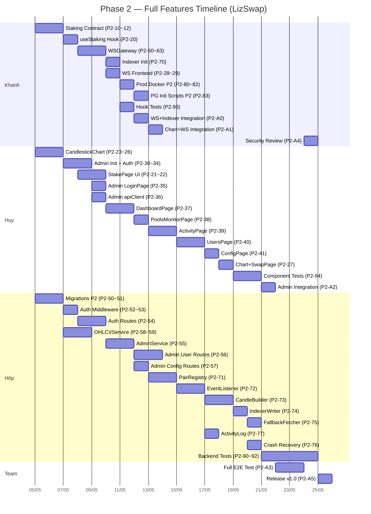

# 🟢 GIAI ĐOẠN 2 — Full Features

> **Mục tiêu**: Hoàn thành TẤT CẢ tính năng đã đặt ra trong tài liệu kiến trúc.
> **Thời gian ước tính**: ~5 tuần (5 Sprints × 1 tuần)
> **Bắt đầu sau khi**: Phase 1 MVP đã merge vào `develop` và smoke test pass.

---

## Phạm vi Phase 2

**✅ Bao gồm:**
- Smart Contract: `LizSwapStaking.sol` + tests
- Frontend DApp: `/stake` page, CandlestickChart components, WebSocket integration
- Admin Dashboard: Toàn bộ 6 pages + AuthGuard + RoleGuard + Sidebar
- Backend API: Auth endpoints, Admin endpoints, OHLCVService, AdminService, WebSocket Gateway
- BSC Indexer: Toàn bộ pipeline (PairRegistry → EventListener → CandleBuilder → IndexerWriter → FallbackFetcher)
- Database: Bảng `ohlcv_candles`, `activity_log`, `user_roles`, `system_config` + seeds
- **Production Infra mở rộng**: Thêm Dockerfiles cho Admin Dashboard + Indexer, cập nhật Nginx cho `admin.lizswap.xyz` + WSS upgrade, cập nhật init SQL scripts cho các bảng mới
- Testing: Unit tests + Integration tests cho tất cả layers

> 💡 **Ghi chú**: Production Docker Compose, Nginx cơ bản, Certbot SSL, và Dockerfiles cho DApp + Backend đã được hoàn thành trong **Phase 1**. Phase 2 chỉ cần **mở rộng** cấu hình hiện tại để hỗ trợ thêm Admin Dashboard và Indexer containers.

---

## Bảng Phân Công Công Việc

### ⛓️ Nhóm 1: Staking Contract (Khanh)

| # | Task | Người thực hiện | Git Branch | Thời gian | Mô tả chi tiết | Dependencies | Deliverables | Tiêu chí hoàn thành |
|---|------|-----------------|------------|-----------|-----------------|-------------|-------------|---------------------|
| P2-10 | Viết `LizSwapStaking.sol` — stake/unstake/claimReward/updatePool/pendingReward | Khanh | `feat/p2/khanh/staking-contract` | 1 ngày | | Phase 1 merged | | |
| P2-11 | Viết Foundry test `Staking.t.sol` — block reward, accRewardPerShare, multi-user stake | Khanh | `feat/p2/khanh/staking-tests` | 0.5 ngày | | P2-10 merged | | |
| P2-12 | Deploy LizSwapStaking lên BSC Testnet + cập nhật `contracts.ts`, `addresses.json` | Khanh | `feat/p2/khanh/staking-deploy` | 0.5 ngày | | P2-11 merged | | |

---

### 🎨 Nhóm 2: Frontend — Staking & Chart (Khanh + Huy)

| # | Task | Người thực hiện | Git Branch | Thời gian | Mô tả chi tiết | Dependencies | Deliverables | Tiêu chí hoàn thành |
|---|------|-----------------|------------|-----------|-----------------|-------------|-------------|---------------------|
| P2-20 | `useStaking.ts` — hook stake/unstake/claimReward/pendingReward (wagmi) | Khanh | `feat/p2/khanh/staking-hooks` | 1 ngày | | P2-12 merged | | |
| P2-21 | StakePage layout (`/stake`): chọn LP pair, nhập amount, hiển thị pending reward | Huy | `feat/p2/huy/stake-page-ui` | 1.5 ngày | | P2-20 merged (hook API) | | |
| P2-22 | `StakeForm.tsx` — form stake/unstake, approve LP, confirm button | Huy | `feat/p2/huy/stake-page-ui` | (cùng P2-21) | | | | |
| P2-23 | `CandlestickChart.tsx` — lightweight-charts v4 wrapper, render OHLCV candle data | Huy | `feat/p2/huy/candlestick-chart` | 2 ngày | | Phase 1 merged | | |
| P2-24 | `ChartLoader.tsx` — fetch OHLCV api, loading/error states, NO_DIRECT_POOL handling | Huy | `feat/p2/huy/candlestick-chart` | (cùng P2-23) | | | | |
| P2-25 | `NoDataMessage.tsx` — thông báo "Không có dữ liệu chart" khi NO_DIRECT_POOL | Huy | `feat/p2/huy/candlestick-chart` | (cùng P2-23) | | | | |
| P2-26 | `IntervalPicker.tsx` — chọn interval 1m/5m/1h/1d, trigger reload chart | Huy | `feat/p2/huy/candlestick-chart` | (cùng P2-23) | | | | |
| P2-27 | Tích hợp CandlestickChart vào SwapPage (`/swap`) | Huy | `feat/p2/huy/chart-swap-integration` | 0.5 ngày | | P2-23, P2-65 merged (OHLCV API) | | |
| P2-28 | WebSocket integration — DApp apiClient thêm Socket.IO: price:update, ohlcv:new_candle | Khanh | `feat/p2/khanh/ws-frontend` | 1 ngày | | P2-60 merged (WSGateway) | | |
| P2-29 | `usePriceSubscription.ts` + `useOHLCVSubscription.ts` — real-time hooks | Khanh | `feat/p2/khanh/ws-frontend` | (cùng P2-28) | | | | |

---

### 🖥️ Nhóm 3: Admin Dashboard (Huy)

| # | Task | Người thực hiện | Git Branch | Thời gian | Mô tả chi tiết | Dependencies | Deliverables | Tiêu chí hoàn thành |
|---|------|-----------------|------------|-----------|-----------------|-------------|-------------|---------------------|
| P2-30 | Init Admin Dashboard (`apps/admin/`): Layout, Sidebar, navigation, shadcn/ui setup | Huy | `feat/p2/huy/admin-init` | 1 ngày | | Phase 1 merged | | |
| P2-31 | `RoleContext.tsx` — useState role: manager/staff, expose useRole() hook | Huy | `feat/p2/huy/admin-auth` | 0.5 ngày | | P2-30 merged | | |
| P2-32 | `middleware.ts` (AuthGuard) — redirect `/login` nếu không có JWT, verify JWT on navigation | Huy | `feat/p2/huy/admin-auth` | (cùng P2-31) | | | | |
| P2-33 | `RoleGuard.tsx` — HOC kiểm tra role, ẩn UI Manager-only cho Staff | Huy | `feat/p2/huy/admin-auth` | (cùng P2-31) | | | | |
| P2-34 | `Sidebar.tsx` — navigation menu, ẩn `/users` + `/config` cho Staff | Huy | `feat/p2/huy/admin-sidebar` | 0.5 ngày | | P2-31 merged | | |
| P2-35 | LoginPage (`/login`): WalletConnector + MetaMask sign EIP-191 → JWT | Huy | `feat/p2/huy/admin-login` | 1 ngày | | P2-31, P2-52 merged (Auth API) | | |
| P2-36 | Admin `apiClient.ts` — axios instance với JWT Bearer header, auto redirect on 401 | Huy | `feat/p2/huy/admin-api-client` | 0.5 ngày | | P2-30 merged | | |
| P2-37 | DashboardPage (`/dashboard`): tổng quan volume, TVL, active wallets | Huy | `feat/p2/huy/admin-dashboard-page` | 1.5 ngày | | P2-36, P2-56 merged | | |
| P2-38 | PoolsMonitorPage (`/pools`): pool stats table, TVL sorting | Huy | `feat/p2/huy/admin-pools-page` | 1 ngày | | P2-36 merged | | |
| P2-39 | ActivityPage (`/activity`): lịch sử Swap/Mint/Burn, filter by pair/time, pagination | Huy | `feat/p2/huy/admin-activity-page` | 1.5 ngày | | P2-36, P2-57 merged | | |
| P2-40 | UsersPage (`/users`): danh sách user/role, thêm Staff, vô hiệu hoá (Manager only) | Huy | `feat/p2/huy/admin-users-page` | 1.5 ngày | | P2-33, P2-36, P2-54 merged | | |
| P2-41 | ConfigPage (`/config`): form cài đặt system_config, protocol fee toggle (Manager only) | Huy | `feat/p2/huy/admin-config-page` | 1 ngày | | P2-33, P2-36, P2-55 merged | | |

---

### 🔧 Nhóm 4: Backend — Auth, Admin API, OHLCV (Hộp)

| # | Task | Người thực hiện | Git Branch | Thời gian | Mô tả chi tiết | Dependencies | Deliverables | Tiêu chí hoàn thành |
|---|------|-----------------|------------|-----------|-----------------|-------------|-------------|---------------------|
| P2-50 | Database migrations Phase 2: `create_ohlcv_candles.sql`, `create_activity_log.sql`, `create_user_roles.sql`, `create_system_config.sql` | Hộp | `feat/p2/hop/database-migrations-p2` | 1 ngày | | Phase 1 merged | | |
| P2-51 | Seed data: initial Manager wallet + default system_config entries | Hộp | `feat/p2/hop/database-seeds` | 0.5 ngày | | P2-50 merged | | |
| P2-52 | `auth.middleware.ts` — JWT verify + Redis blacklist check | Hộp | `feat/p2/hop/auth-middleware` | 1 ngày | | P2-50 merged | | |
| P2-53 | `role.middleware.ts` — role guard: manager / staff enforcement | Hộp | `feat/p2/hop/auth-middleware` | (cùng P2-52) | | | | |
| P2-54 | Auth routes: `POST /api/auth/login` (EIP-191 verify + JWT issue), `POST /api/auth/logout` (blacklist) | Hộp | `feat/p2/hop/auth-routes` | 1.5 ngày | | P2-52 merged | | |
| P2-55 | `AdminService.ts` — CRUD user_roles, CRUD system_config | Hộp | `feat/p2/hop/admin-service` | 1.5 ngày | | P2-50 merged | | |
| P2-56 | Admin routes: `GET/POST/PUT/DELETE /api/admin/users`, `GET /api/admin/stats` | Hộp | `feat/p2/hop/admin-routes` | 1.5 ngày | | P2-55, P2-52 merged | | |
| P2-57 | Admin routes: `GET /api/admin/activity`, `GET/PUT /api/admin/config` | Hộp | `feat/p2/hop/admin-config-activity-routes` | 1 ngày | | P2-55 merged | | |
| P2-58 | `OHLCVService.ts` — validateDirectPool (Factory.getPair on-chain) + fetchCandles (Redis/PG) | Hộp | `feat/p2/hop/ohlcv-service` | 1.5 ngày | | P2-50, BSCClient (Khanh) merged | | |
| P2-59 | Route `GET /api/ohlcv` + Zod validation cho ohlcv query params | Hộp | `feat/p2/hop/ohlcv-route` | 0.5 ngày | | P2-58 merged | | |

---

### 🌐 Nhóm 5: WebSocket Gateway (Khanh)

| # | Task | Người thực hiện | Git Branch | Thời gian | Mô tả chi tiết | Dependencies | Deliverables | Tiêu chí hoàn thành |
|---|------|-----------------|------------|-----------|-----------------|-------------|-------------|---------------------|
| P2-60 | `WSGateway.ts` — Socket.IO v4 server setup, room/namespace management | Khanh | `feat/p2/khanh/ws-gateway` | 1.5 ngày | | Phase 1 merged | | |
| P2-61 | WS events: subscribe:price/unsubscribe:price → PriceService poll → price:update broadcast | Khanh | `feat/p2/khanh/ws-gateway` | (cùng P2-60) | | | | |
| P2-62 | WS events: subscribe:ohlcv/unsubscribe:ohlcv → Redis pub/sub → ohlcv:new_candle broadcast | Khanh | `feat/p2/khanh/ws-gateway` | (cùng P2-60) | | | | |
| P2-63 | WS rate limiting, subscription limits (max 20 price, 10 ohlcv), error handling | Khanh | `feat/p2/khanh/ws-gateway` | (cùng P2-60) | | | | |

---

### 📊 Nhóm 6: BSC Indexer (Hộp)

| # | Task | Người thực hiện | Git Branch | Thời gian | Mô tả chi tiết | Dependencies | Deliverables | Tiêu chí hoàn thành |
|---|------|-----------------|------------|-----------|-----------------|-------------|-------------|---------------------|
| P2-70 | Init Indexer boilerplate (`packages/indexer/`): entry point, config, logger | Khanh | `feat/p2/khanh/indexer-init` | 0.5 ngày | | Phase 1 merged | | |
| P2-71 | `PairRegistry.ts` — đồng bộ allPairs từ Factory, lưu pair metadata (token0/1, decimals) | Hộp | `feat/p2/hop/indexer-pair-registry` | 1.5 ngày | | P2-70, BSCClient merged | | |
| P2-72 | `EventListener.ts` — viem watchContractEvent: Swap/Mint/Burn events, reconnect strategy | Hộp | `feat/p2/hop/indexer-event-listener` | 2 ngày | | P2-71 merged | | |
| P2-73 | `CandleBuilder.ts` — parseSwapEvent → calcSpotPrice → CandleAggregator (1m/5m/1h/1d) | Hộp | `feat/p2/hop/indexer-candle-builder` | 2 ngày | | P2-72 merged | | |
| P2-74 | `IndexerWriter.ts` — INSERT ohlcv_candles (upsert ON CONFLICT) + SET Redis cache + PUBLISH Redis pub/sub | Hộp | `feat/p2/hop/indexer-writer` | 1 ngày | | P2-73 merged | | |
| P2-75 | `FallbackFetcher.ts` — fetch OHLCV từ nguồn ngoài nếu cần (axios) | Hộp | `feat/p2/hop/indexer-fallback` | 0.5 ngày | | P2-74 merged | | |
| P2-76 | Indexer crash recovery: lưu last_processed_block, catch-up on restart, idempotent insert | Hộp | `feat/p2/hop/indexer-recovery` | 1 ngày | | P2-74 merged | | |
| P2-77 | Activity log writer: INSERT activity_log cho Swap/Mint/Burn events | Hộp | `feat/p2/hop/indexer-activity-log` | 0.5 ngày | | P2-72 merged | | |

### 🏗️ Nhóm 6: Production Infra Mở rộng (Khanh)

> Production Docker Compose, Nginx cơ bản, SSL, Dockerfiles cho DApp + Backend đã có từ Phase 1. Phase 2 chỉ mở rộng cho Admin Dashboard + Indexer.

| # | Task | Người thực hiện | Git Branch | Thời gian | Mô tả chi tiết | Dependencies | Deliverables | Tiêu chí hoàn thành |
|---|------|-----------------|------------|-----------|-----------------|-------------|-------------|---------------------|
| P2-80 | Dockerfile cho Admin Dashboard (`apps/admin/Dockerfile`) + Indexer (`packages/indexer/Dockerfile`) | Khanh | `feat/p2/khanh/prod-docker-p2` | 0.5 ngày | | Phase 1 Prod Docker merged | | |
| P2-81 | Cập nhật `docker-compose.yml`: thêm `lizswap-admin` + `lizswap-indexer` containers | Khanh | `feat/p2/khanh/prod-docker-p2` | (cùng P2-80) | | | | |
| P2-82 | Cập nhật Nginx config: thêm virtual host `admin.lizswap.xyz → :3002`, WSS upgrade cho `/socket.io` | Khanh | `feat/p2/khanh/nginx-prod-p2` | 0.5 ngày | | P2-80 merged | | |
| P2-83 | Cập nhật Init SQL scripts: thêm `ohlcv_candles`, `activity_log`, `user_roles`, `system_config` + seed Manager | Khanh | `feat/p2/khanh/pg-init-scripts-p2` | 0.5 ngày | | P2-50 merged (Hộp's migrations) | | |

---

### ✅ Nhóm 7: Testing (Tất cả)

| # | Task | Người thực hiện | Git Branch | Thời gian | Mô tả chi tiết | Dependencies | Deliverables | Tiêu chí hoàn thành |
|---|------|-----------------|------------|-----------|-----------------|-------------|-------------|---------------------|
| P2-90 | Backend unit tests: PriceService, PoolService, OHLCVService, AdminService (Vitest + mock) | Hộp | `feat/p2/hop/backend-unit-tests` | 2 ngày | | Nhóm 4 merged | | |
| P2-91 | Backend integration tests: auth routes, admin routes (Vitest + Supertest + test DB) | Hộp | `feat/p2/hop/backend-integration-tests` | 1.5 ngày | | P2-90 merged | | |
| P2-92 | Indexer unit tests: CandleBuilder, PairRegistry (Vitest + mock events) | Hộp | `feat/p2/hop/indexer-unit-tests` | 1.5 ngày | | Nhóm 5 merged | | |
| P2-93 | Frontend hook tests: useSwap, useLiquidity, useStaking (Vitest + RTL renderHook) | Khanh | `feat/p2/khanh/frontend-hook-tests` | 1 ngày | | Nhóm 2 merged | | |
| P2-94 | Frontend component tests: TokenSelector, SlippageControl, SwapButton, PoolList (Vitest + RTL) | Huy | `feat/p2/huy/frontend-component-tests` | 1.5 ngày | | Nhóm 3 merged | | |
| P2-95 | Contract tests: Staking.t.sol đạt coverage >= 80% | Khanh | `feat/p2/khanh/staking-tests` | (đã tính trong P2-11) | | | | |

---

### 🔗 Nhóm 8: Final Integration & QA (Tất cả)

| # | Task | Người thực hiện | Git Branch | Thời gian | Mô tả chi tiết | Dependencies | Deliverables | Tiêu chí hoàn thành |
|---|------|-----------------|------------|-----------|-----------------|-------------|-------------|---------------------|
| P2-A0 | Integration: WSGateway + Indexer (Redis pub/sub) → ohlcv:new_candle E2E | Khanh + Hộp | `feat/p2/khanh/ws-indexer-integration` | 1 ngày | | P2-60, P2-74 merged | | |
| P2-A1 | Integration: CandlestickChart + OHLCV API + WebSocket realtime update | Huy + Khanh | `feat/p2/huy/chart-ws-integration` | 1 ngày | | P2-27, P2-28 merged | | |
| P2-A2 | Integration: Admin Dashboard + Auth API + Admin routes E2E | Huy + Hộp | `feat/p2/huy/admin-integration` | 1 ngày | | Nhóm 3, Nhóm 4 merged | | |
| P2-A3 | Full E2E test: Deploy production Docker trên VPS / local → verify all features | Team | — | 2 ngày | | Tất cả merged | | |
| P2-A4 | Security review: CORS, Helmet, rate limiting, JWT blacklist, contract reentrancy | Khanh (lead) | — | 1 ngày | | P2-A3 passed | | |
| P2-A5 | Final merge `develop` → `release/v1.0` → testing → `main` | Team | `release/v1.0` | 1 ngày | | P2-A4 passed | | |

---

## Tổng hợp Khối lượng Công việc

| Thành viên | Tasks | Ước tính tổng | Ghi chú |
|------------|-------|---------------|---------|
| **Khanh** | P2-10~12, P2-20, P2-28~29, P2-60~63, P2-70, P2-80~83, P2-93, P2-A0~A1, P2-A4 | ~11 ngày | Staking + WSGateway + WS Frontend + Prod Infra mở rộng (nhẹ hơn vì đã có base từ P1) + Tests + Security review |
| **Huy** | P2-21~27, P2-30~41, P2-94, P2-A1~A2 | ~17 ngày | StakePage + Chart + Admin Dashboard toàn bộ + Component tests + Integration |
| **Hộp** | P2-50~59, P2-71~77, P2-90~92, P2-A0, P2-A2 | ~21 ngày | Auth/Admin API + OHLCV + Indexer pipeline + All backend tests |

> ⚠️ **Ghi chú**: Phase 2 khối lượng Hộp nặng nhất vì phải xây dựng toàn bộ Indexer pipeline + Auth/Admin API + Tests. Khanh support bằng cách init Indexer boilerplate và review code. Production Infra của Khanh nhẹ hơn (~1.5 ngày) vì chỉ cần mở rộng base đã setup từ Phase 1, nên Khanh có thể hỗ trợ Huy 1-2 admin pages nếu cần.

---

## Integration Points — Điểm Phối hợp

| Điểm tích hợp | Thành viên liên quan | File/Module chung | Quy tắc |
|---|---|---|---|
| Staking ABI → useStaking → StakePage | Khanh → Huy | `contracts.ts`, `useStaking.ts` | Khanh export hook + update contracts.ts, Huy gọi trong StakePage |
| WSGateway → Frontend WS client | Khanh → Huy | `WSGateway.ts` ↔ `apiClient.ts` | Khanh tạo WS server events, export WS event types, Huy subscribe trong components |
| Indexer → Redis pub/sub → WSGateway | Khanh ↔ Hộp | `IndexerWriter.ts` ↔ `WSGateway.ts` | Thống nhất Redis channel name + payload format trước khi code |
| Auth API → Admin Dashboard login | Hộp → Huy | `auth routes` ↔ `LoginPage` | Hộp deploy auth API trước, Huy gọi POST /api/auth/login |
| Admin API → Admin pages | Hộp → Huy | `admin routes` ↔ `adminApiClient.ts` | Hộp export API spec (URL + response), Huy implement UI gọi theo spec |
| OHLCVService → BSCClient | Hộp → Khanh | `OHLCVService.ts` → `BSCClient.ts` | Hộp sử dụng BSCClient (Khanh) để gọi Factory.getPair() |
| Prod Docker mở rộng → Admin + Indexer | Khanh → Team | `docker-compose.yml`, `Dockerfile` | Khanh thêm containers cho Admin + Indexer, cập nhật Nginx |
| Init SQL scripts mở rộng ← Migrations P2 | Khanh ← Hộp | `01_init_schema.sql` ← migration files | Hộp viết migrations P2, Khanh merge vào init script |

---

## Critical Path

```
Phase 1 merged (Production Docker/Nginx/SSL đã có base)
    ├── P2-10 (Staking contract) → P2-12 (Deploy) → P2-20 (useStaking) → P2-21 (StakePage UI)
    ├── P2-50 (Migrations) → P2-52 (Auth MW) → P2-54 (Auth routes) → P2-35 (Admin LoginPage)
    │   └── P2-55 (AdminService) → P2-56 (Admin routes) → P2-37~41 (Admin pages)
    ├── P2-50 (Migrations) → P2-71 (PairRegistry) → P2-72 (EventListener) → P2-73 (CandleBuilder)
    │   └── P2-74 (IndexerWriter) → P2-60 (WSGateway) → P2-A0 (WS+Indexer integration)
    │       └── P2-28 (WS Frontend) → P2-A1 (Chart+WS integration)
    └── P2-80 (Prod Docker mở rộng) → P2-82 (Nginx update) → P2-A3 (E2E)
            └── P2-A4 (Security review) → P2-A5 (Release)
```

**Longest path (Indexer pipeline)**: P2-50 → P2-71 → P2-72 → P2-73 → P2-74 → P2-A0 → P2-A3 → P2-A5 = ~12 ngày làm việc

---

## Sprint Plan

### Sprint 5 (Tuần 1 Phase 2): Staking + Auth + Indexer Start

| Người | Task chính |
|-------|-----------|
| **Khanh** | P2-10~12 (Staking contract + deploy, 2 ngày) → P2-20 (useStaking hook, 1 ngày) → P2-60~63 (WSGateway, 1.5 ngày) |
| **Huy** | P2-23~26 (CandlestickChart components, 2 ngày) → P2-30 (Admin init, 1 ngày) → P2-31~33 (RoleContext + AuthGuard, 0.5 ngày) → P2-34 (Sidebar, 0.5 ngày) |
| **Hộp** | P2-50 (Migrations, 1 ngày) → P2-51 (Seeds, 0.5 ngày) → P2-52~53 (Auth middleware, 1 ngày) → P2-54 (Auth routes, 1.5 ngày) → P2-58 (OHLCVService, start) |

### Sprint 6 (Tuần 2): Admin API + Indexer Core + StakePage

| Người | Task chính |
|-------|-----------|
| **Khanh** | P2-70 (Indexer init, 0.5 ngày) → P2-28~29 (WS frontend hooks, 1 ngày) → P2-80~81 (Prod Docker mở rộng, 0.5 ngày) → P2-82 (Nginx update, 0.5 ngày) → P2-83 (PG init scripts update, 0.5 ngày) |
| **Huy** | P2-21~22 (StakePage UI, 1.5 ngày) → P2-35 (Admin LoginPage, 1 ngày) → P2-36 (Admin apiClient, 0.5 ngày) → P2-37 (DashboardPage, 1.5 ngày) |
| **Hộp** | P2-58 (OHLCVService finish, 0.5 ngày) → P2-59 (OHLCV route, 0.5 ngày) → P2-55 (AdminService, 1.5 ngày) → P2-71 (PairRegistry, 1.5 ngày) |

### Sprint 7 (Tuần 3): Admin Pages + Indexer Pipeline

| Người | Task chính |
|-------|-----------|
| **Khanh** | P2-83 (PG init scripts, đã xong) → P2-93 (Frontend hook tests, 1 ngày) → P2-A0 (WS+Indexer integration, 1 ngày) → Code review |
| **Huy** | P2-38 (PoolsMonitorPage, 1 ngày) → P2-39 (ActivityPage, 1.5 ngày) → P2-40 (UsersPage, 1.5 ngày) |
| **Hộp** | P2-56 (Admin user routes, 1.5 ngày) → P2-72 (EventListener, 2 ngày) → P2-57 (Admin config/activity routes, 1 ngày) |

### Sprint 8 (Tuần 4): Indexer Finish + Tests + Integration

| Người | Task chính |
|-------|-----------|
| **Khanh** | P2-A1 (Chart+WS integration, 1 ngày) → Code review toàn bộ → Security prep |
| **Huy** | P2-41 (ConfigPage, 1 ngày) → P2-27 (Chart+SwapPage integration, 0.5 ngày) → P2-94 (Component tests, 1.5 ngày) → P2-A2 (Admin integration, 1 ngày) |
| **Hộp** | P2-73 (CandleBuilder, 2 ngày) → P2-74 (IndexerWriter, 1 ngày) → P2-75 (FallbackFetcher, 0.5 ngày) → P2-77 (ActivityLog writer, 0.5 ngày) |

### Sprint 9 (Tuần 5): Testing + QA + Release

| Người | Task chính |
|-------|-----------|
| **Khanh** | P2-A4 (Security review, 1 ngày) → P2-A5 (Release, 0.5 ngày) → Bug fixes |
| **Huy** | P2-A2 (Admin integration finish) → Bug fixes → UI polish |
| **Hộp** | P2-76 (Crash recovery, 1 ngày) → P2-90~92 (Backend + Indexer tests, 4 ngày) → P2-91 (Integration tests) |
| **Team** | P2-A3 (Full E2E test, 2 ngày) → P2-A5 (Release) |

---

## Timeline Gantt Chart



---

## Risk Assessment

| Risk | Mức độ | Mitigation |
|------|--------|------------|
| BSC Indexer pipeline phức tạp — Hộp lần đầu làm | 🔴 Cao | Khanh init boilerplate + review code. Chia nhỏ task. Test với mock events trước khi chuyển real BSC |
| CandleBuilder tính sai OHLCV → chart sai | 🔴 Cao | Coverage target >= 95% cho CandleBuilder. Test với nhiều edge case (single swap, many swaps, different decimals) |
| WebSocket + Redis pub/sub integration phức tạp | 🟡 Trung bình | Khanh và Hộp thống nhất Redis channel format trước khi code (ngày đầu Sprint 5) |
| Admin Dashboard 6 pages — Huy có thể không kịp | 🟡 Trung bình | Khanh support 1-2 page đơn giản (PoolsMonitorPage) nếu Huy bị delay |
| JWT blacklist không sync khi có nhiều pod | 🟢 Thấp | Single server — dùng Redis centralized. Không cần distributed cache |
| Indexer mất events khi restart | 🟡 Trung bình | Implement catch-up mechanism (last_processed_block). Idempotent upsert |
| Hộp quá tải (Auth + Admin + Indexer + Tests) | 🟡 Trung bình | Khanh hỗ trợ Indexer init + review. Có thể chuyển 1 số admin routes đơn giản cho Khanh |
